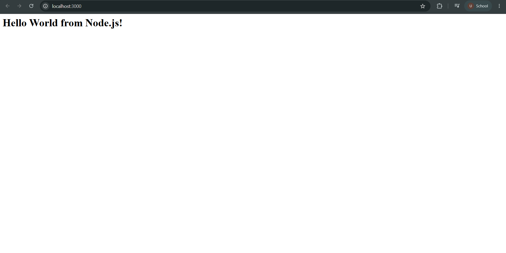
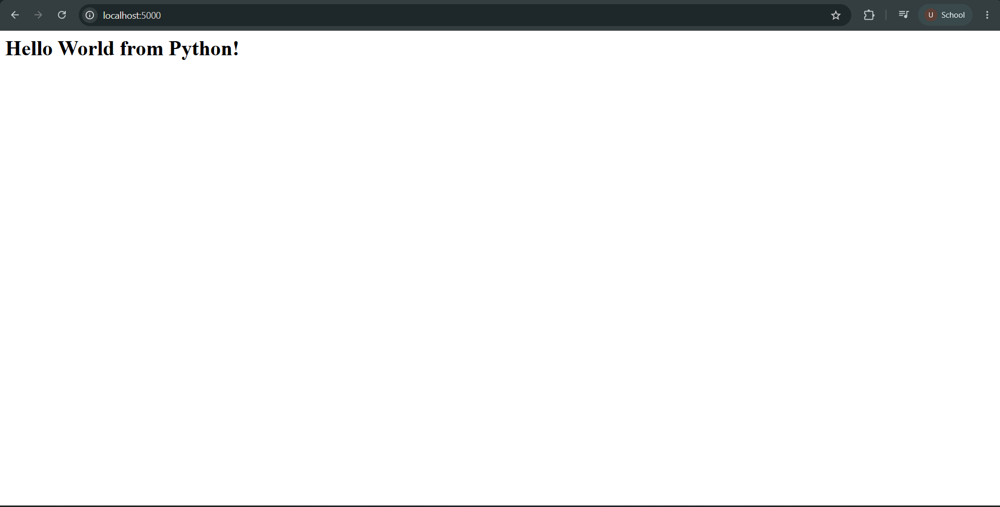
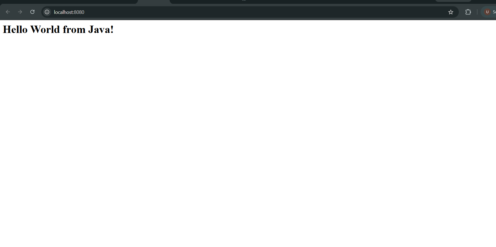
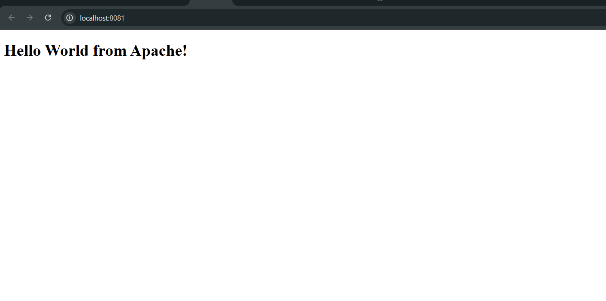
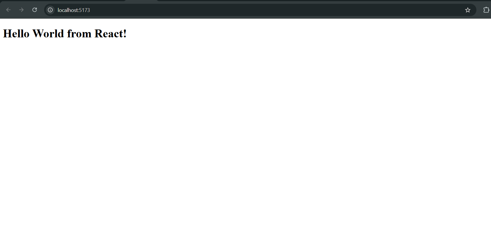
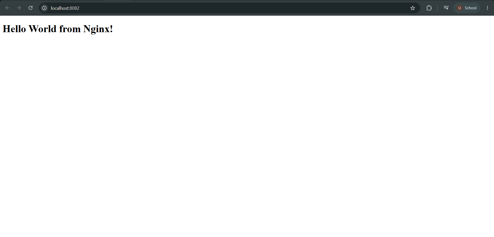

# Docker Homework

## Student Details

- **Name:** Ujwal Kumar Reddy Salapala
- **Enrollment Number:** 24BCS10334

---

## Overview

This assignment contains containerized "Hello World" web applications implemented across 6 different runtimes and web servers using Docker:

| # | Application | Base Image | Container Port | Host Port | Documentation / Source |
|---|---|---|---|---|---|
| **01** | Node.js | `node:22-alpine` | 3000 | 3000 | [nodejs-app/](nodejs-app/) |
| **02** | Python | `python:3.12-alpine` | 5000 | 5000 | [python-app/](python-app/) |
| **03** | Java | `eclipse-temurin:17-jdk-alpine` | 8080 | 8080 | [java-app/](java-app/) |
| **04** | Apache HTTP Server | `httpd:2.4-alpine` | 80 | 8081 | [Apache-app/](Apache-app/) |
| **05** | React | `node:22-alpine` | 5173 | 5173 | [React-app/](React-app/) |
| **06** | Nginx | `nginx:alpine` | 80 | 8082 | [nginx-app/](nginx-app/) |

---

# 1. Node.js Application

A lightweight Node.js HTTP server returning a greeting message.

### Dockerfile

```dockerfile
FROM node:22-alpine

WORKDIR /app

COPY app.js .

EXPOSE 3000

CMD ["node", "app.js"]
```

### Build and Run Commands

```powershell
# Build Docker image
docker build -t nodejs-hello-world ./Docker-Homework/nodejs-app

# Run container
docker run -d -p 3000:3000 --name nodejs-container nodejs-hello-world
```

### Verification

```powershell
curl http://localhost:3000
```

### Screenshot



---

# 2. Python Application

A Python HTTP server built on Alpine Linux serving a response on port 5000.

### Dockerfile

```dockerfile
FROM python:3.12-alpine

WORKDIR /app

COPY app.py .

EXPOSE 5000

CMD ["python", "app.py"]
```

### Build and Run Commands

```powershell
# Build Docker image
docker build -t python-hello-world ./Docker-Homework/python-app

# Run container
docker run -d -p 5000:5000 --name python-container python-hello-world
```

### Verification

```powershell
curl http://localhost:5000
```

### Screenshot



---

# 3. Java Application

A compiled Java HTTP server using Eclipse Temurin JDK on Alpine Linux.

### Dockerfile

```dockerfile
FROM eclipse-temurin:17-jdk-alpine

WORKDIR /app

COPY HelloWorld.java .

RUN javac HelloWorld.java

EXPOSE 8080

CMD ["java", "HelloWorld"]
```

### Build and Run Commands

```powershell
# Build Docker image
docker build -t java-hello-world ./Docker-Homework/java-app

# Run container
docker run -d -p 8080:8080 --name java-container java-hello-world
```

### Verification

```powershell
curl http://localhost:8080
```

### Screenshot



---

# 4. Apache HTTP Server

An Apache HTTP server (`httpd:2.4-alpine`) serving a custom static HTML page.

### Dockerfile

```dockerfile
FROM httpd:2.4-alpine

COPY index.html /usr/local/apache2/htdocs/

EXPOSE 80
```

### Build and Run Commands

```powershell
# Build Docker image
docker build -t apache-hello-world ./Docker-Homework/Apache-app

# Run container
docker run -d -p 8081:80 --name apache-container apache-hello-world
```

### Verification

```powershell
curl http://localhost:8081
```

### Screenshot



---

# 5. React Application

A React web application containerized with Node.js Alpine and served on port 5173.

### Dockerfile

```dockerfile
FROM node:22-alpine

WORKDIR /app

COPY package.json .

RUN npm install

COPY . .

EXPOSE 5173

CMD ["npm", "run", "start"]
```

### Build and Run Commands

```powershell
# Build Docker image
docker build -t react-hello-world ./Docker-Homework/React-app

# Run container
docker run -d -p 5173:5173 --name react-container react-hello-world
```

### Verification

```powershell
curl http://localhost:5173
```

### Screenshot



---

# 6. Nginx Application

An Nginx web server (`nginx:alpine`) serving a custom static HTML page.

### Dockerfile

```dockerfile
FROM nginx:alpine

COPY index.html /usr/share/nginx/html/

EXPOSE 80
```

### Build and Run Commands

```powershell
# Build Docker image
docker build -t nginx-hello-world ./Docker-Homework/nginx-app

# Run container
docker run -d -p 8082:80 --name nginx-container nginx-hello-world
```

### Verification

```powershell
curl http://localhost:8082
```

### Screenshot



---

## Repository Structure

```text
Docker-Homework/
├── Apache-app/
│   ├── Dockerfile
│   └── index.html
├── java-app/
│   ├── Dockerfile
│   └── HelloWorld.java
├── nginx-app/
│   ├── Dockerfile
│   └── index.html
├── nodejs-app/
│   ├── Dockerfile
│   └── app.js
├── python-app/
│   ├── Dockerfile
│   └── app.py
├── React-app/
│   ├── Dockerfile
│   ├── index.html
│   ├── package.json
│   ├── server.js
│   └── src/
│       ├── App.jsx
│       └── main.jsx
├── Screenshots/
│   ├── 01-nodejs.png
│   ├── 02-python.png
│   ├── 03-java.png
│   ├── 04-apache.png
│   ├── 05-react.png
│   └── 06-nginx.png
└── README.md
```
