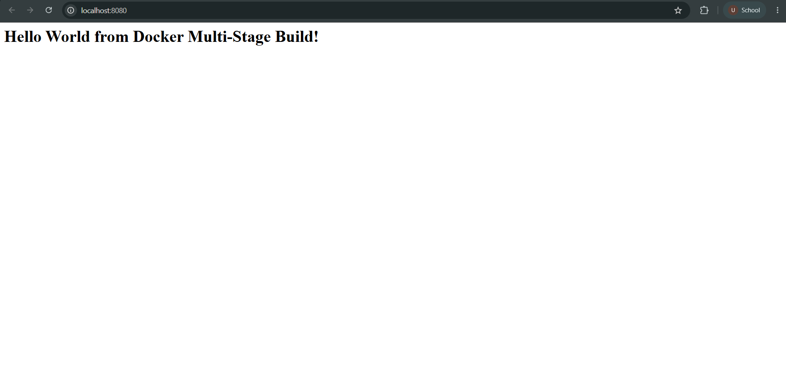
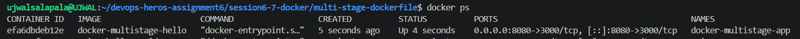
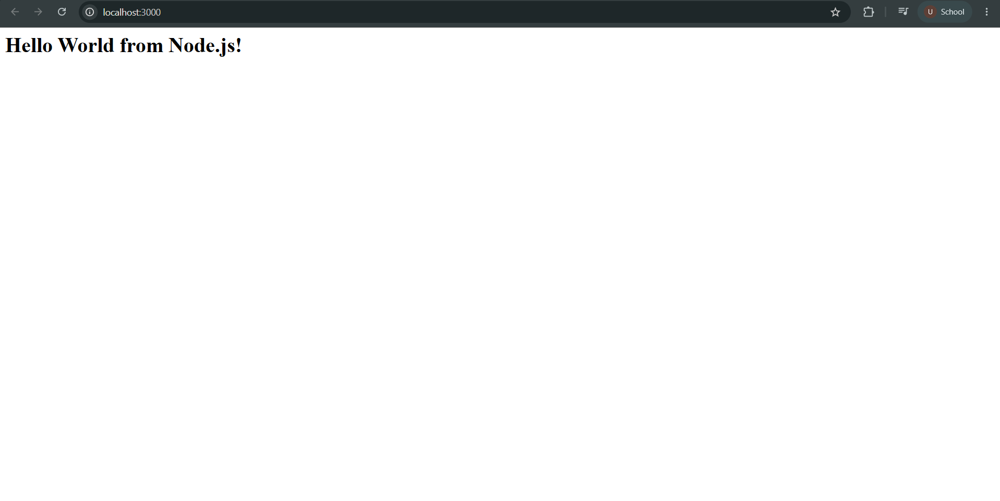
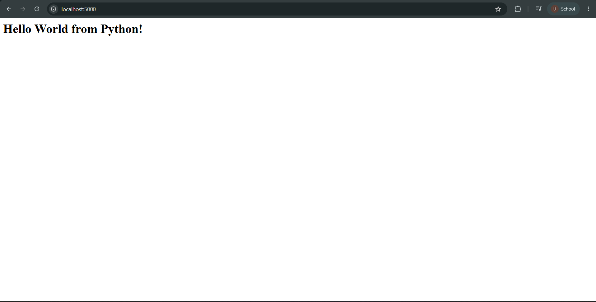
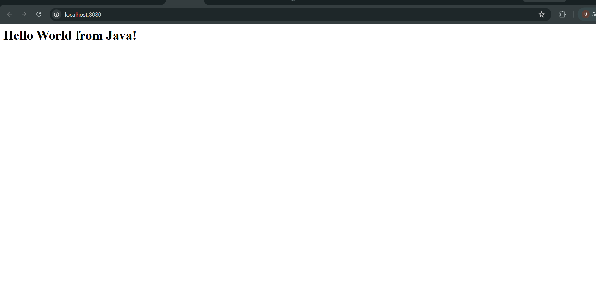

# Docker Multi-Stage Build Homework

## Student Details

- Name: Ujwal Kumar Reddy Salapala
- Enrollment Number: 24BCS10334

---

## Task 1: Run Multi-Stage Dockerfile

The provided multi-stage Dockerfile was cloned from the DevOps Heroes repository and used without modification.

### Docker Image Build

Command:

docker build -t docker-multistage-hello .

The Docker image was successfully built using a multi-stage Dockerfile.

### Run Container

Command:

docker run -d --name docker-multistage-app -p 8080:3000 docker-multistage-hello

The application runs on port 3000 inside the container and is mapped to port 8080 on the host.

### Application Verification

The application was accessed at:

http://localhost:8080

The application displayed:

Hello World from Docker Multi-Stage Build!

---

## Task 2: Verify Running Container

The running Docker container was verified using:

docker ps

The output showed the multi-stage application running with:

0.0.0.0:8080->3000/tcp

This confirms that the application is running successfully and is accessible through port 8080.

---

## Task 3: Docker Application Deployment

Three different application types were deployed using Docker.

### Node.js Application

Docker image: nodejs-hello-world

Host port: 3000

### Python Application

Docker image: python-hello-world

Host port: 5000

### Java Application

Docker image: java-hello-world

Host port: 8080

---

## Conclusion

The Docker multi-stage application was successfully built and deployed.

The application was verified through the browser on port 8080, and the running container was verified using docker ps.

Additionally, Node.js, Python, and Java applications were successfully deployed using Docker.