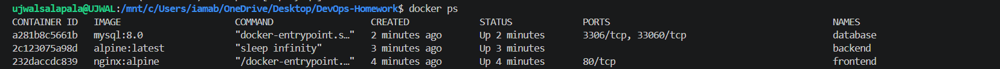
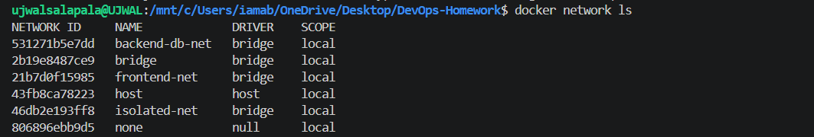
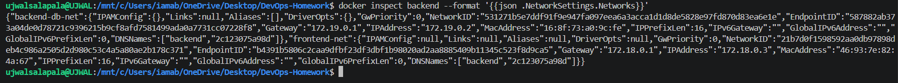
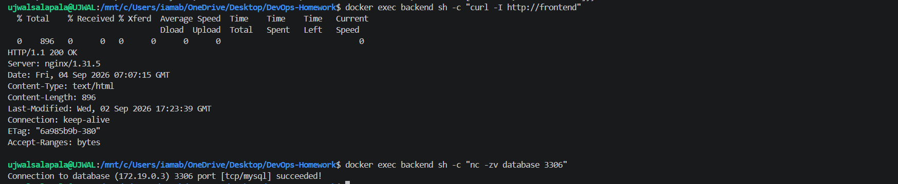
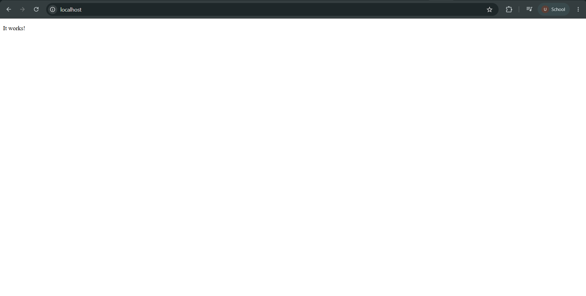
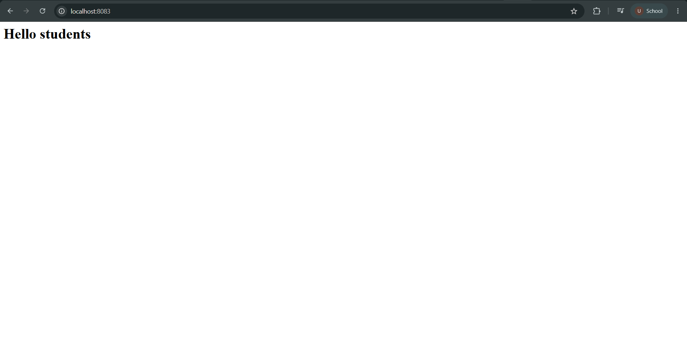
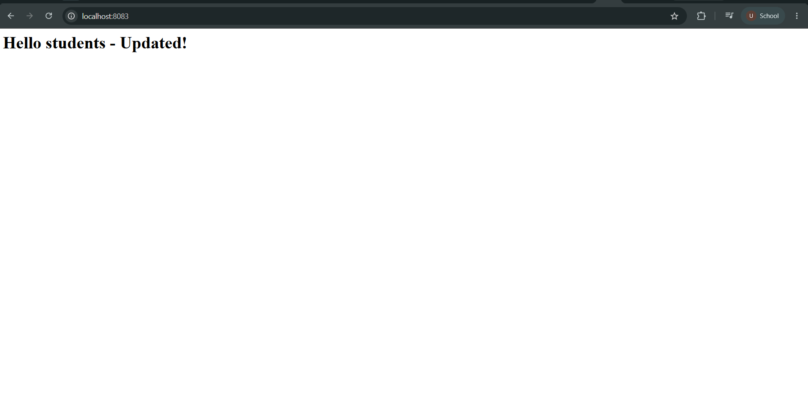

# Docker Networking & Volume Homework

## Student Details

- **Name:** Ujwal Kumar Reddy Salapala
- **Enrollment Number:** 24BCS10334

---

# Task 1: Docker Container Networking

Three Docker containers were created:

- **Frontend:** `nginx:alpine`
- **Backend:** `alpine:latest`
- **Database:** `mysql:8.0`

Three Docker networks were created:

- `frontend-net`
- `backend-db-net`
- `isolated-net`

The frontend container was connected to `frontend-net` and `isolated-net`.

The backend container was connected to exactly two networks:

- `frontend-net`
- `backend-db-net`

The database container was connected to `backend-db-net`.

### Connectivity Verification

Backend to frontend connectivity was successful with `HTTP/1.1 200 OK`.

Backend to MySQL connectivity was successful with:

`Connection to database (172.19.0.3) 3306 port [tcp/mysql] succeeded!`

### Evidence

---

# Task 2: Host Network

The Apache image was pulled using `docker pull httpd:alpine`.

An Apache container was created using the Docker host network:

`docker run -d --name apache-host --network host httpd:alpine`

Apache was accessed directly at:

`http://localhost:80`

The browser displayed `It works!`, confirming that Apache was successfully accessed through port 80 using host networking.

### Evidence

---

# Task 3: Bind Mount

A local directory named `bind-mount-site` was created with an `index.html` file.

Initially, the file contained:

`<h1>Hello students</h1>`

The directory was bind-mounted into an Nginx container named `bind-nginx` and accessed at:

`http://localhost:8083`

The browser displayed `Hello students`.

### File Modification

The host `index.html` was modified to:

`<h1>Hello students - Updated!</h1>`

The change was reflected immediately inside the running Nginx container without restarting it.

The container remained running and the updated file was verified using `docker exec`.

---

# Task 4: Overlay Network

An overlay network is a Docker network driver that allows containers and services to communicate across multiple Docker hosts.

Overlay networks are commonly used with Docker Swarm and are useful for distributed container applications.

### Key Points

- Overlay networks can span multiple Docker hosts.
- They are useful for distributed applications.
- Docker Swarm commonly uses overlay networks.
- Containers and services on different hosts can communicate through the overlay network.
- An attachable overlay network can allow standalone containers to connect to it.

Official Docker documentation:

https://docs.docker.com/engine/network/drivers/overlay/

---

# Conclusion

All required Docker Networking and Volume exercises were completed successfully.

- Three Docker networks created
- Frontend, backend, and database containers created
- Backend connected to two networks
- Container connectivity verified
- Apache deployed using host networking on port 80
- Nginx deployed using a bind mount
- Bind mount changes verified without restarting the container
- Overlay networks researched and documented
