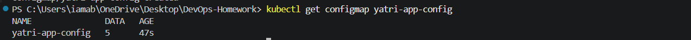
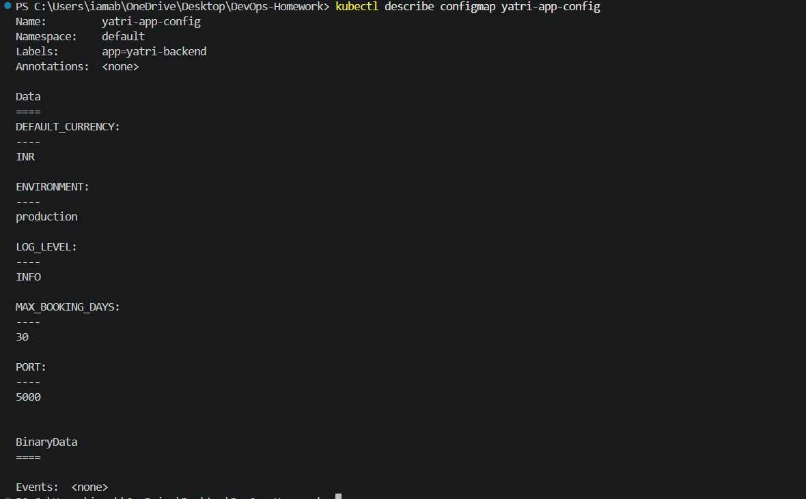
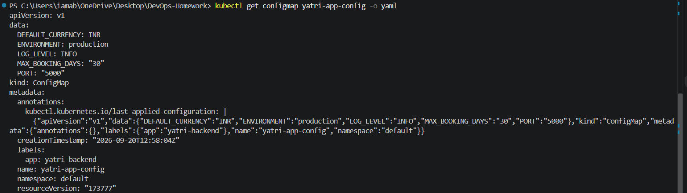

# 01 - ConfigMap

## Objective

This exercise demonstrates how Kubernetes **ConfigMaps** are used to store non-sensitive application configuration separately from the container image.

The ConfigMap created in this exercise is:

```text
yatri-app-config
```

It contains application configuration for the Yatri backend such as the environment, log level, port, currency, and maximum booking period.

---

## 1. ConfigMap Manifest

The ConfigMap manifest is stored at:

```text
configmap/app-config.yaml
```

### Manifest

```yaml
apiVersion: v1
kind: ConfigMap
metadata:
  name: yatri-app-config
  labels:
    app: yatri-backend
data:
  ENVIRONMENT: "production"
  LOG_LEVEL: "INFO"
  PORT: "5000"
  DEFAULT_CURRENCY: "INR"
  MAX_BOOKING_DAYS: "30"
```

The manifest defines five non-sensitive configuration values.

---

# 2. Create the ConfigMap

The ConfigMap was created using:

```powershell
kubectl apply -f Ingress-ConfigMaps-Secrets\01-configmap\configmap\app-config.yaml
```

### Actual Terminal Output

```text
configmap/yatri-app-config created
```

The output confirms that the `yatri-app-config` ConfigMap was successfully created in the Kubernetes cluster.

### Screenshot


---

# 3. Verify the ConfigMap

The created ConfigMap was checked using:

```powershell
kubectl get configmap yatri-app-config
```

### Actual Terminal Output

```text
NAME               DATA   AGE
yatri-app-config   5      47s
```

The `DATA` value of `5` confirms that the ConfigMap contains five configuration entries.

### Screenshot



---

# 4. Inspect ConfigMap Details

The complete contents and metadata of the ConfigMap were inspected using:

```powershell
kubectl describe configmap yatri-app-config
```

### Actual Terminal Output

```text
Name:         yatri-app-config
Namespace:    default
Labels:       app=yatri-backend
Annotations:  <none>

Data
====
DEFAULT_CURRENCY:
----
INR

ENVIRONMENT:
----
production

LOG_LEVEL:
----
INFO

MAX_BOOKING_DAYS:
----
30

PORT:
----
5000


BinaryData
====

Events:  <none>
```

The output confirms that all five expected configuration values are present:

- `ENVIRONMENT = production`
- `LOG_LEVEL = INFO`
- `PORT = 5000`
- `DEFAULT_CURRENCY = INR`
- `MAX_BOOKING_DAYS = 30`

There are no BinaryData entries and no Kubernetes events associated with the ConfigMap.

### Screenshot



---

# 5. Read a ConfigMap Value Directly

A specific value from the ConfigMap was retrieved using JSONPath:

```powershell
kubectl get configmap yatri-app-config -o jsonpath='{.data.LOG_LEVEL}'
```

### Actual Terminal Output

```text
INFO
```

This confirms that the `LOG_LEVEL` value stored in the ConfigMap is correctly set to `INFO`.

### Screenshot


---

# 6. Final YAML Verification

The complete Kubernetes object was verified using:

```powershell
kubectl get configmap yatri-app-config -o yaml
```

### Actual Terminal Output

```yaml
apiVersion: v1
data:
  DEFAULT_CURRENCY: INR
  ENVIRONMENT: production
  LOG_LEVEL: INFO
  MAX_BOOKING_DAYS: "30"
  PORT: "5000"
kind: ConfigMap
metadata:
  annotations:
    kubectl.kubernetes.io/last-applied-configuration: |
      {"apiVersion":"v1","data":{"DEFAULT_CURRENCY":"INR","ENVIRONMENT":"production","LOG_LEVEL":"INFO","MAX_BOOKING_DAYS":"30","PORT":"5000"},"kind":"ConfigMap","metadata":{"annotations":{},"labels":{"app":"yatri-backend"},"name":"yatri-app-config","namespace":"default"}}
  creationTimestamp: "2026-09-20T12:58:04Z"
  labels:
    app: yatri-backend
  name: yatri-app-config
  namespace: default
  resourceVersion: "173777"
  uid: 651ca4c2-c627-4ca5-ab8d-84311c7f9c5f
```

The final YAML output confirms the ConfigMap structure, metadata, and all five stored configuration values.

### Screenshot



---

# 7. Key Concepts

## Why ConfigMap?

A ConfigMap allows configuration to be managed separately from application code and container images.

This means the same application image can be used in different environments while configuration values can be changed independently.

## Suitable Data

ConfigMaps are intended for non-sensitive configuration such as:

- Environment names
- Log levels
- Port numbers
- Feature flags
- Application settings
- Non-sensitive URLs and configuration values

Passwords, authentication tokens, certificates, and other sensitive information should be stored using Kubernetes **Secrets** instead.

---

# 8. Configuration Verified

The following values were successfully stored and verified:

| Configuration | Value |
|---|---|
| Environment | `production` |
| Log Level | `INFO` |
| Port | `5000` |
| Default Currency | `INR` |
| Maximum Booking Days | `30` |

---

# 9. Cleanup

After completing the verification, the ConfigMap can be removed using:

```powershell
kubectl delete configmap yatri-app-config
```

This removes the ConfigMap from the Kubernetes cluster.

---

# Result

The `yatri-app-config` ConfigMap was successfully created and verified.

The exercise demonstrated:

- Creating a Kubernetes ConfigMap
- Storing non-sensitive application configuration
- Inspecting ConfigMap contents
- Reading an individual ConfigMap value using JSONPath
- Verifying the complete Kubernetes object
- Cleaning up the ConfigMap after the exercise
