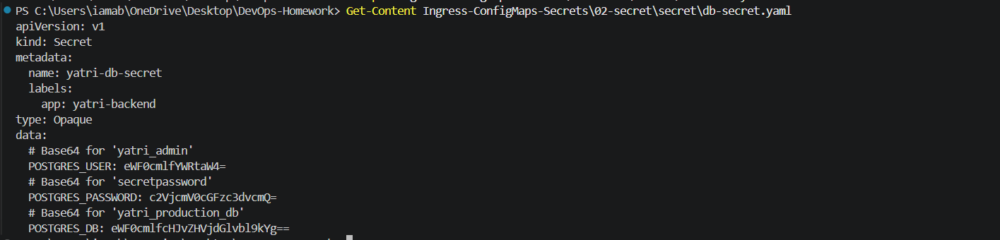
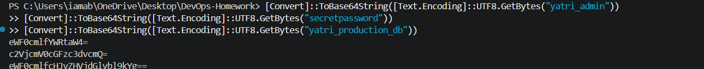
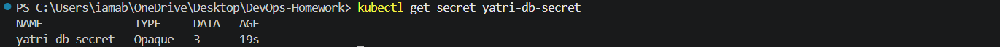
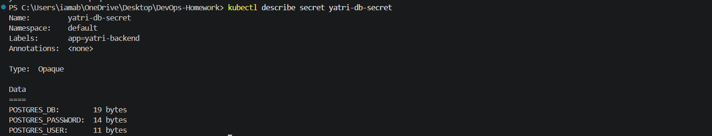
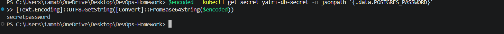

# 02 - Secret

## Objective

This exercise demonstrates how Kubernetes **Secrets** are used to store sensitive application credentials separately from application code.

The Secret created in this exercise is:

```text
yatri-db-secret
```

It contains database-related credentials represented as Base64-encoded values.

> **Important:** Base64 is encoding, not encryption. Kubernetes Secrets should be protected with appropriate RBAC and, in production environments, encryption at rest and/or an external secret-management solution should be considered.

---

# 1. Secret Manifest

The Secret manifest is stored at:

```text
secret/db-secret.yaml
```

### Manifest

```yaml
apiVersion: v1
kind: Secret
metadata:
  name: yatri-db-secret
  labels:
    app: yatri-backend
type: Opaque
data:
  # Base64 for 'yatri_admin'
  POSTGRES_USER: eWF0cmlfYWRtaW4=
  # Base64 for 'secretpassword'
  POSTGRES_PASSWORD: c2VjcmV0cGFzc3dvcmQ=
  # Base64 for 'yatri_production_db'
  POSTGRES_DB: eWF0cmlfcHJvZHVjdGlvbl9kYg==
```

The Secret uses type `Opaque` and contains three data entries.

### Screenshot



---

# 2. Generate and Verify Base64 Values

The Base64 values were generated and verified in PowerShell using:

```powershell
[Convert]::ToBase64String([Text.Encoding]::UTF8.GetBytes("yatri_admin"))
[Convert]::ToBase64String([Text.Encoding]::UTF8.GetBytes("secretpassword"))
[Convert]::ToBase64String([Text.Encoding]::UTF8.GetBytes("yatri_production_db"))
```

### Actual Terminal Output

```text
eWF0cmlfYWRtaW4=
c2VjcmV0cGFzc3dvcmQ=
eWF0cmlfcHJvZHVjdGlvbl9kYg==
```

These values match the Base64 values stored in `db-secret.yaml`.

### Screenshot



---

# 3. Create the Secret

The Secret was created using:

```powershell
kubectl apply -f Ingress-ConfigMaps-Secrets\02-secret\secret\db-secret.yaml
```

### Actual Terminal Output

```text
secret/yatri-db-secret created
```

The output confirms that the `yatri-db-secret` Secret was successfully created in the Kubernetes cluster.

### Screenshot


---

# 4. Verify the Secret

The Secret was checked using:

```powershell
kubectl get secret yatri-db-secret
```

### Actual Terminal Output

```text
NAME              TYPE     DATA   AGE
yatri-db-secret   Opaque   3      19s
```

The output confirms:

- Secret name: `yatri-db-secret`
- Type: `Opaque`
- Number of stored data entries: `3`

### Screenshot



---

# 5. Inspect Secret Metadata Safely

The Secret was inspected using:

```powershell
kubectl describe secret yatri-db-secret
```

### Actual Terminal Output

```text
Name:         yatri-db-secret
Namespace:    default
Labels:       app=yatri-backend
Annotations:  <none>

Type:  Opaque

Data
====
POSTGRES_DB:        19 bytes
POSTGRES_PASSWORD:  14 bytes
POSTGRES_USER:      11 bytes
```

The Secret data is represented by byte counts rather than displaying the actual values. This avoids exposing the credentials during normal inspection.

### Screenshot



---

# 6. Decode a Secret Value for Debugging

The stored `POSTGRES_PASSWORD` value was retrieved and decoded using PowerShell:

```powershell
$encoded = kubectl get secret yatri-db-secret -o jsonpath='{.data.POSTGRES_PASSWORD}'
[Text.Encoding]::UTF8.GetString([Convert]::FromBase64String($encoded))
```

### Actual Terminal Output

```text
secretpassword
```

This confirms that the stored Base64 value correctly represents the original password value.

### Screenshot



---

# 7. Verify Additional Secret Values

The Base64-encoded `POSTGRES_USER` value was checked using:

```powershell
kubectl get secret yatri-db-secret -o jsonpath='{.data.POSTGRES_USER}'
```

### Actual Output

```text
eWF0cmlfYWRtaW4=
```

The `POSTGRES_DB` value was checked using:

```powershell
kubectl get secret yatri-db-secret -o jsonpath='{.data.POSTGRES_DB}'
```

### Actual Output

```text
eWF0cmlfcHJvZHVjdGlvbl9kYg==
```

These outputs confirm that both additional Secret entries are present.

---

# 8. ConfigMap vs Secret

ConfigMaps and Secrets serve different purposes:

| Kubernetes Object | Purpose |
|---|---|
| ConfigMap | Non-sensitive application configuration |
| Secret | Sensitive data such as passwords, tokens, and credentials |

The previous exercise used a ConfigMap for normal application configuration, while this exercise uses a Secret for database credentials.

---

# 9. Cleanup

After completing the verification, the Secret was deleted using:

```powershell
kubectl delete secret yatri-db-secret
```

### Actual Terminal Output

```text
secret "yatri-db-secret" deleted from default namespace
```

The Secret was then verified to ensure it was removed:

```powershell
kubectl get secret yatri-db-secret
```

### Actual Terminal Output

```text
Error from server (NotFound): secrets "yatri-db-secret" not found
```

This confirms that the Secret was successfully removed from the Kubernetes cluster.

---

# Result

The `yatri-db-secret` Kubernetes Secret was successfully created, inspected, verified, decoded for debugging, and cleaned up.

The exercise demonstrated:

- Creating a Kubernetes Secret
- Storing database credentials as Secret data
- Generating Base64 values
- Inspecting Secret metadata without exposing values
- Decoding a Secret value for debugging
- Verifying individual Secret entries
- Cleaning up the Secret after the exercise
