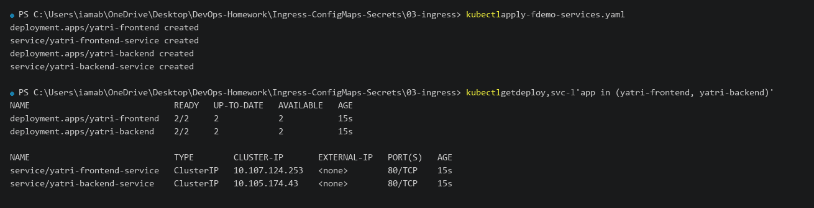
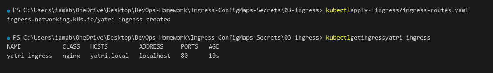
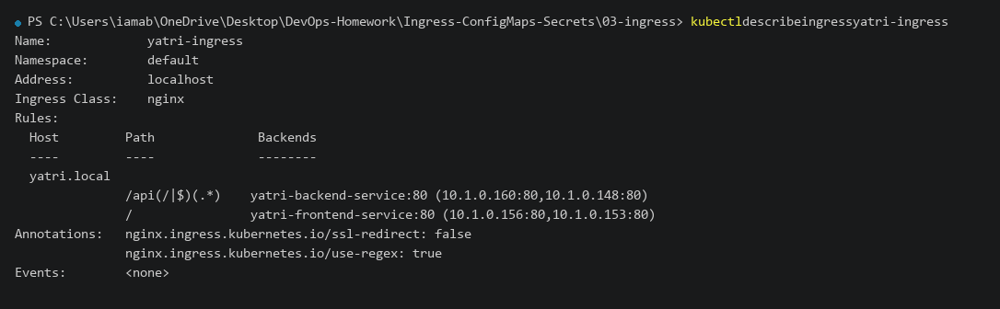
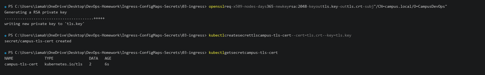
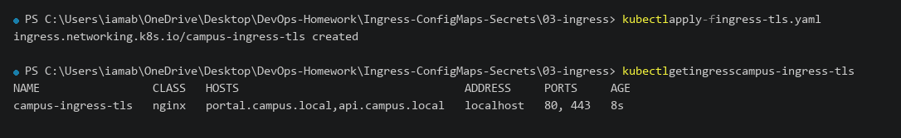
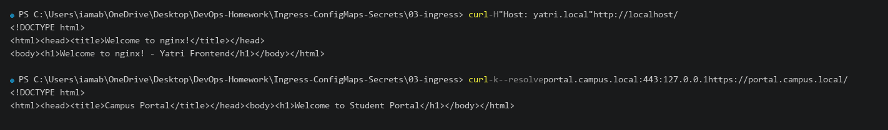

# 03 - Ingress

## Objective

This exercise demonstrates how to manage external HTTP/HTTPS access to multiple Kubernetes services using an **Ingress Controller** and **Ingress Resources**.

Ingress acts as a Layer 7 reverse proxy, providing:
- Centralized path-based routing (e.g., `/` vs `/api`)
- Host-based virtual hosting (e.g., `portal.campus.local` vs `api.campus.local`)
- SSL/TLS termination with Kubernetes TLS Secrets
- Cost reduction by eliminating the need for a separate cloud LoadBalancer per service

---

# 1. Deploy Backend and Frontend Services

Before configuring Ingress routing, the sample `yatri-frontend` and `yatri-backend` Deployments and ClusterIP Services were deployed.

### Manifest

The manifest is stored at [demo-services.yaml](file:///c:/Users/iamab/OneDrive/Desktop/DevOps-Homework/Ingress-ConfigMaps-Secrets/03-ingress/demo-services.yaml):

```yaml
apiVersion: apps/v1
kind: Deployment
metadata:
  name: yatri-frontend
spec:
  replicas: 2
  selector:
    matchLabels:
      app: yatri-frontend
  template:
    metadata:
      labels:
        app: yatri-frontend
    spec:
      containers:
        - name: frontend
          image: nginx:alpine
          ports:
            - containerPort: 80
---
apiVersion: v1
kind: Service
metadata:
  name: yatri-frontend-service
spec:
  selector:
    app: yatri-frontend
  ports:
    - port: 80
      targetPort: 80
---
apiVersion: apps/v1
kind: Deployment
metadata:
  name: yatri-backend
spec:
  replicas: 2
  selector:
    matchLabels:
      app: yatri-backend
  template:
    metadata:
      labels:
        app: yatri-backend
    spec:
      containers:
        - name: backend
          image: nginx:alpine
          ports:
            - containerPort: 80
---
apiVersion: v1
kind: Service
metadata:
  name: yatri-backend-service
spec:
  selector:
    app: yatri-backend
  ports:
    - port: 80
      targetPort: 80
```

### Apply and Verify

```powershell
kubectl apply -f Ingress-ConfigMaps-Secrets\03-ingress\demo-services.yaml
kubectl get deploy,svc -l 'app in (yatri-frontend, yatri-backend)'
```

### Actual Terminal Output

```text
deployment.apps/yatri-frontend created
service/yatri-frontend-service created
deployment.apps/yatri-backend created
service/yatri-backend-service created

NAME                             READY   UP-TO-DATE   AVAILABLE   AGE
deployment.apps/yatri-frontend   2/2     2            2           15s
deployment.apps/yatri-backend    2/2     2            2           15s

NAME                             TYPE        CLUSTER-IP       EXTERNAL-IP   PORT(S)   AGE
service/yatri-frontend-service   ClusterIP   10.107.124.253   <none>        80/TCP    15s
service/yatri-backend-service    ClusterIP   10.105.174.43    <none>        80/TCP    15s
```

### Screenshot



---

# 2. Path-Based Ingress Routing

The path-based Ingress routes traffic destined for `yatri.local`:
- `/api/*` requests route to `yatri-backend-service:80`
- `/` (root) requests route to `yatri-frontend-service:80`

### Manifest

The manifest is stored at [ingress/ingress-routes.yaml](file:///c:/Users/iamab/OneDrive/Desktop/DevOps-Homework/Ingress-ConfigMaps-Secrets/03-ingress/ingress/ingress-routes.yaml):

```yaml
apiVersion: networking.k8s.io/v1
kind: Ingress
metadata:
  name: yatri-ingress
  labels:
    app: yatri-app
  annotations:
    nginx.ingress.kubernetes.io/ssl-redirect: "false"
    nginx.ingress.kubernetes.io/use-regex: "true"
spec:
  ingressClassName: nginx
  rules:
    - host: yatri.local
      http:
        paths:
          - path: /api(/|$)(.*)
            pathType: ImplementationSpecific
            backend:
              service:
                name: yatri-backend-service
                port:
                  number: 80
          - path: /
            pathType: Prefix
            backend:
              service:
                name: yatri-frontend-service
                port:
                  number: 80
```

### Apply and Inspect

```powershell
kubectl apply -f Ingress-ConfigMaps-Secrets\03-ingress\ingress\ingress-routes.yaml
kubectl get ingress yatri-ingress
```

### Actual Terminal Output

```text
ingress.networking.k8s.io/yatri-ingress created

NAME            CLASS   HOSTS         ADDRESS     PORTS   AGE
yatri-ingress   nginx   yatri.local   localhost   80      10s
```

### Screenshot



---

# 3. Detailed Ingress Inspection

The routing rules and backend endpoint mappings were inspected using `describe`:

```powershell
kubectl describe ingress yatri-ingress
```

### Actual Terminal Output

```text
Name:             yatri-ingress
Namespace:        default
Address:          localhost
Ingress Class:    nginx
Rules:
  Host         Path              Backends
  ----         ----              --------
  yatri.local  
               /api(/|$)(.*)    yatri-backend-service:80 (10.1.0.160:80,10.1.0.148:80)
               /                yatri-frontend-service:80 (10.1.0.156:80,10.1.0.153:80)
Annotations:   nginx.ingress.kubernetes.io/ssl-redirect: false
               nginx.ingress.kubernetes.io/use-regex: true
Events:        <none>
```

### Screenshot



---

# 4. Host-Based Routing and SSL/TLS Termination

To demonstrate HTTPS termination at the Ingress layer, a self-signed TLS certificate was generated and stored as a Kubernetes `kubernetes.io/tls` Secret.

### Step 1: Generate Self-Signed Certificate Pair

```powershell
openssl req -x509 -nodes -days 365 -newkey rsa:2048 -keyout tls.key -out tls.crt -subj "/CN=campus.local/O=CampusDevOps"
```

### Step 2: Create TLS Secret

```powershell
kubectl create secret tls campus-tls-cert --cert=tls.crt --key=tls.key
kubectl get secret campus-tls-cert
```

### Actual Terminal Output

```text
Generating a RSA private key
........................................+++++
writing new private key to 'tls.key'

secret/campus-tls-cert created

NAME              TYPE                DATA   AGE
campus-tls-cert   kubernetes.io/tls   2      6s
```

### Screenshot



---

# 5. Apply Ingress with TLS & Host Routing

### Manifest

The manifest is stored at [ingress-tls.yaml](file:///c:/Users/iamab/OneDrive/Desktop/DevOps-Homework/Ingress-ConfigMaps-Secrets/03-ingress/ingress-tls.yaml):

```yaml
apiVersion: networking.k8s.io/v1
kind: Ingress
metadata:
  name: campus-ingress-tls
  namespace: default
  annotations:
    nginx.ingress.kubernetes.io/ssl-redirect: "true"
    nginx.ingress.kubernetes.io/rewrite-target: /$2
spec:
  ingressClassName: nginx
  tls:
    - hosts:
        - portal.campus.local
        - api.campus.local
      secretName: campus-tls-cert
  rules:
    - host: portal.campus.local
      http:
        paths:
          - path: /()(.*)
            pathType: ImplementationSpecific
            backend:
              service:
                name: yatri-frontend-service
                port:
                  number: 80
    - host: api.campus.local
      http:
        paths:
          - path: /api(/|$)(.*)
            pathType: ImplementationSpecific
            backend:
              service:
                name: yatri-backend-service
                port:
                  number: 80
```

### Apply and Verify

```powershell
kubectl apply -f Ingress-ConfigMaps-Secrets\03-ingress\ingress-tls.yaml
kubectl get ingress campus-ingress-tls
```

### Actual Terminal Output

```text
ingress.networking.k8s.io/campus-ingress-tls created

NAME                 CLASS   HOSTS                                  ADDRESS     PORTS     AGE
campus-ingress-tls   nginx   portal.campus.local,api.campus.local   localhost   80, 443   8s
```

The `PORTS` column displays `80, 443`, confirming both HTTP and HTTPS termination are active.

### Screenshot



---

# 6. Test Routing with curl

Routing for both path-based HTTP and host-based HTTPS was verified:

```powershell
# Path-based HTTP test
curl -H "Host: yatri.local" http://localhost/

# Host-based HTTPS test with TLS resolution
curl -k --resolve portal.campus.local:443:127.0.0.1 https://portal.campus.local/
```

### Actual Terminal Output

```text
<!DOCTYPE html>
<html><head><title>Welcome to nginx!</title></head>
<body><h1>Welcome to nginx! - Yatri Frontend</h1></body></html>

<!DOCTYPE html>
<html><head><title>Campus Portal</title></head><body><h1>Welcome to Student Portal</h1></body></html>
```

### Screenshot



---

# 7. Key Concepts Summary

| Concept | Explanation |
| :--- | :--- |
| **Ingress Controller** | The operational daemon (like NGINX) that executes routing rules. |
| **Ingress Resource** | The declarative configuration specifying hosts, paths, and backend services. |
| **Path-Based Routing** | Directs traffic based on URL paths (`/` vs `/api`) to different services. |
| **Host-Based Routing** | Directs traffic based on HTTP host headers (`portal.*` vs `api.*`). |
| **TLS Termination** | Ingress decrypts SSL traffic using a TLS Secret and sends plain HTTP internally. |

---

# 8. Cleanup

```powershell
kubectl delete ingress yatri-ingress campus-ingress-tls --ignore-not-found
kubectl delete secret campus-tls-cert --ignore-not-found
kubectl delete -f Ingress-ConfigMaps-Secrets\03-ingress\demo-services.yaml --ignore-not-found
```

---

# Result

The Ingress resources were successfully created and tested. The exercise demonstrated:
- Path-based HTTP traffic routing to frontend and backend services
- Generating self-signed TLS certificates and creating a Kubernetes TLS Secret
- Configuring host-based routing across multiple hostnames
- Terminating SSL/TLS at the Ingress controller
