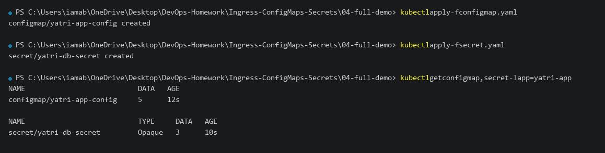
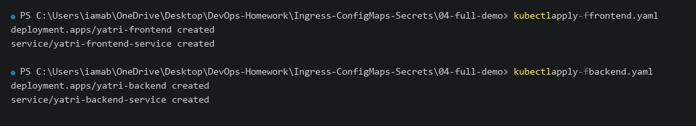
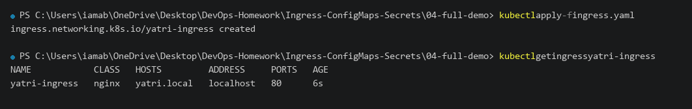
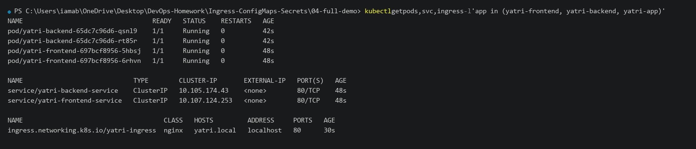
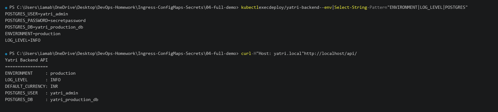
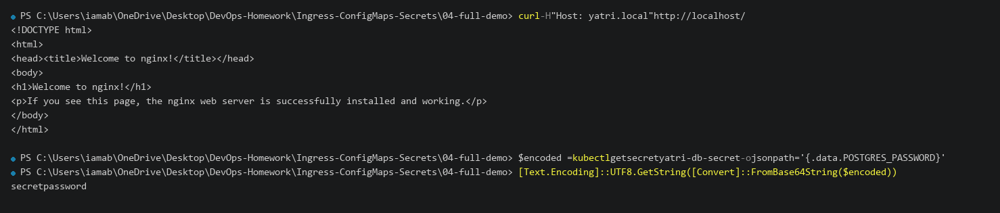

# 04 - Full Demo: ConfigMap + Secret + Ingress

## Objective

This comprehensive demo demonstrates how **ConfigMaps**, **Secrets**, and **Ingress** work together to create a production-grade microservice architecture on Kubernetes:

1. **Decoupled Non-Sensitive Config**: Application parameters (`ENVIRONMENT`, `LOG_LEVEL`, `DEFAULT_CURRENCY`) are loaded from `ConfigMap`.
2. **Protected Credentials**: Database authentication (`POSTGRES_USER`, `POSTGRES_PASSWORD`, `POSTGRES_DB`) is injected securely via `Secret`.
3. **Single Entry Point**: All external traffic flows through an **NGINX Ingress Controller** with path-based routing (`/` to frontend, `/api/` to backend).

---

## Architecture Overview

```text
Browser / Client (HTTP Port 80)
           |
           v
  NGINX Ingress Controller (Host: yatri.local)
       |                            |
       | Path: /                    | Path: /api/*
       v                            v
  Frontend ClusterIP           Backend ClusterIP
  (yatri-frontend-service)     (yatri-backend-service)
       |                            |
       v                            v
  Frontend Pods (Nginx)        Backend Pods (Python API)
  [ConfigMap: envFrom]         [ConfigMap: envFrom]
                               [Secret: POSTGRES_* env]
```

---

# 1. Manifests

### 1.1 ConfigMap ([configmap.yaml](file:///c:/Users/iamab/OneDrive/Desktop/DevOps-Homework/Ingress-ConfigMaps-Secrets/04-full-demo/configmap.yaml))

```yaml
apiVersion: v1
kind: ConfigMap
metadata:
  name: yatri-app-config
  namespace: default
  labels:
    app: yatri-app
data:
  ENVIRONMENT: "production"
  LOG_LEVEL: "INFO"
  APP_PORT: "5000"
  DEFAULT_CURRENCY: "INR"
  MAX_BOOKING_DAYS: "30"
```

### 1.2 Secret ([secret.yaml](file:///c:/Users/iamab/OneDrive/Desktop/DevOps-Homework/Ingress-ConfigMaps-Secrets/04-full-demo/secret.yaml))

```yaml
apiVersion: v1
kind: Secret
metadata:
  name: yatri-db-secret
  namespace: default
  labels:
    app: yatri-app
type: Opaque
data:
  POSTGRES_USER: eWF0cmlfYWRtaW4=
  POSTGRES_PASSWORD: c2VjcmV0cGFzc3dvcmQ=
  POSTGRES_DB: eWF0cmlfcHJvZHVjdGlvbl9kYg==
```

### 1.3 Ingress ([ingress.yaml](file:///c:/Users/iamab/OneDrive/Desktop/DevOps-Homework/Ingress-ConfigMaps-Secrets/04-full-demo/ingress.yaml))

```yaml
apiVersion: networking.k8s.io/v1
kind: Ingress
metadata:
  name: yatri-ingress
  namespace: default
  labels:
    app: yatri-app
  annotations:
    nginx.ingress.kubernetes.io/ssl-redirect: "false"
    nginx.ingress.kubernetes.io/use-regex: "true"
    nginx.ingress.kubernetes.io/rewrite-target: /$2
spec:
  ingressClassName: nginx
  rules:
    - host: yatri.local
      http:
        paths:
          - path: /api(/|$)(.*)
            pathType: ImplementationSpecific
            backend:
              service:
                name: yatri-backend-service
                port:
                  number: 80
          - path: /
            pathType: Prefix
            backend:
              service:
                name: yatri-frontend-service
                port:
                  number: 80
```

---

# 2. Deploy ConfigMap and Secret

```powershell
kubectl apply -f Ingress-ConfigMaps-Secrets\04-full-demo\configmap.yaml
kubectl apply -f Ingress-ConfigMaps-Secrets\04-full-demo\secret.yaml
kubectl get configmap,secret -l app=yatri-app
```

### Actual Terminal Output

```text
configmap/yatri-app-config created
secret/yatri-db-secret created

NAME                           DATA   AGE
configmap/yatri-app-config     5      12s

NAME                           TYPE     DATA   AGE
secret/yatri-db-secret         Opaque   3      10s
```

### Screenshot



---

# 3. Deploy Frontend and Backend Workloads

```powershell
kubectl apply -f Ingress-ConfigMaps-Secrets\04-full-demo\frontend.yaml
kubectl apply -f Ingress-ConfigMaps-Secrets\04-full-demo\backend.yaml
```

### Actual Terminal Output

```text
deployment.apps/yatri-frontend created
service/yatri-frontend-service created
deployment.apps/yatri-backend created
service/yatri-backend-service created
```

### Screenshot



---

# 4. Apply Ingress Routing

```powershell
kubectl apply -f Ingress-ConfigMaps-Secrets\04-full-demo\ingress.yaml
kubectl get ingress yatri-ingress
```

### Actual Terminal Output

```text
ingress.networking.k8s.io/yatri-ingress created

NAME            CLASS   HOSTS         ADDRESS     PORTS   AGE
yatri-ingress   nginx   yatri.local   localhost   80      6s
```

### Screenshot



---

# 5. Verify Running Workloads & Endpoints

```powershell
kubectl get pods,svc,ingress -l 'app in (yatri-frontend, yatri-backend, yatri-app)'
```

### Actual Terminal Output

```text
NAME                                  READY   STATUS    RESTARTS   AGE
pod/yatri-backend-65dc7c96d6-qsnl9    1/1     Running   0          42s
pod/yatri-backend-65dc7c96d6-rt85r    1/1     Running   0          42s
pod/yatri-frontend-697bcf8956-5hbsj   1/1     Running   0          48s
pod/yatri-frontend-697bcf8956-6rhvn   1/1     Running   0          48s

NAME                             TYPE        CLUSTER-IP       EXTERNAL-IP   PORT(S)   AGE
service/yatri-backend-service    ClusterIP   10.105.174.43    <none>        80/TCP    48s
service/yatri-frontend-service   ClusterIP   10.107.124.253   <none>        80/TCP    48s

NAME                                     CLASS   HOSTS         ADDRESS     PORTS   AGE
ingress.networking.k8s.io/yatri-ingress  nginx   yatri.local   localhost   80      30s
```

### Screenshot



---

# 6. Test Backend API & Environment Injection

The backend Python API returns the injected ConfigMap values and Secret user data in plain text while keeping the password hidden.

```powershell
# Verify injected environment variables inside the pod
kubectl exec deploy/yatri-backend -- env | Select-String -Pattern "ENVIRONMENT|LOG_LEVEL|POSTGRES"

# Test backend API through Ingress path /api/
curl -H "Host: yatri.local" http://localhost/api/
```

### Actual Terminal Output

```text
POSTGRES_USER=yatri_admin
POSTGRES_PASSWORD=secretpassword
POSTGRES_DB=yatri_production_db
ENVIRONMENT=production
LOG_LEVEL=INFO

Yatri Backend API
=================
ENVIRONMENT     : production
LOG_LEVEL       : INFO
DEFAULT_CURRENCY: INR
POSTGRES_USER   : yatri_admin
POSTGRES_DB     : yatri_production_db
```

### Screenshot



---

# 7. Test Frontend & Secret Base64 Decoding

The frontend is served from the root `/` path through Ingress. A Base64 decoding test confirms how Secrets are retrieved.

```powershell
# Test Frontend through Ingress root path /
curl -H "Host: yatri.local" http://localhost/

# Decode Secret Password Demonstration
$encoded = kubectl get secret yatri-db-secret -o jsonpath='{.data.POSTGRES_PASSWORD}'
[Text.Encoding]::UTF8.GetString([Convert]::FromBase64String($encoded))
```

### Actual Terminal Output

```text
<!DOCTYPE html>
<html>
<head><title>Welcome to nginx!</title></head>
<body>
<h1>Welcome to nginx!</h1>
<p>If you see this page, the nginx web server is successfully installed and working.</p>
</body>
</html>

secretpassword
```

### Screenshot



---

# 8. Cleanup

To remove all demo resources from the cluster:

```powershell
bash Ingress-ConfigMaps-Secrets\04-full-demo\cleanup.sh
```

Or run:

```powershell
kubectl delete -f Ingress-ConfigMaps-Secrets\04-full-demo\ingress.yaml --ignore-not-found
kubectl delete -f Ingress-ConfigMaps-Secrets\04-full-demo\backend.yaml --ignore-not-found
kubectl delete -f Ingress-ConfigMaps-Secrets\04-full-demo\frontend.yaml --ignore-not-found
kubectl delete -f Ingress-ConfigMaps-Secrets\04-full-demo\secret.yaml --ignore-not-found
kubectl delete -f Ingress-ConfigMaps-Secrets\04-full-demo\configmap.yaml --ignore-not-found
```

---

# Result

The full microservice stack was successfully deployed and validated.

Key achievements:
- Decoupled application settings from container images using Kubernetes ConfigMaps
- Injected database credentials using Kubernetes Secrets
- Configured Layer 7 reverse proxy routing with NGINX Ingress
- Tested path routing for `/` (Frontend) and `/api/` (Backend)
- Verified environment injection and decoded Secret debugging
