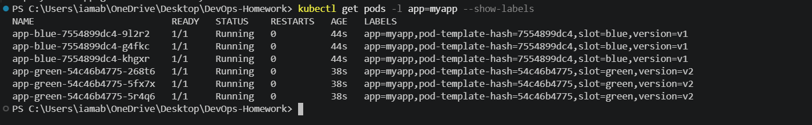
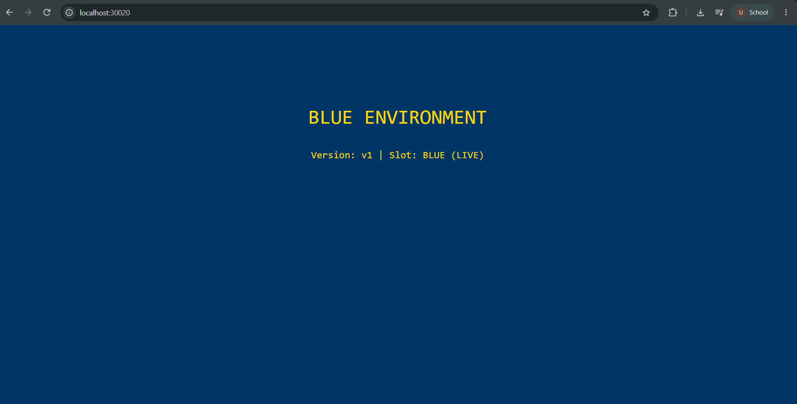
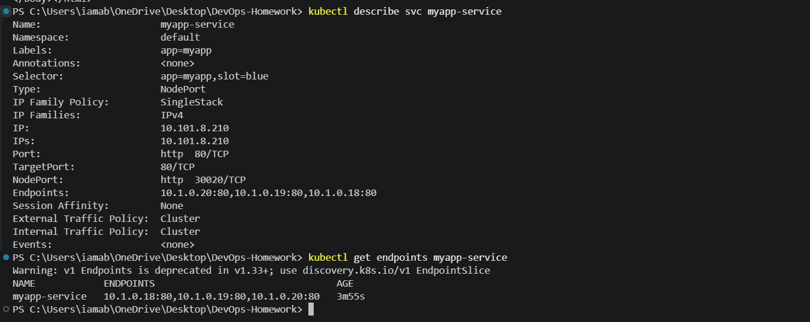
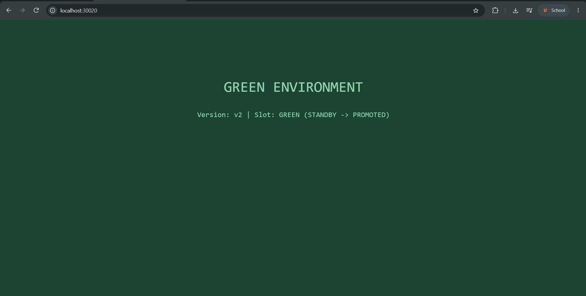
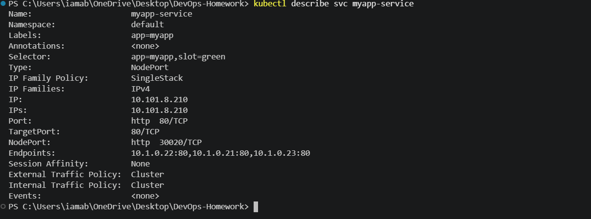

# Blue-Green Deployment Strategy

## Objective

Implement a Blue-Green deployment strategy in Kubernetes using two environments running simultaneously:

- **Blue** — Version 1 (`v1`), initially serving live traffic.
- **Green** — Version 2 (`v2`), initially running as standby.
- A Kubernetes **Service selector** is switched between `slot: blue` and `slot: green` to change which environment receives traffic.

This exercise was completed using **Docker Desktop Kubernetes**.

---

## Kubernetes Resources

| Resource | Purpose |
|---|---|
| `app-blue` | Blue deployment with 3 replicas running v1 |
| `app-green` | Green deployment with 3 replicas running v2 |
| `myapp-service` | NodePort service used to switch traffic |
| NodePort `30020` | Application access |

---

# Step 1 — Deploy Both Environments

Commands:

```powershell
kubectl apply -f K8s-Core-Objects/02-blue-green/deployment-blue.yaml
kubectl apply -f K8s-Core-Objects/02-blue-green/deployment-green.yaml
kubectl rollout status deployment/app-blue
kubectl rollout status deployment/app-green
kubectl get pods -l app=myapp --show-labels
```

Both deployments rolled out successfully.

### Actual Pod Output

Six pods were running simultaneously:

- 3 Blue pods: `slot=blue`, `version=v1`
- 3 Green pods: `slot=green`, `version=v2`

All pods were `1/1 Running`.

### Screenshot



---

# Step 2 — Point Service to BLUE

The Service was configured to select the Blue environment.

Command:

```powershell
kubectl apply -f K8s-Core-Objects/02-blue-green/service-blue.yaml
```

Output:

```text
service/myapp-service created
```

The application was tested using Docker Desktop:

```powershell
curl.exe http://localhost:30020
```

The application returned:

```text
BLUE ENVIRONMENT
Version: v1 | Slot: BLUE (LIVE)
```

### Screenshot



---

# Step 3 — Verify BLUE Service Selector and Endpoints

The Service configuration was checked using:

```powershell
kubectl describe svc myapp-service
```

The selector was:

```text
Selector: app=myapp,slot=blue
```

The endpoints were checked using:

```powershell
kubectl get endpoints myapp-service
```

Actual Blue endpoints:

```text
10.1.0.18:80
10.1.0.19:80
10.1.0.20:80
```

Therefore, the Service was routing traffic to the three Blue pods.

> Note: Kubernetes displayed a warning that the v1 `Endpoints` API is deprecated in Kubernetes 1.33+. This is only a deprecation warning; the command returned the expected endpoints.

### Screenshot



---

# Step 4 — Switch Traffic from BLUE to GREEN

The Service selector was changed from Blue to Green.

Command:

```powershell
kubectl apply -f K8s-Core-Objects/02-blue-green/service-green.yaml
```

The Service was successfully configured.

The application was then tested:

```powershell
curl.exe http://localhost:30020
```

The response changed to:

```text
GREEN ENVIRONMENT
Version: v2 | Slot: GREEN (STANDBY -> PROMOTED)
```

The Service was verified with:

```powershell
kubectl describe svc myapp-service
```

The selector became:

```text
Selector: app=myapp,slot=green
```

The Green environment therefore became the live environment.

### Screenshot



---

# Step 5 — Verify GREEN Endpoints

The Service endpoints were checked again:

```powershell
kubectl get endpoints myapp-service
```

Actual Green endpoints:

```text
10.1.0.21:80
10.1.0.22:80
10.1.0.23:80
```

The endpoints changed from the Blue pod IPs to the Green pod IPs, confirming that the Service was routing traffic to Green.

### Screenshot



---

# Step 6 — Rollback GREEN to BLUE

The Service was switched back to Blue:

```powershell
kubectl apply -f K8s-Core-Objects/02-blue-green/service-blue.yaml
```

The application was checked again at:

```text
http://localhost:30020
```

The response returned to:

```text
BLUE ENVIRONMENT
Version: v1 | Slot: BLUE (LIVE)
```

The Service selector was also changed back to:

```text
Selector: app=myapp,slot=blue
```

This demonstrated that traffic could be switched back to the previous version without recreating the deployments.

### Screenshot


---

# Final State

After completing the Blue-Green deployment exercise:

```text
                    Kubernetes Service
                         :30020
                            |
                            v
                    slot = blue
                            |
             +--------------+--------------+
             |              |              |
          BLUE v1         BLUE v1        BLUE v1
           LIVE            LIVE           LIVE

          GREEN v2       GREEN v2       GREEN v2
          STANDBY        STANDBY        STANDBY
```

The exercise demonstrated:

1. Running Blue and Green environments simultaneously.
2. Routing traffic to Blue v1.
3. Verifying Blue service selectors and endpoints.
4. Switching traffic to Green v2 by changing the Service selector.
5. Verifying the Green endpoints.
6. Rolling traffic back to Blue v1.

---

## Files

```text
02-blue-green/
├── README.md
├── deployment-blue.yaml
├── deployment-green.yaml
├── service-blue.yaml
├── service-green.yaml
└── screenshots/
    ├── step-1-six-pods-running.png
    ├── step-2-blue-environment-live.png
    ├── step-3-blue-selector-endpoints.png
    ├── step-4-green-switch.png
    ├── step-5-green-endpoints.png
    └── step-6-rollback-to-blue.png
```
