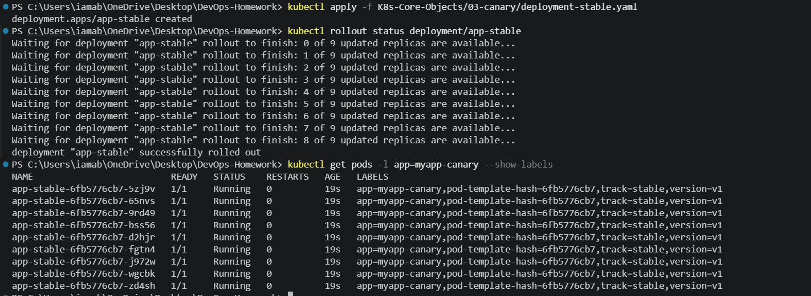
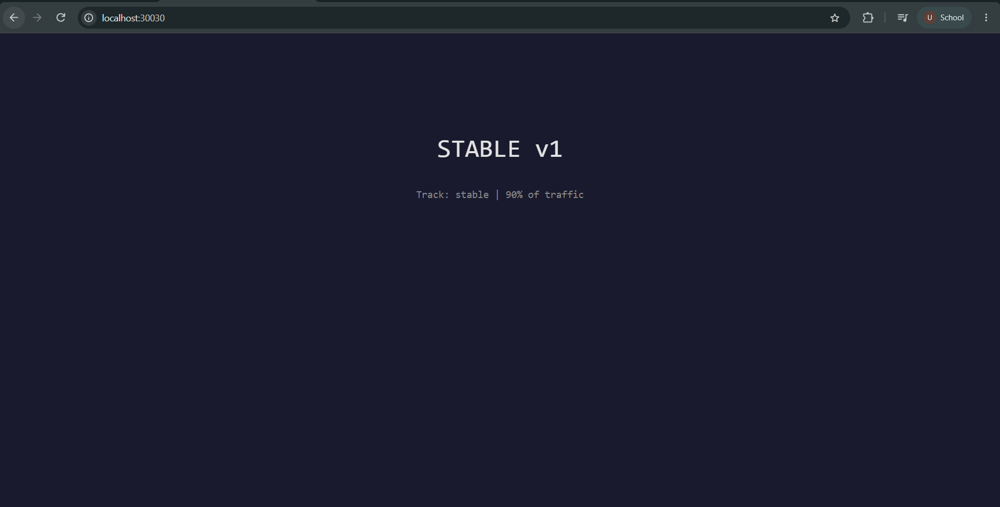
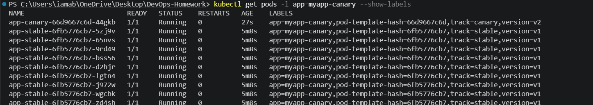
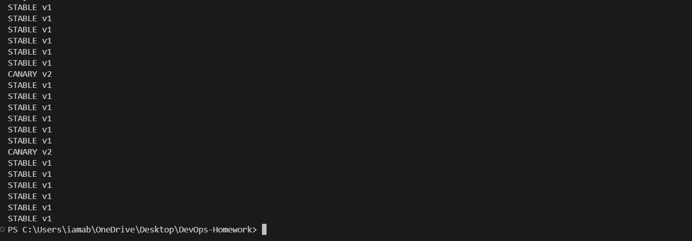
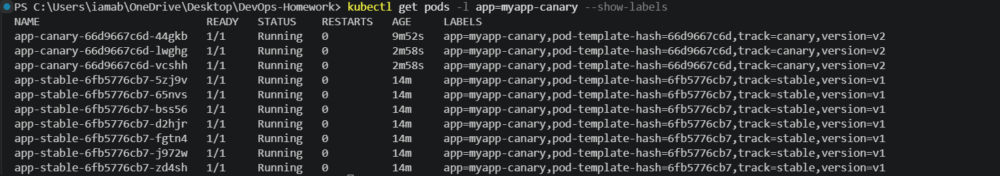
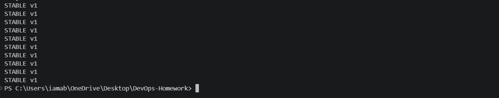
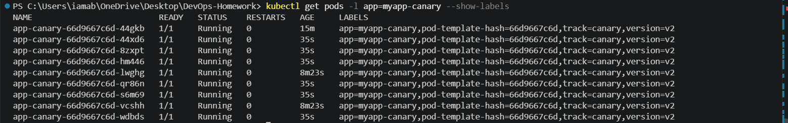
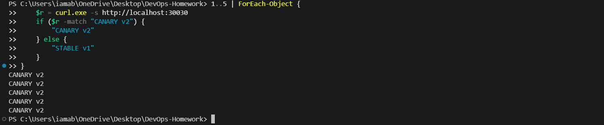

# Canary Deployment Strategy

## Objective

Implement a Kubernetes Canary Deployment strategy where traffic is gradually shifted from a stable version (v1) to a canary version (v2).

The deployment was tested in the following stages:

- 90% Stable v1 + 10% Canary v2
- Approximately 30% Canary v2
- 100% Canary v2
- Traffic verification at each stage

**Environment:** Docker Desktop Kubernetes  
**NodePort:** `30030`  
**Application URL:** `http://localhost:30030`

---

## Project Structure

```text
03-canary/
├── deployment-stable.yaml
├── deployment-canary.yaml
├── service.yaml
├── README.md
└── screenshots/
    ├── step-1-nine-stable-pods.png
    ├── step-2-stable-v1-live.png
    ├── step-3-nine-stable-one-canary.png
    ├── step-4-canary-traffic-test.png
    ├── step-5-thirty-percent-canary.png
    ├── step-6-thirty-percent-traffic.png
    ├── step-7-canary-100-percent.png
    └── step-8-canary-100-percent-traffic.png
```

---

## Step 1: Deploy Stable Version

The stable deployment was created with 9 replicas running version v1.

### Commands

```powershell
kubectl apply -f K8s-Core-Objects/03-canary/deployment-stable.yaml
kubectl rollout status deployment/app-stable
kubectl get pods -l app=myapp-canary --show-labels
```

### Result

9 stable v1 pods were successfully created and all pods were running.

- Stable pods: 9
- Version: v1
- Track: stable
- Status: Running

### Screenshot



---

## Step 2: Create Service

The Kubernetes Service was created to expose the application through NodePort `30030`.

### Command

```powershell
kubectl apply -f K8s-Core-Objects/03-canary/service.yaml
```

The application was accessed using:

```text
http://localhost:30030
```

### Result

The stable version was serving traffic:

```text
STABLE v1
Track: stable | 90% of traffic
```

### Screenshot



---

## Step 3: Deploy Canary Version

The canary deployment was created with 1 replica running version v2.

At this stage there were:

- 9 Stable v1 pods
- 1 Canary v2 pod

### Commands

```powershell
kubectl apply -f K8s-Core-Objects/03-canary/deployment-canary.yaml
kubectl rollout status deployment/app-canary
kubectl get pods -l app=myapp-canary --show-labels
```

### Pod Ratio

```text
Stable : 9 pods
Canary : 1 pod

Canary ratio ≈ 10%
```

### Screenshot



---

## Step 4: Test Canary Traffic

20 requests were sent to the application.

### Command

```powershell
1..20 | ForEach-Object {
    $r = curl.exe -s http://localhost:30030
    if ($r -match "CANARY v2") {
        "CANARY v2"
    } else {
        "STABLE v1"
    }
}
```

### Result

```text
STABLE v1 - 18 requests
CANARY v2 - 2 requests
```

Observed distribution:

```text
Stable: 18/20 ≈ 90%
Canary:  2/20 ≈ 10%
```

### Screenshot



---

## Step 5: Increase Canary to Approximately 30%

The canary deployment was scaled to 3 replicas and the stable deployment was reduced to 7 replicas.

### Commands

```powershell
kubectl scale deployment app-canary --replicas=3
kubectl scale deployment app-stable --replicas=7
kubectl get pods -l app=myapp-canary --show-labels
kubectl get endpoints myapp-canary-service
kubectl rollout status deployment/app-stable
kubectl get pods -l app=myapp-canary --show-labels
```

### Result

```text
Stable v1 : 7 pods
Canary v2 : 3 pods
Total     : 10 pods
```

### Pod Ratio

```text
Stable: 7/10 ≈ 70%
Canary: 3/10 ≈ 30%
```

### Screenshot



---

## Step 6: Test Approximately 30% Canary Traffic

10 requests were sent to the application.

### Result

```text
STABLE v1 - 8 requests
CANARY v2 - 2 requests
```

Observed distribution:

```text
Stable: 8/10 ≈ 80%
Canary: 2/10 ≈ 20%
```

The traffic distribution is approximate because individual request samples can vary.

### Screenshot



---

## Step 7: Promote Canary to 100%

The canary version was promoted by scaling the canary deployment to 9 replicas and the stable deployment to 0 replicas.

### Commands

```powershell
kubectl scale deployment app-canary --replicas=9
kubectl scale deployment app-stable --replicas=0
kubectl rollout status deployment/app-canary
kubectl get pods -l app=myapp-canary --show-labels
```

### Result

```text
Stable v1 : 0 pods
Canary v2 : 9 pods
```

All running application pods were Canary v2.

### Screenshot



---

## Step 8: Verify 100% Canary Traffic

After promoting the canary deployment, 5 requests were sent to the application.

### Command

```powershell
1..5 | ForEach-Object {
    $r = curl.exe -s http://localhost:30030
    if ($r -match "CANARY v2") {
        "CANARY v2"
    } else {
        "STABLE v1"
    }
}
```

### Result

```text
CANARY v2
CANARY v2
CANARY v2
CANARY v2
CANARY v2
```

All 5 requests were served by Canary v2.

```text
5/5 = 100% Canary responses
```

### Screenshot



---

## Canary Deployment Flow

```text
                Stable v1
                   |
                   v
            9 Stable Pods
                   |
                   v
       +-----------------------+
       | 9 Stable + 1 Canary  |
       |    ~10% Canary       |
       +-----------------------+
                   |
                   v
       +-----------------------+
       | 7 Stable + 3 Canary  |
       |    ~30% Canary       |
       +-----------------------+
                   |
                   v
       +-----------------------+
       | 0 Stable + 9 Canary  |
       |    100% Canary       |
       +-----------------------+
                   |
                   v
             Canary v2
          Fully Promoted
```

---

## Summary

| Stage | Stable v1 | Canary v2 | Traffic Test |
|---|---:|---:|---|
| Initial | 9 | 0 | Stable v1 |
| Canary Introduction | 9 | 1 | 18 Stable / 2 Canary |
| Canary Increase | 7 | 3 | 8 Stable / 2 Canary |
| Final Promotion | 0 | 9 | 5 Canary / 5 |

---

## Kubernetes Resources

### Deployments

```text
app-stable
app-canary
```

### Service

```text
myapp-canary-service
```

### Service Type

```text
NodePort
```

### NodePort

```text
30030
```

### Application URL

```text
http://localhost:30030
```

---

## Screenshots

### Step 1 — Nine Stable Pods


### Step 2 — Stable v1 Live


### Step 3 — Nine Stable + One Canary


### Step 4 — Canary Traffic Test


### Step 5 — Approximately 30% Canary


### Step 6 — 30% Traffic Test


### Step 7 — Canary 100% Promotion


### Step 8 — 100% Canary Traffic Verification


---

## Conclusion

The Kubernetes Canary Deployment strategy was successfully implemented.

The application was initially served by Stable v1, followed by the introduction of Canary v2 with a small number of replicas. The canary deployment was then increased to approximately 30% of the pod pool and finally promoted to 100%.

Traffic tests confirmed the gradual transition, with the final verification showing all 5 requests being served by Canary v2.
