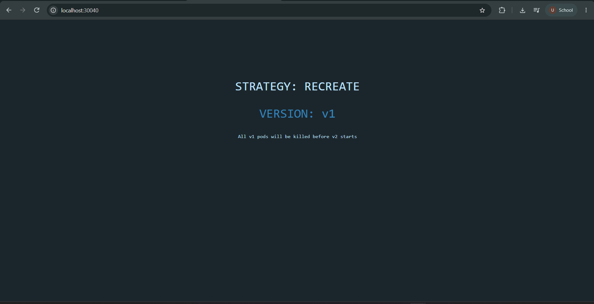
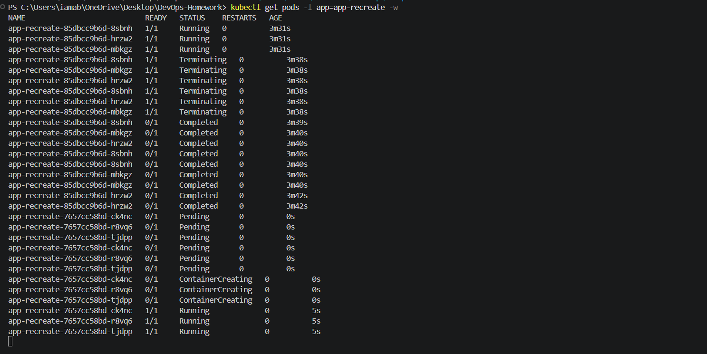
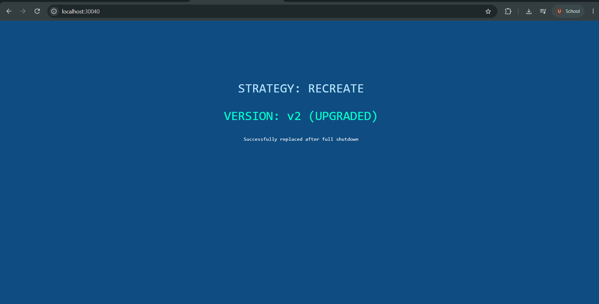

# Recreate Deployment Strategy

## Objective

Demonstrate the Kubernetes **Recreate deployment strategy** using three replicas.

With `strategy: Recreate`, Kubernetes terminates all existing v1 pods before creating the new v2 pods. This means there can be a short period with no running application pods during the update.

**Environment:** Docker Desktop Kubernetes  
**Service Type:** NodePort  
**NodePort:** `30040`  
**Application URL:** `http://localhost:30040`

---

## What is the Recreate Strategy?

The Recreate strategy is an all-or-nothing deployment approach.

During an update:

1. Kubernetes terminates the existing v1 pods.
2. Kubernetes waits until the old pods have stopped.
3. The new v2 pods are created.
4. The application becomes available again after the v2 pods are running.

This differs from a RollingUpdate because the old and new versions are not intended to run simultaneously during the replacement.

---

## Project Structure

```text
04-recreate/
├── deployment-v1.yaml
├── deployment-v2.yaml
├── service.yaml
├── README.md
└── screenshots/
    ├── step-1-version-1-running.png
    ├── step-2-recreate-pod-transition.png
    └── step-3-version-2-running.png
```

---

## Step 1: Deploy Version 1

The initial deployment was created with 3 replicas using version v1.

### Commands

```powershell
kubectl apply -f K8s-Core-Objects/04-recreate/deployment-v1.yaml
kubectl apply -f K8s-Core-Objects/04-recreate/service.yaml
kubectl rollout status deployment/app-recreate
kubectl get pods -l app=app-recreate --show-labels
```

### Result

The deployment successfully rolled out with 3 running v1 pods.

```text
app-recreate-85dbcc9b6d-8sbnh   1/1   Running   0
app-recreate-85dbcc9b6d-hrzw2   1/1   Running   0
app-recreate-85dbcc9b6d-mbkgz   1/1   Running   0
```

All three pods had:

```text
app=app-recreate
version=v1
```

### Application Verification

```powershell
curl.exe http://localhost:30040
```

The application returned:

```text
STRATEGY: RECREATE
VERSION: v1
All v1 pods will be killed before v2 starts
```

### Screenshot



---

## Step 2: Trigger the Recreate Update

The v2 deployment was applied while watching the pods in real time.

### Terminal 1 — Watch Pods

```powershell
kubectl get pods -l app=app-recreate -w
```

### Terminal 2 — Apply Version 2

```powershell
kubectl apply -f K8s-Core-Objects/04-recreate/deployment-v2.yaml
```

### Observed Pod Transition

The actual pod watch output showed the following sequence:

```text
v1 pods
    ↓
Running
    ↓
Terminating
    ↓
Completed
    ↓
v2 pods
    ↓
Pending
    ↓
ContainerCreating
    ↓
Running
```

The actual output included the v1 pods entering `Terminating` and `Completed` states before the v2 pods appeared:

```text
app-recreate-85dbcc9b6d-8sbnh   1/1   Terminating
app-recreate-85dbcc9b6d-mbkgz   1/1   Terminating
app-recreate-85dbcc9b6d-hrzw2   1/1   Terminating

app-recreate-7657cc58bd-ck4nc   0/1   Pending
app-recreate-7657cc58bd-r8vq6   0/1   Pending
app-recreate-7657cc58bd-tjdpp   0/1   Pending

app-recreate-7657cc58bd-ck4nc   0/1   ContainerCreating
app-recreate-7657cc58bd-r8vq6   0/1   ContainerCreating
app-recreate-7657cc58bd-tjdpp   0/1   ContainerCreating

app-recreate-7657cc58bd-ck4nc   1/1   Running
app-recreate-7657cc58bd-r8vq6   1/1   Running
app-recreate-7657cc58bd-tjdpp   1/1   Running
```

This demonstrates the Recreate behavior: the v1 pods were terminated before the v2 pods became running.

### Screenshot



---

## Step 3: Verify Version 2

After the Recreate update, the deployment was checked to confirm that all three pods were running version v2.

### Commands

```powershell
kubectl rollout status deployment/app-recreate
kubectl get pods -l app=app-recreate --show-labels
```

### Result

The deployment successfully rolled out.

All three running pods had `version=v2`:

```text
app-recreate-7657cc58bd-ck4nc   1/1   Running   0   app=app-recreate,pod-template-hash=7657cc58bd,version=v2
app-recreate-7657cc58bd-r8vq6   1/1   Running   0   app=app-recreate,pod-template-hash=7657cc58bd,version=v2
app-recreate-7657cc58bd-tjdpp   1/1   Running   0   app=app-recreate,pod-template-hash=7657cc58bd,version=v2
```

### Application Verification

```powershell
curl.exe http://localhost:30040
```

The application returned:

```text
STRATEGY: RECREATE
VERSION: v2 (UPGRADED)
Successfully replaced after full shutdown
```

### Screenshot



---

## Recreate Deployment Flow

```text
          Version 1
       3 Running Pods
             |
             | Apply deployment-v2.yaml
             v
     3 v1 Pods Terminating
             |
             v
       Old Pods Stopped
             |
             v
       3 v2 Pods Pending
             |
             v
    ContainerCreating
             |
             v
       3 v2 Pods Running
             |
             v
        Version 2 Live
```

---

## Strategy Characteristics

The Recreate strategy intentionally allows an outage during the replacement process because the old pods are terminated before the new pods are started.

Typical situations where this strategy can be useful include:

- Applications where v1 and v2 cannot safely run simultaneously.
- Database schema changes that require the old application to stop before the new version starts.
- Applications using storage that cannot be mounted by multiple instances at the same time.
- Legacy or stateful applications that require a single active version.
- Development or staging environments where additional temporary pods are undesirable.

---

## Kubernetes Resources

### Deployment

```text
app-recreate
```

### Service

```text
app-recreate-service
```

### Replicas

```text
3
```

### Strategy

```text
Recreate
```

### Container Images

```text
Version 1: nginx:1.24-alpine
Version 2: nginx:1.25-alpine
```

### NodePort

```text
30040
```

### Application URL

```text
http://localhost:30040
```

---

## Screenshots

### Step 1 — Version 1 Running


### Step 2 — Recreate Pod Transition


### Step 3 — Version 2 Running


---

## Conclusion

The Kubernetes Recreate deployment strategy was successfully demonstrated.

The application started with three Stable v1 pods. When the v2 deployment was applied, the three v1 pods were terminated before the new v2 pods were created. The new v2 pods then progressed through `Pending`, `ContainerCreating`, and `Running` states.

The final verification confirmed that all three application pods were running version v2 and that the application was successfully serving the upgraded version through NodePort `30040`.
