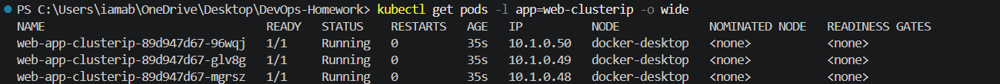
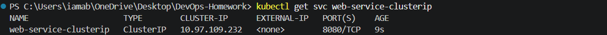
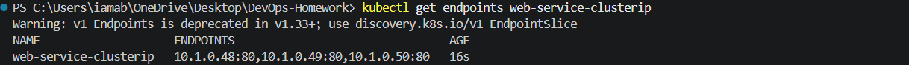
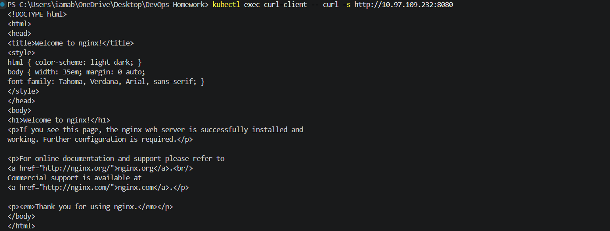
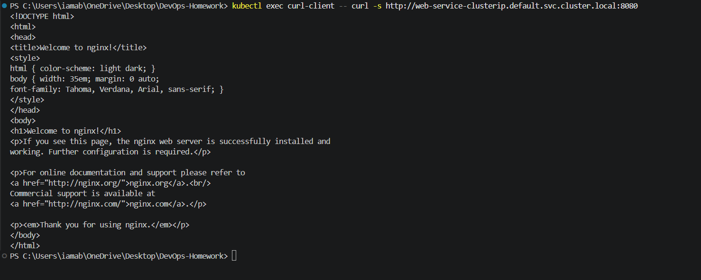

# 01 - ClusterIP Service

This exercise demonstrates how a Kubernetes **ClusterIP Service** provides stable internal access to a group of Pods.

The implementation was performed using **Docker Desktop Kubernetes** and `kubectl`.

---

## 1. Objective

The goal was to:

- Create an NGINX Deployment with 3 replicas.
- Expose the Deployment using a ClusterIP Service.
- Verify that the Service has endpoints for all 3 Pods.
- Test Service access from inside the Kubernetes cluster.
- Test access using the Service name.
- Test access using the Service ClusterIP.
- Test access using the Kubernetes Service FQDN.
- Clean up the temporary resources after verification.

---

# 2. Repository Structure

```text
01-clusterip/
├── app-deployment.yaml
├── service.yaml
├── client-pod.yaml
├── screenshots/
│   ├── 01-pods-running.png
│   ├── 02-clusterip-service.png
│   ├── 03-service-endpoints.png
│   ├── 04-clusterip-service-name-test.png
│   └── 05-clusterip-fqdn-test.png
└── README.md
```

---

# 3. Step 1 - Create the NGINX Deployment

The Deployment creates 3 NGINX replicas.

### `app-deployment.yaml`

```yaml
apiVersion: apps/v1
kind: Deployment
metadata:
  name: web-app-clusterip
  labels:
    app: web-clusterip
spec:
  replicas: 3
  selector:
    matchLabels:
      app: web-clusterip
  template:
    metadata:
      labels:
        app: web-clusterip
    spec:
      containers:
        - name: nginx-web
          image: nginx:1.25-alpine
          ports:
            - containerPort: 80
          resources:
            requests:
              cpu: "50m"
              memory: "64Mi"
            limits:
              cpu: "100m"
              memory: "128Mi"
```

### Apply the Deployment

```powershell
kubectl apply -f Kubernetes-Services/01-clusterip/app-deployment.yaml
```

### Verify the Pods

```powershell
kubectl get pods -l app=web-clusterip -o wide
```

Three Pods were created and reached the `Running` state.

### Evidence



---

# 4. Step 2 - Create the ClusterIP Service

The Service exposes the NGINX Pods internally on port `8080` and forwards traffic to container port `80`.

### `service.yaml`

```yaml
apiVersion: v1
kind: Service
metadata:
  name: web-service-clusterip
  labels:
    app: web-clusterip
spec:
  type: ClusterIP
  selector:
    app: web-clusterip
  ports:
    - name: http
      port: 8080
      targetPort: 80
      protocol: TCP
```

### Apply the Service

```powershell
kubectl apply -f Kubernetes-Services/01-clusterip/service.yaml
```

### Verify the Service

```powershell
kubectl get svc web-service-clusterip
```

The Service was created with:

```text
TYPE        ClusterIP
CLUSTER-IP  10.97.109.232
PORT        8080/TCP
```

### Evidence



---

# 5. Step 3 - Verify Service Endpoints

The Service selector matches the Pods labelled `app=web-clusterip`.

The endpoints were checked using:

```powershell
kubectl get endpoints web-service-clusterip
```

The Service resolved to the following Pod endpoints:

```text
10.1.0.48:80
10.1.0.49:80
10.1.0.50:80
```

A Kubernetes warning indicated that the legacy `Endpoints` API is deprecated in Kubernetes v1.33+ and that `EndpointSlice` should be used for newer implementations. The command nevertheless successfully displayed the active endpoints used by this exercise.

### Evidence



---

# 6. Step 4 - Create the Internal Client Pod

A temporary curl client Pod was created so that the ClusterIP Service could be tested from **inside the Kubernetes cluster**.

### `client-pod.yaml`

```yaml
apiVersion: v1
kind: Pod
metadata:
  name: curl-client
spec:
  containers:
    - name: curl
      image: curlimages/curl:8.10.1
      command:
        - sleep
        - "3600"
```

### Apply the Client Pod

```powershell
kubectl apply -f Kubernetes-Services/01-clusterip/client-pod.yaml
```

### Verify the Client Pod

```powershell
kubectl get pod curl-client
```

The Pod initially remained in `ContainerCreating` while the image was being pulled and then reached:

```text
curl-client   1/1   Running
```

---

# 7. Step 5 - Test Using the Service Name

The Service was accessed from the curl client using its Kubernetes DNS name:

```powershell
kubectl exec curl-client -- curl -s http://web-service-clusterip:8080
```

The request returned the NGINX welcome page:

```text
<h1>Welcome to nginx!</h1>
```

This confirms that Kubernetes DNS resolved `web-service-clusterip` and that the Service successfully routed the request to one of the NGINX Pods.

### Evidence



---

# 8. Step 6 - Test Using the ClusterIP Address

The actual ClusterIP assigned to the Service was:

```text
10.97.109.232
```

The Service was tested from the curl client using:

```powershell
kubectl exec curl-client -- curl -s http://10.97.109.232:8080
```

The request successfully returned the NGINX welcome page.

This confirms that the ClusterIP address provides internal access to the Service.

---

# 9. Step 7 - Test Using the Kubernetes Service FQDN

The Service was also tested using its fully qualified Kubernetes DNS name:

```powershell
kubectl exec curl-client -- curl -s http://web-service-clusterip.default.svc.cluster.local:8080
```

The request successfully returned the NGINX welcome page.

### Evidence



---

# 10. Why the Service Name Was Not Opened Directly in Chrome

The address:

```text
http://web-service-clusterip:8080
```

was not directly accessible from the Windows Chrome browser.

This is expected because `web-service-clusterip` is a Kubernetes internal DNS name. It is resolvable from workloads inside the Kubernetes cluster, such as the `curl-client` Pod.

The successful `kubectl exec` tests demonstrate the intended internal ClusterIP access.

---

# 11. ClusterIP Request Flow

```text
curl-client Pod
      |
      | HTTP request
      v
web-service-clusterip:8080
      |
      | Service forwards to targetPort 80
      v
+-------------------------------+
| Kubernetes Service            |
| ClusterIP: 10.97.109.232     |
+-------------------------------+
      |
      +----------+----------+
      |          |          |
      v          v          v
   NGINX Pod  NGINX Pod  NGINX Pod
   10.1.0.48  10.1.0.49  10.1.0.50
```

---

# 12. Important Service Configuration

| Setting | Value |
|---|---|
| Service Name | `web-service-clusterip` |
| Service Type | `ClusterIP` |
| ClusterIP | `10.97.109.232` |
| Service Port | `8080` |
| Target Port | `80` |
| Protocol | TCP |
| Backend Replicas | 3 |
| Container Image | `nginx:1.25-alpine` |

---

# 13. Cleanup

After all evidence was captured, the temporary resources were removed.

### Delete the Client Pod

```powershell
kubectl delete -f Kubernetes-Services/01-clusterip/client-pod.yaml
```

Output:

```text
pod "curl-client" deleted from default namespace
```

### Delete the Service

```powershell
kubectl delete -f Kubernetes-Services/01-clusterip/service.yaml
```

Output:

```text
service "web-service-clusterip" deleted from default namespace
```

### Delete the Deployment

```powershell
kubectl delete -f Kubernetes-Services/01-clusterip/app-deployment.yaml
```

Output:

```text
deployment.apps "web-app-clusterip" deleted from default namespace
```

The screenshots and YAML files were retained as assignment evidence.

---

# 14. Final Verification

After cleanup, the existing Kubernetes workloads from previous sessions remained running.

The ClusterIP resources created specifically for this exercise were successfully removed.

The final Service list contained the previously created services:

```text
app-recreate-service
app-rolling-service
kubernetes
myapp-canary-service
myapp-service
```

The temporary `web-service-clusterip` Service was no longer present.

---

# 15. What Was Learned

This exercise demonstrated:

- A `ClusterIP` Service provides internal cluster networking.
- A Service uses a selector to identify backend Pods.
- A Service can expose a different port from the container's target port.
- Kubernetes DNS allows Pods to access Services by name.
- Kubernetes Services can also be accessed using their ClusterIP.
- The full Service FQDN follows the Kubernetes DNS pattern:
  `service.namespace.svc.cluster.local`
- ClusterIP DNS names are intended for internal cluster communication.
- A temporary client Pod can be used to test internal Service connectivity.

---

# 16. Conclusion

The ClusterIP Service was successfully deployed and tested using Docker Desktop Kubernetes.

Three NGINX Pods were created and exposed through the `web-service-clusterip` Service. Connectivity was successfully verified using the Service name, the assigned ClusterIP address `10.97.109.232`, and the Kubernetes Service FQDN.

After verification, the temporary Deployment, Service, and curl client Pod were cleaned up while all evidence files were retained.
