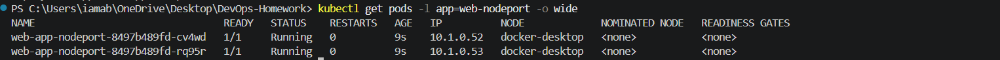
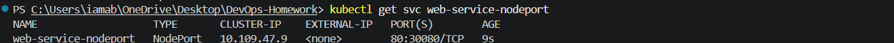
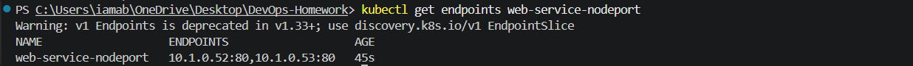
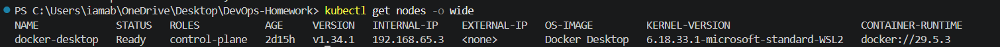
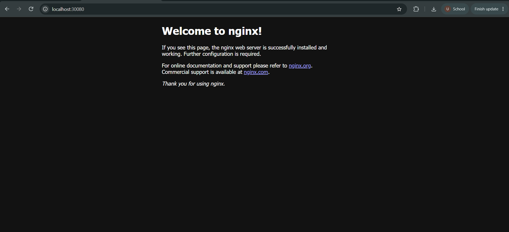

# 02 - NodePort Service

This exercise demonstrates how a Kubernetes **NodePort Service** exposes an application outside the Kubernetes cluster through a port on the node.

The implementation was performed using **Docker Desktop Kubernetes** and `kubectl`.

---

## 1. Objective

The goal was to:

- Create an NGINX Deployment with 2 replicas.
- Expose the Deployment using a NodePort Service.
- Verify that the Service has endpoints for both Pods.
- Verify the Docker Desktop Kubernetes node.
- Access the application through NodePort `30080`.
- Confirm the application is reachable from the Windows host.
- Clean up the temporary resources after verification.

---

# 2. Repository Structure

```text
02-nodeport/
├── app-deployment.yaml
├── service.yaml
├── screenshots/
│   ├── 01-nodeport-pods-running.png
│   ├── 02-nodeport-service.png
│   ├── 03-nodeport-endpoints.png
│   ├── 04-nodeport-node-info.png
│   └── 05-nodeport-application-test.png
└── README.md
```

---

# 3. Step 1 - Create the NGINX Deployment

The Deployment creates 2 NGINX replicas.

### `app-deployment.yaml`

```yaml
apiVersion: apps/v1
kind: Deployment
metadata:
  name: web-app-nodeport
  labels:
    app: web-nodeport
spec:
  replicas: 2
  selector:
    matchLabels:
      app: web-nodeport
  template:
    metadata:
      labels:
        app: web-nodeport
    spec:
      containers:
        - name: web-server
          image: nginx:1.25-alpine
          ports:
            - containerPort: 80
          resources:
            requests:
              cpu: "50m"
              memory: "64Mi"
            limits:
              cpu: "100m"
              memory: "128Mi"
```

### Apply the Deployment

```powershell
kubectl apply -f Kubernetes-Services/02-nodeport/app-deployment.yaml
```

The Deployment was created successfully.

### Verify the Pods

```powershell
kubectl get pods -l app=web-nodeport -o wide
```

The two Pods reached the `Running` state.

The observed Pod IPs were:

```text
10.1.0.52
10.1.0.53
```

### Evidence



---

# 4. Step 2 - Create the NodePort Service

The Service exposes the NGINX application using NodePort `30080`.

### `service.yaml`

```yaml
apiVersion: v1
kind: Service
metadata:
  name: web-service-nodeport
  labels:
    app: web-nodeport
spec:
  type: NodePort
  selector:
    app: web-nodeport
  ports:
    - name: http
      port: 80
      targetPort: 80
      nodePort: 30080
      protocol: TCP
```

The port mapping is:

```text
NodePort 30080
      |
      v
Service port 80
      |
      v
Container port 80
```

### Apply the Service

```powershell
kubectl apply -f Kubernetes-Services/02-nodeport/service.yaml
```

The Service was created successfully.

### Verify the Service

```powershell
kubectl get svc web-service-nodeport
```

The observed Service configuration was:

```text
NAME                   TYPE       CLUSTER-IP    EXTERNAL-IP   PORT(S)
web-service-nodeport   NodePort   10.109.47.9   <none>        80:30080/TCP
```

The assigned ClusterIP was:

```text
10.109.47.9
```

The NodePort was:

```text
30080
```

### Evidence



---

# 5. Step 3 - Verify Service Endpoints

The Service selector matches the Pods labelled `app=web-nodeport`.

The endpoints were checked using:

```powershell
kubectl get endpoints web-service-nodeport
```

The observed endpoints were:

```text
10.1.0.52:80
10.1.0.53:80
```

A Kubernetes warning indicated that the legacy `Endpoints` API is deprecated in Kubernetes v1.33+ and that `EndpointSlice` should be used for newer implementations. The command nevertheless successfully displayed the active endpoints used by this exercise.

### Evidence



---

# 6. Step 4 - Verify the Kubernetes Node

The Docker Desktop Kubernetes node was inspected using:

```powershell
kubectl get nodes -o wide
```

The observed node information was:

```text
NAME             docker-desktop
STATUS           Ready
ROLES            control-plane
VERSION          v1.34.1
INTERNAL-IP      192.168.65.3
OS-IMAGE         Docker Desktop
CONTAINER-RUNTIME docker://29.5.3
```

The node was in the `Ready` state.

### Evidence



---

# 7. Step 5 - Test the NodePort

The NodePort was tested from the Windows host using:

```powershell
curl.exe http://localhost:30080
```

The request successfully returned the NGINX welcome page:

```text
<h1>Welcome to nginx!</h1>
```

This confirms that the NodePort Service successfully exposed the application through port `30080`.

The application was also opened in a web browser at:

```text
http://localhost:30080
```

The browser displayed the NGINX welcome page.

### Evidence



---

# 8. NodePort Request Flow

```text
Windows Host / Browser
          |
          | localhost:30080
          v
+--------------------------+
| NodePort Service         |
| web-service-nodeport     |
| NodePort: 30080         |
+--------------------------+
          |
          | Service port 80
          v
+--------------------------+
| Kubernetes Service       |
| ClusterIP: 10.109.47.9  |
+--------------------------+
          |
       +--+--+
       |     |
       v     v
   NGINX Pod  NGINX Pod
   10.1.0.52 10.1.0.53
```

---

# 9. Important Service Configuration

| Setting | Value |
|---|---|
| Service Name | `web-service-nodeport` |
| Service Type | `NodePort` |
| ClusterIP | `10.109.47.9` |
| Service Port | `80` |
| Target Port | `80` |
| NodePort | `30080` |
| Protocol | TCP |
| Backend Replicas | 2 |
| Container Image | `nginx:1.25-alpine` |
| Kubernetes Node | `docker-desktop` |

---

# 10. Cleanup

After all evidence was captured, the temporary NodePort resources were removed.

### Delete the Deployment

```powershell
kubectl delete -f Kubernetes-Services/02-nodeport/app-deployment.yaml
```

Output:

```text
deployment.apps "web-app-nodeport" deleted from default namespace
```

### Delete the Service

```powershell
kubectl delete -f Kubernetes-Services/02-nodeport/service.yaml
```

Output:

```text
service "web-service-nodeport" deleted from default namespace
```

---

# 11. Final Verification

The following commands were used after cleanup:

```powershell
kubectl get pods
```

and:

```powershell
kubectl get svc
```

The temporary `web-app-nodeport` Pods and `web-service-nodeport` Service were no longer present.

The Kubernetes workloads from previous sessions remained running and were not modified.

The remaining Services included:

```text
app-recreate-service
app-rolling-service
kubernetes
myapp-canary-service
myapp-service
```

This confirmed that the NodePort exercise was cleaned up without affecting previous Kubernetes sessions.

---

# 12. What Was Learned

This exercise demonstrated:

- A `NodePort` Service exposes an application through a port on the Kubernetes node.
- A NodePort Service can route external traffic to backend Pods.
- The NodePort used in this exercise was `30080`.
- The Service internally forwarded traffic to port `80`.
- Service selectors connected the NodePort Service to the two NGINX Pods.
- The application was reachable from the Windows host using `localhost:30080`.
- Docker Desktop Kubernetes can expose NodePort Services through localhost.

---

# 13. Conclusion

The NodePort Service was successfully deployed and tested using Docker Desktop Kubernetes.

Two NGINX Pods were exposed through `web-service-nodeport`. The Service used ClusterIP `10.109.47.9` and NodePort `30080`, with traffic forwarded to port `80` on the NGINX Pods.

The application was successfully accessed through `http://localhost:30080`, confirming external access through the NodePort.

After verification, the Deployment and Service were deleted while all YAML files and five evidence screenshots were retained.
