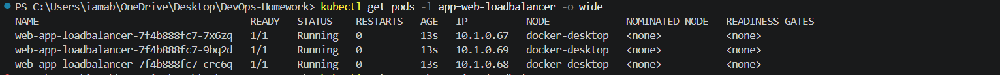
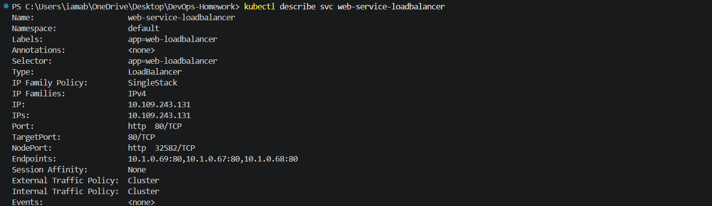
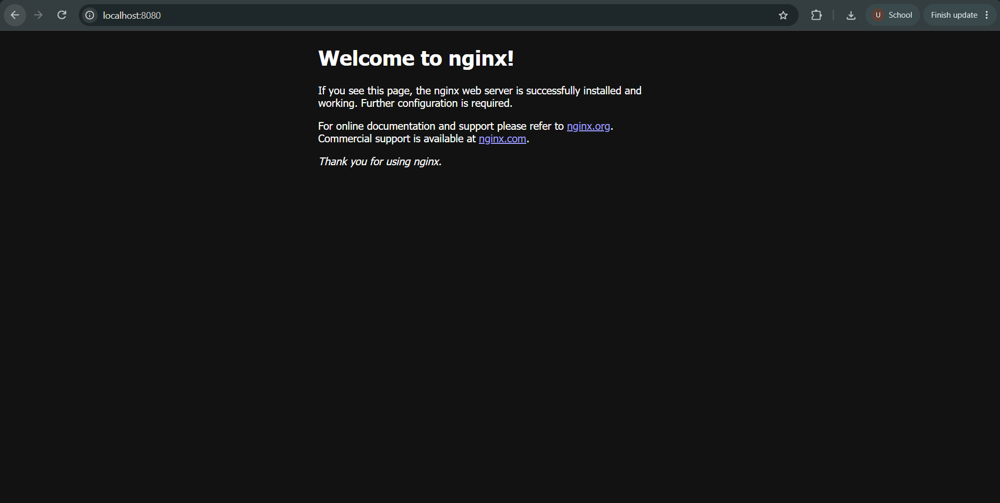

# LoadBalancer Service — Production Public Cloud Ingress

## 1. What is a LoadBalancer Service?

A `LoadBalancer` service is the standard way to expose internet-facing applications in managed cloud environments such as AWS EKS, Google Cloud GKE, Azure AKS, and DigitalOcean DOKS.

When you deploy a service with `type: LoadBalancer`:

1. Kubernetes requests an external cloud-managed load balancer.
2. The cloud provider assigns a public IP address or DNS name.
3. Under the hood, Kubernetes also uses a NodePort and ClusterIP.

In this Docker Desktop Kubernetes environment, there is no cloud provider load-balancer integration. Therefore, `EXTERNAL-IP` remains `<pending>`. The Service itself is still created correctly as a `LoadBalancer` Service.

---

## 2. Why do we need LoadBalancer?

### NodePort limitations

A `NodePort` exposes an application on a fixed port on every Kubernetes node.

Problems with using NodePort directly in production:

- Users must know the node IP and port.
- It exposes a high-numbered port.
- It does not automatically provide a public cloud load balancer.
- Managing external traffic becomes more difficult as infrastructure grows.

### LoadBalancer solution

A `LoadBalancer` Service is designed for cloud environments.

```text
Internet
   |
   v
Cloud Load Balancer
   |
   v
LoadBalancer Service
   |
   v
ClusterIP / NodePort
   |
   v
Application Pods
```

The cloud provider manages the external load-balancing infrastructure while Kubernetes connects that traffic to the application Pods.

---

## 3. Airport analogy

Think of a LoadBalancer Service like an airport.

- **Internet users** → passengers
- **Cloud Load Balancer** → airport
- **LoadBalancer Service** → airport's traffic-control system
- **Pods** → gates
- **Traffic distribution** → passengers being directed to available gates

Users do not need to know which individual Pod handles their request.

---

## 4. Production uses

LoadBalancer Services are commonly used for:

- Internet-facing web applications
- Public APIs
- Production frontend applications
- Public backend services
- Applications requiring cloud-managed external traffic distribution

In managed cloud Kubernetes, the cloud provider normally provisions the external load balancer automatically.

---

## 5. Manifests

### `app-deployment.yaml`

```yaml
apiVersion: apps/v1
kind: Deployment
metadata:
  name: web-app-loadbalancer
  labels:
    app: web-loadbalancer
spec:
  replicas: 3
  selector:
    matchLabels:
      app: web-loadbalancer
  template:
    metadata:
      labels:
        app: web-loadbalancer
    spec:
      containers:
        - name: web-server
          image: nginx:1.25-alpine
          ports:
            - containerPort: 80
          resources:
            requests:
              cpu: "50m"
              memory: "64Mi"
            limits:
              cpu: "100m"
              memory: "128Mi"
```

### `service.yaml`

```yaml
apiVersion: v1
kind: Service
metadata:
  name: web-service-loadbalancer
  labels:
    app: web-loadbalancer
spec:
  type: LoadBalancer
  selector:
    app: web-loadbalancer
  ports:
    - name: http
      port: 80
      targetPort: 80
      protocol: TCP
```

### Key fields

- `type: LoadBalancer` — requests an external load balancer.
- `port: 80` — Service port.
- `targetPort: 80` — container port receiving the traffic.
- `selector: app: web-loadbalancer` — connects the Service to the Deployment Pods.

---

## 6. How to run

Apply the Deployment:

```powershell
kubectl apply -f 03-loadbalancer/app-deployment.yaml
```

Verify the Pods:

```powershell
kubectl get pods -l app=web-loadbalancer -o wide
```

Apply the Service:

```powershell
kubectl apply -f 03-loadbalancer/service.yaml
```

Verify the Service:

```powershell
kubectl get svc web-service-loadbalancer
```

Verify the endpoints:

```powershell
kubectl get endpoints web-service-loadbalancer
```

Inspect the Service:

```powershell
kubectl describe svc web-service-loadbalancer
```

---

## 7. Traffic and local Docker Desktop verification

### Cloud environment

In a managed cloud Kubernetes cluster, the `EXTERNAL-IP` normally becomes a public IP address or DNS name after the cloud provider provisions the external load balancer.

Example:

```text
NAME                       TYPE           CLUSTER-IP     EXTERNAL-IP      PORT(S)
web-service-loadbalancer   LoadBalancer   10.x.x.x       203.x.x.x        80:xxxxx/TCP
```

### Docker Desktop adaptation

This exercise is running on Docker Desktop Kubernetes rather than a managed cloud provider.

Therefore, the Service output is:

```text
NAME                       TYPE           CLUSTER-IP       EXTERNAL-IP   PORT(S)
web-service-loadbalancer   LoadBalancer   10.109.243.131   <pending>     80:32582/TCP
```

`<pending>` is expected because Docker Desktop is not provisioning a public cloud load balancer.

The Service still correctly selects the three application Pods:

```text
10.1.0.67:80
10.1.0.68:80
10.1.0.69:80
```

For local application verification, `kubectl port-forward` was used:

```powershell
kubectl port-forward service/web-service-loadbalancer 8080:80
```

Then the application was opened at:

```text
http://localhost:8080
```

This verifies that the LoadBalancer Service is correctly connected to the NGINX application locally. It does not represent a public cloud LoadBalancer IP.

---

## 8. Actual verification results

### Pods

Three replicas were successfully deployed:

```text
web-app-loadbalancer-7f4b888fc7-7x6zq   1/1   Running   10.1.0.67
web-app-loadbalancer-7f4b888fc7-9bq2d   1/1   Running   10.1.0.69
web-app-loadbalancer-7f4b888fc7-crc6q   1/1   Running   10.1.0.68
```

### Service

```text
NAME                       TYPE           CLUSTER-IP       EXTERNAL-IP   PORT(S)
web-service-loadbalancer   LoadBalancer   10.109.243.131   <pending>     80:32582/TCP
```

### Endpoints

```text
10.1.0.67:80
10.1.0.68:80
10.1.0.69:80
```

### Service details

```text
Type:                     LoadBalancer
IP:                       10.109.243.131
Port:                     http  80/TCP
TargetPort:               80/TCP
NodePort:                 http  32582/TCP
Endpoints:                10.1.0.69:80,10.1.0.67:80,10.1.0.68:80
```

### Local application test

```text
kubectl port-forward service/web-service-loadbalancer 8080:80
```

The NGINX application was successfully accessed through:

```text
http://localhost:8080
```

---

## 9. Screenshots

### Screenshot 1 — Pods running



Shows the three `web-loadbalancer` Pods in `Running` state.

### Screenshot 2 — LoadBalancer Service


Shows:

- `TYPE` = `LoadBalancer`
- `EXTERNAL-IP` = `<pending>`
- Service port `80`
- Assigned NodePort

### Screenshot 3 — Service endpoints


Shows the three Pod endpoints connected to the Service.

### Screenshot 4 — Service details



Shows the Service type, ClusterIP, target port, NodePort, and endpoints.

### Screenshot 5 — Application test



Shows the NGINX application accessed locally through:

```text
http://localhost:8080
```

---

## 10. Cloud costs and best practices

In managed cloud environments, a `LoadBalancer` Service can create billable cloud infrastructure.

Best practices include:

- Use a LoadBalancer only when external access is required.
- Consider an Ingress controller when many HTTP/HTTPS applications share an entry point.
- Monitor cloud load-balancer costs.
- Use appropriate health checks and traffic policies.
- Avoid exposing internal-only services publicly.

---

## 11. Cleanup

Delete the Service:

```powershell
kubectl delete -f 03-loadbalancer/service.yaml
```

Delete the Deployment:

```powershell
kubectl delete -f 03-loadbalancer/app-deployment.yaml
```

Verify:

```powershell
kubectl get pods
kubectl get svc
```

The Docker Desktop adaptation used in this exercise is only for local verification. In a managed cloud Kubernetes environment, the `LoadBalancer` Service would normally receive an externally provisioned IP address or DNS name.
