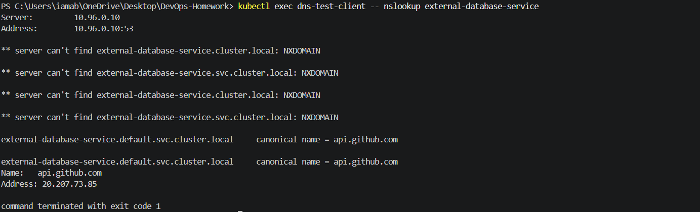
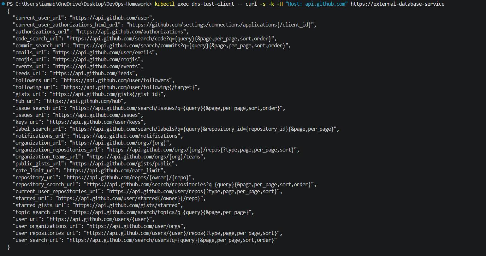
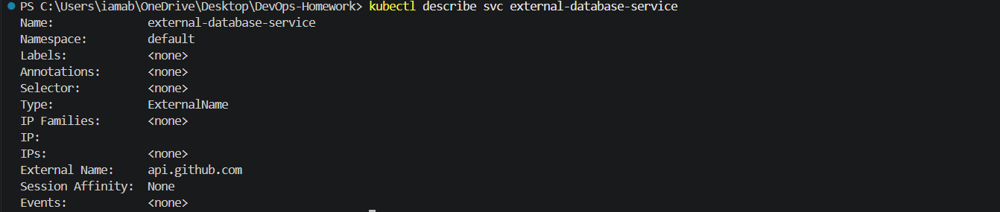
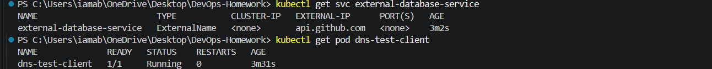

# ExternalName (External DNS) Service — Bridging Outside Infrastructure

## 1. What is an ExternalName Service?

An `ExternalName` Service is a Kubernetes Service that has no selector, no Pod backends, and no ClusterIP address.

Instead of routing traffic through a Kubernetes virtual IP, it acts as an internal DNS CNAME alias managed by CoreDNS. When an application inside the cluster queries the Service name, CoreDNS returns a CNAME pointing to the configured external fully qualified domain name (FQDN).

---

## 2. Why Do We Need ExternalName?

An ExternalName Service provides an unchanging internal DNS name for an external service.

For example, application code can use:

```text
http://external-database-service
```

while Kubernetes maps that name to an external hostname such as:

```text
api.github.com
```

If the external destination changes, the Kubernetes Service definition can be updated without changing the application code.

### Request Flow

```text
+-------------------------------------------------------------+
| Kubernetes Cluster                                          |
|                                                             |
|   +---------------+                                         |
|   | App Pod       |                                         |
|   +---------------+                                         |
|          |                                                  |
|          | DNS Query: "external-database-service"           |
|          v                                                  |
|   +---------------+                                         |
|   | CoreDNS       |                                         |
|   +---------------+                                         |
|          |                                                  |
|          | Returns CNAME: "api.github.com"                   |
|          v                                                  |
|   +---------------+                                         |
|   | App Pod       |                                         |
|   +---------------+                                         |
|                                                             |
+--------------------------|----------------------------------+
                           |
                           | Direct outbound connection
                           v
+-------------------------------------------------------------+
| External Internet / Cloud Service                           |
| api.github.com                                               |
+-------------------------------------------------------------+
```

---

## 3. Where is ExternalName Used?

ExternalName can be useful for:

- Managed cloud databases such as AWS RDS, GCP CloudSQL, or MongoDB Atlas.
- Third-party APIs and gateways.
- Gradual migration of external or legacy infrastructure into Kubernetes.

---

## 4. Manifest

### File: `service.yaml`

```yaml
apiVersion: v1
kind: Service
metadata:
  name: external-database-service
spec:
  type: ExternalName
  externalName: api.github.com
```

### Key Fields

- `spec.type: ExternalName` — configures the Service as a DNS alias.
- `spec.externalName: api.github.com` — specifies the external DNS target.
- No `selector`, `ports`, or `targetPort` are defined.

---

## 5. DNS Test Client

### File: `client-pod.yaml`

```yaml
apiVersion: v1
kind: Pod
metadata:
  name: dns-test-client
spec:
  containers:
    - name: curl
      image: curlimages/curl:8.10.1
      command:
        - sleep
        - "3600"
```

The client Pod is used only to test DNS resolution and HTTP connectivity from inside the Kubernetes cluster.

---

## 6. How to Run and Test

### Step 1: Apply the ExternalName Service

```powershell
kubectl apply -f Kubernetes-Services/04-externalname/service.yaml
```

Verify:

```powershell
kubectl get svc external-database-service
```

### Actual Result

```text
NAME                        TYPE           CLUSTER-IP   EXTERNAL-IP      PORT(S)
external-database-service   ExternalName   <none>       api.github.com   <none>
```

This confirms:

- Type: `ExternalName`
- ClusterIP: `<none>`
- External Name: `api.github.com`
- Ports: `<none>`

### Screenshot


---

### Step 2: Deploy the DNS Test Pod

```powershell
kubectl apply -f Kubernetes-Services/04-externalname/client-pod.yaml
```

Verify:

```powershell
kubectl get pod dns-test-client
```

Actual result:

```text
NAME              READY   STATUS    RESTARTS   AGE
dns-test-client   1/1     Running   0          ...
```

---

### Step 3: Verify DNS CNAME Resolution

Run:

```powershell
kubectl exec dns-test-client -- nslookup external-database-service
```

The lookup produced:

```text
external-database-service.default.svc.cluster.local
    canonical name = api.github.com
```

and resolved `api.github.com` to:

```text
20.207.73.85
```

The command also showed NXDOMAIN responses for shorter DNS search forms before successfully resolving the full Kubernetes Service FQDN. The successful canonical-name mapping is the important result.

### Screenshot



---

### Step 4: Test HTTP Request

The reference test was:

```powershell
kubectl exec dns-test-client -- curl -s -H "Host: api.github.com" https://external-database-service
```

On this Docker Desktop environment, the request initially returned:

```text
command terminated with exit code 60
```

This is a TLS certificate verification error because the HTTPS connection is made using the internal Service hostname while the external certificate is for `api.github.com`.

To verify the ExternalName connection itself, certificate verification was disabled:

```powershell
kubectl exec dns-test-client -- curl -s -k -H "Host: api.github.com" https://external-database-service
```

The request then successfully returned GitHub API JSON, including:

```json
{
  "current_user_url": "https://api.github.com/user",
  "current_user_authorizations_html_url": "https://github.com/settings/connections/applications{/client_id}",
  "authorizations_url": "https://api.github.com/authorizations"
}
```

This demonstrates that:

```text
external-database-service
        ↓
api.github.com
        ↓
GitHub API
```

was successfully reached from inside the Kubernetes Pod.

### Screenshot



---

## 7. Service Details

Run:

```powershell
kubectl describe svc external-database-service
```

Actual important values:

```text
Name:              external-database-service
Namespace:         default
Type:              ExternalName
IP:                
IPs:               <none>
External Name:     api.github.com
Selector:          <none>
Events:            <none>
```

### Screenshot



---

## 8. Final Verification

The Service and test Pod were verified with:

```powershell
kubectl get svc external-database-service
kubectl get pod dns-test-client
```

Actual results showed:

```text
external-database-service   ExternalName   <none>   api.github.com   <none>
```

and:

```text
dns-test-client   1/1   Running
```

### Screenshot



---

## 9. Important Caveats

### No Port Remapping

ExternalName operates at the DNS level. It does not provide Kubernetes port remapping.

### TLS / HTTPS Hostname Consideration

When HTTPS is accessed through an ExternalName alias, the external server's TLS certificate normally corresponds to the real external hostname, such as `api.github.com`, rather than the internal Kubernetes Service name.

In this exercise, the reference command returned curl exit code `60`. The connection was then verified using `curl -k` to bypass certificate verification while retaining:

```text
Host: api.github.com
```

### No IP Addresses in `externalName`

The `externalName` field should contain a DNS hostname such as:

```text
db.example.com
```

rather than a raw IP address.

---

## 10. Cleanup

After the screenshots were captured:

```powershell
kubectl delete -f Kubernetes-Services/04-externalname/client-pod.yaml
kubectl delete -f Kubernetes-Services/04-externalname/service.yaml
```

The existing Session 10 workloads and Services were not deleted.

---

## 11. Commands Summary

```powershell
# Apply ExternalName Service
kubectl apply -f Kubernetes-Services/04-externalname/service.yaml

# Verify Service
kubectl get svc external-database-service

# Apply DNS test client
kubectl apply -f Kubernetes-Services/04-externalname/client-pod.yaml

# Verify client
kubectl get pod dns-test-client

# Verify DNS CNAME
kubectl exec dns-test-client -- nslookup external-database-service

# Reference HTTP test
kubectl exec dns-test-client -- curl -s -H "Host: api.github.com" https://external-database-service

# Docker Desktop verification when TLS certificate validation fails
kubectl exec dns-test-client -- curl -s -k -H "Host: api.github.com" https://external-database-service

# Inspect Service
kubectl describe svc external-database-service

# Final verification
kubectl get svc external-database-service
kubectl get pod dns-test-client

# Cleanup
kubectl delete -f Kubernetes-Services/04-externalname/client-pod.yaml
kubectl delete -f Kubernetes-Services/04-externalname/service.yaml
```

---

## Conclusion

The ExternalName exercise demonstrates how Kubernetes CoreDNS can provide an internal DNS alias for an external service.

In this Docker Desktop environment:

- `external-database-service` was created as an `ExternalName` Service.
- Its external target was exactly `api.github.com`.
- The Service had no ClusterIP and no selector.
- Kubernetes DNS successfully returned `canonical name = api.github.com`.
- The external hostname resolved to `20.207.73.85` during the test.
- The reference HTTPS command encountered curl certificate verification error 60.
- Using `curl -k` for the test successfully reached the GitHub API and returned JSON.
