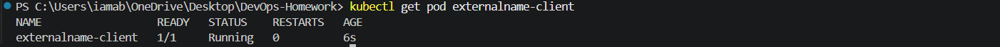
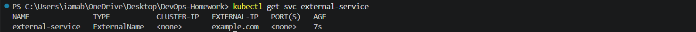
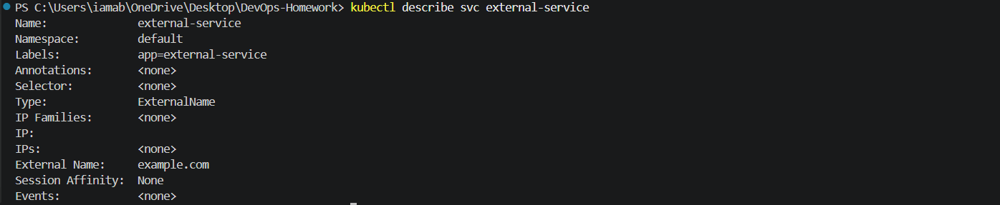
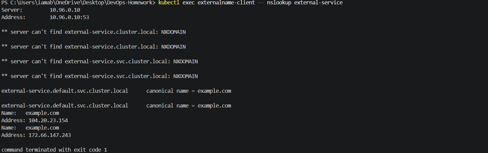
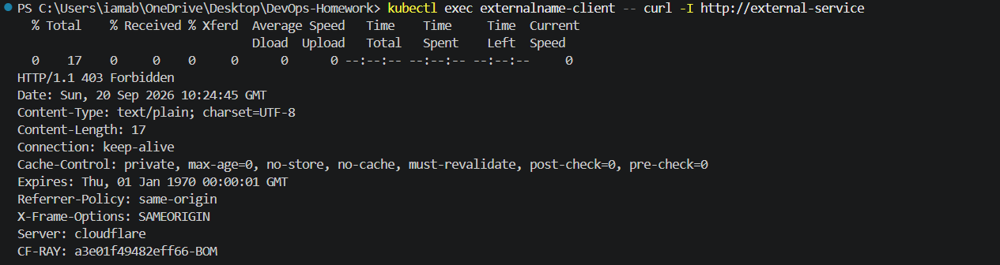

# 04 - ExternalName Service

## Objective

Create and test a Kubernetes `ExternalName` Service that maps a Kubernetes Service DNS name to an external DNS name.

> **Environment:** Docker Desktop Kubernetes (local single-node cluster)

---

## Folder Structure

```text
04-externalname/
├── client-pod.yaml
├── service.yaml
├── README.md
└── screenshots/
    ├── 01-externalname-client-pod.png
    ├── 02-externalname-service.png
    ├── 03-externalname-service-details.png
    ├── 04-externalname-dns-test.png
    └── 05-externalname-application-test.png
```

---

## 1. Client Pod

A temporary curl client Pod was created to test the ExternalName Service from inside the Kubernetes cluster.

### Manifest

`client-pod.yaml`

```yaml
apiVersion: v1
kind: Pod
metadata:
  name: externalname-client
spec:
  containers:
    - name: curl
      image: curlimages/curl:8.10.1
      command:
        - sleep
        - "3600"
```

### Apply

```powershell
kubectl apply -f Kubernetes-Services/04-externalname/client-pod.yaml
```

### Verify

```powershell
kubectl get pod externalname-client
```

### Actual Result

```text
NAME                  READY   STATUS    RESTARTS   AGE
externalname-client   1/1     Running   0          6s
```

### Screenshot



---

## 2. ExternalName Service

### Manifest

`service.yaml`

```yaml
apiVersion: v1
kind: Service
metadata:
  name: external-service
  labels:
    app: external-service
spec:
  type: ExternalName
  externalName: example.com
```

### Apply

```powershell
kubectl apply -f Kubernetes-Services/04-externalname/service.yaml
```

### Verify

```powershell
kubectl get svc external-service
```

### Actual Result

```text
NAME               TYPE           CLUSTER-IP   EXTERNAL-IP   PORT(S)
external-service   ExternalName   <none>       example.com   <none>
```

The Service has:

- **Type:** `ExternalName`
- **External Name:** `example.com`
- **ClusterIP:** `<none>`
- **Ports:** `<none>`

### Screenshot



---

## 3. Service Details

Run:

```powershell
kubectl describe svc external-service
```

### Actual Result

```text
Name:              external-service
Namespace:         default
Labels:            app=external-service
Annotations:       <none>
Selector:          <none>
Type:              ExternalName
IP Families:       <none>
IP:
IPs:               <none>
External Name:     example.com
Session Affinity:  None
Events:            <none>
```

An ExternalName Service does not select Kubernetes Pods. Instead, it provides a DNS alias to the configured external DNS name.

### Screenshot



---

## 4. DNS Resolution Test

The DNS mapping was tested from inside the Kubernetes cluster.

Command:

```powershell
kubectl exec externalname-client -- nslookup external-service
```

The DNS server was:

```text
10.96.0.10
```

The full Kubernetes Service DNS name successfully resolved as:

```text
external-service.default.svc.cluster.local canonical name = example.com
```

The external name resolved to:

```text
104.20.23.154
172.66.147.243
```

The command also displayed NXDOMAIN responses for shorter DNS forms before successfully resolving the full Service FQDN. The final successful canonical-name mapping demonstrates the ExternalName DNS alias.

### Screenshot



---

## 5. External HTTP Test

The external destination was tested through the Kubernetes Service:

```powershell
kubectl exec externalname-client -- curl -I http://external-service
```

### Actual Result

```text
HTTP/1.1 403 Forbidden
Date: Sun, 20 Sep 2026 10:24:45 GMT
Content-Type: text/plain; charset=UTF-8
Content-Length: 17
Connection: keep-alive
Server: cloudflare
```

The HTTP request reached the external destination and received an HTTP response from Cloudflare.

The `403 Forbidden` response is from the external website/server; it does not indicate that the Kubernetes ExternalName DNS mapping failed.

### Screenshot



---

## 6. How ExternalName Works

The flow demonstrated in this exercise is:

```text
Kubernetes client Pod
        |
        v
external-service
        |
        v
external-service.default.svc.cluster.local
        |
        | DNS CNAME
        v
example.com
        |
        v
External server
```

Unlike a normal ClusterIP Service, an ExternalName Service:

- Does not create a ClusterIP.
- Does not select Kubernetes Pods.
- Does not create normal Pod endpoints.
- Provides a DNS alias to an external DNS name.

---

## 7. Browser Test Note

Opening:

```text
http://external-service
```

directly in the Windows browser does not work.

The browser uses the host operating system's DNS configuration, not the Kubernetes cluster DNS service. Therefore, the Kubernetes-only DNS name is not resolvable from Windows Chrome.

The correct verification was performed from inside the Kubernetes client Pod using:

```powershell
kubectl exec externalname-client -- nslookup external-service
```

and:

```powershell
kubectl exec externalname-client -- curl -I http://external-service
```

---

## 8. Cleanup

After all screenshots were captured, the temporary resources were deleted:

```powershell
kubectl delete -f Kubernetes-Services/04-externalname/service.yaml
kubectl delete -f Kubernetes-Services/04-externalname/client-pod.yaml
```

Final verification:

```powershell
kubectl get pods
kubectl get svc
```

The `external-service` Service was removed and the `externalname-client` Pod was deleted. Existing Session 10 workloads and Services remained.

At the time of the immediate post-cleanup check, the client Pod briefly appeared as:

```text
externalname-client   1/1   Terminating
```

This is normal while Kubernetes completes deletion.

The remaining Services were:

```text
app-recreate-service   NodePort    10.111.251.134   <none>   80:30040/TCP
app-rolling-service    NodePort    10.96.26.158     <none>   80:30010/TCP
kubernetes             ClusterIP   10.96.0.1        <none>   443/TCP
myapp-canary-service   NodePort    10.104.138.184   <none>   80:30030/TCP
myapp-service          NodePort    10.101.8.210     <none>   80:30020/TCP
```

---

## 9. Commands Summary

```powershell
# Create client Pod
kubectl apply -f Kubernetes-Services/04-externalname/client-pod.yaml

# Verify client
kubectl get pod externalname-client

# Create ExternalName Service
kubectl apply -f Kubernetes-Services/04-externalname/service.yaml

# Verify Service
kubectl get svc external-service

# Inspect Service
kubectl describe svc external-service

# Test Kubernetes DNS
kubectl exec externalname-client -- nslookup external-service

# Test external HTTP destination
kubectl exec externalname-client -- curl -I http://external-service

# Cleanup
kubectl delete -f Kubernetes-Services/04-externalname/service.yaml
kubectl delete -f Kubernetes-Services/04-externalname/client-pod.yaml

# Final verification
kubectl get pods
kubectl get svc
```

---

## Conclusion

The ExternalName Service was successfully created and tested.

The exercise demonstrated:

- Creating an `ExternalName` Service
- Mapping a Kubernetes Service name to `example.com`
- Understanding that ExternalName uses DNS rather than Pod selectors
- Verifying the Kubernetes DNS CNAME mapping
- Resolving the external DNS destination from inside a Kubernetes Pod
- Sending an HTTP request through the ExternalName Service
- Understanding why the external server can return an HTTP `403 Forbidden` while the Kubernetes DNS mapping still works
- Cleaning up the temporary Kubernetes resources
