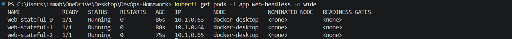
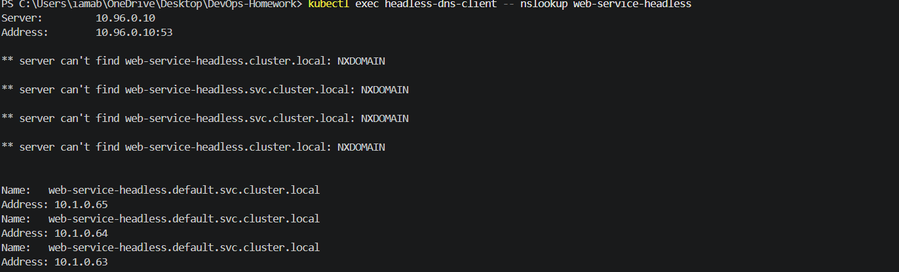
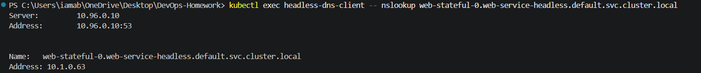
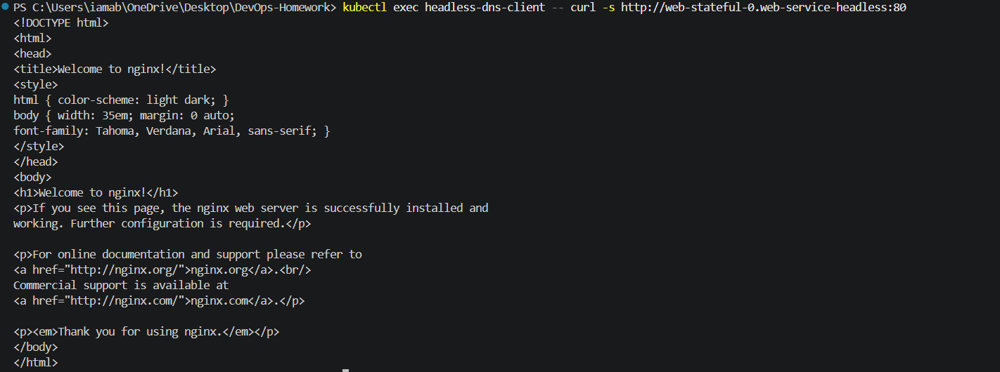

# Headless Service (`clusterIP: None`) — Direct Pod-to-Pod Discovery

## 1. What is a Headless Service?

By default, a Kubernetes Service acts as a Layer 4 proxy: it allocates a single virtual IP (**ClusterIP**) and load balances traffic across backend Pods.

However, sometimes you do **not** want a single virtual IP. You want direct network access to individual Pods.

A **Headless Service** is created by setting:

```yaml
spec:
  clusterIP: None
```

When `clusterIP: None` is set:

1. Kubernetes does not allocate a virtual IP.
2. `kube-proxy` does not configure normal Service load-balancing rules.
3. When a client performs a DNS lookup on the Service name, **CoreDNS returns the individual IP addresses of the matching Pods directly**.

---

## 2. Regular Service vs Headless Service

| Feature | Regular Service (`type: ClusterIP`) | Headless Service (`clusterIP: None`) |
| :--- | :--- | :--- |
| **Virtual IP** | Allocated | **None** |
| **Load Balancing** | Handled through the Service | Handled by the client/application |
| **DNS Lookup Returns** | Single virtual IP | **List of matching Pod IPs** |
| **Individual Pod DNS** | Not provided in the same StatefulSet-oriented form | **Yes** with StatefulSet + Headless Service |
| **Primary Workload** | Stateless applications | **Stateful distributed systems** |

---

## 3. Why Do We Need Headless Services?

Clustered systems such as Kafka, MongoDB Replica Sets, Redis Cluster, Elasticsearch, ZooKeeper, and PostgreSQL replication may require clients or cluster members to discover and communicate with specific Pods.

With a Headless Service paired with a StatefulSet, each Pod receives a predictable hostname:

```text
web-stateful-0.web-service-headless.default.svc.cluster.local
web-stateful-1.web-service-headless.default.svc.cluster.local
web-stateful-2.web-service-headless.default.svc.cluster.local
```

The Service name resolves to the individual Pod IP addresses:

```text
web-service-headless
        |
        v
CoreDNS
        |
        +---- 10.1.0.63  -> web-stateful-0
        +---- 10.1.0.64  -> web-stateful-1
        +---- 10.1.0.65  -> web-stateful-2
```

The client can also resolve a specific StatefulSet Pod directly.

---

## 4. Phone Directory vs Switchboard

A standard Service can be compared to a company switchboard: one number receives the request and the system routes it to an available backend.

A Headless Service is more like a directory containing the individual addresses of the available Pods. The client can discover the individual endpoints and choose which one to contact.

---

## 5. Where is Headless Service Used?

Headless Services are commonly useful for:

- Distributed quorum clusters such as Kafka, ZooKeeper, RabbitMQ, etcd, and Cassandra.
- Master-replica database topologies such as MySQL, PostgreSQL, and MongoDB replica sets.
- Client-side load balancing such as gRPC or Envoy.
- Stateful cache clusters such as Redis Cluster.

---

## 6. Code Manifests & Field-by-Field Breakdown

### File: `app-statefulset.yaml`

```yaml
apiVersion: apps/v1
kind: StatefulSet
metadata:
  name: web-stateful
  labels:
    app: web-headless
spec:
  serviceName: web-service-headless
  replicas: 3
  selector:
    matchLabels:
      app: web-headless
  template:
    metadata:
      labels:
        app: web-headless
    spec:
      containers:
        - name: nginx-stateful
          image: nginx:1.25-alpine
          ports:
            - name: web
              containerPort: 80
          resources:
            requests:
              cpu: "50m"
              memory: "64Mi"
            limits:
              cpu: "100m"
              memory: "128Mi"
```

### File: `service.yaml`

```yaml
apiVersion: v1
kind: Service
metadata:
  name: web-service-headless
  labels:
    app: web-headless
spec:
  clusterIP: None
  selector:
    app: web-headless
  ports:
    - name: web
      port: 80
      targetPort: 80
      protocol: TCP
```

### File: `client-pod.yaml`

```yaml
apiVersion: v1
kind: Pod
metadata:
  name: headless-dns-client
spec:
  containers:
    - name: curl
      image: curlimages/curl:8.10.1
      command:
        - sleep
        - "3600"
```

### Key Field Explanations

- `spec.clusterIP: None` — the defining field that creates a Headless Service.
- `spec.serviceName: web-service-headless` in the StatefulSet — associates the StatefulSet with the Headless Service and enables predictable Pod DNS names.
- `replicas: 3` — creates `web-stateful-0`, `web-stateful-1`, and `web-stateful-2`.

---

## 7. How to Run and Deploy

### Step 1: Apply the Headless Service

```powershell
kubectl apply -f Kubernetes-Services/05-headless/service.yaml
```

Verify:

```powershell
kubectl get svc web-service-headless
```

Actual result:

```text
NAME                   TYPE        CLUSTER-IP   EXTERNAL-IP   PORT(S)
web-service-headless   ClusterIP   None         <none>        80/TCP
```

The important point is:

```text
CLUSTER-IP = None
```

### Screenshot


---

### Step 2: Apply the StatefulSet

```powershell
kubectl apply -f Kubernetes-Services/05-headless/app-statefulset.yaml
```

Verify:

```powershell
kubectl get pods -l app=web-headless -o wide
```

Actual Docker Desktop result:

```text
NAME             READY   STATUS    IP
web-stateful-0   1/1     Running   10.1.0.63
web-stateful-1   1/1     Running   10.1.0.64
web-stateful-2   1/1     Running   10.1.0.65
```

All three Pods were running on the `docker-desktop` node.

### Screenshot



---

## 8. How to Check DNS & Traffic on the Headless Service

### Step 1: Deploy Test Pod

```powershell
kubectl apply -f Kubernetes-Services/05-headless/client-pod.yaml
```

Verify:

```powershell
kubectl get pod headless-dns-client
```

The Pod reached:

```text
headless-dns-client   1/1   Running
```

---

### Step 2: DNS Lookup on Service Name

Run:

```powershell
kubectl exec headless-dns-client -- nslookup web-service-headless
```

The successful DNS response returned all three Pod IPs:

```text
web-service-headless.default.svc.cluster.local
Address: 10.1.0.65
Address: 10.1.0.64
Address: 10.1.0.63
```

The order of the returned addresses is not important. The important result is that **all three individual Pod IPs were returned**, rather than a single virtual IP.

The command also displayed NXDOMAIN responses for some DNS search forms before successfully resolving the full Kubernetes Service name. The final successful records demonstrate the Headless Service behavior.

### Screenshot



---

### Step 3: Direct DNS Lookup for a Specific Pod

Query Pod 0:

```powershell
kubectl exec headless-dns-client -- nslookup web-stateful-0.web-service-headless.default.svc.cluster.local
```

Actual result:

```text
Name:    web-stateful-0.web-service-headless.default.svc.cluster.local
Address: 10.1.0.63
```

This demonstrates that the StatefulSet Pod has a stable, specific DNS hostname.

### Screenshot



---

### Step 4: Curl Pod 0 Directly by Its Unique Hostname

Run:

```powershell
kubectl exec headless-dns-client -- curl -s http://web-stateful-0.web-service-headless:80
```

The request successfully returned the NGINX welcome page:

```html
<!DOCTYPE html>
<html>
<head>
<title>Welcome to nginx!</title>
...
</html>
```

This confirms direct access to `web-stateful-0` through its StatefulSet DNS hostname.

### Screenshot



---

## 9. Key Summary Comparison: When to Use Which Service?

- Use **`ClusterIP`** for standard stateless microservice-to-microservice traffic.
- Use **`NodePort`** when direct host-level access is required.
- Use **`LoadBalancer`** for external/public traffic in cloud environments.
- Use **`ExternalName`** when an application needs an internal DNS alias for an external service.
- Use **`Headless (clusterIP: None)`** when stateful distributed systems need discovery of individual Pods.

---

## 10. Cleanup

After the screenshots are captured:

```powershell
kubectl delete -f Kubernetes-Services/05-headless/client-pod.yaml
kubectl delete -f Kubernetes-Services/05-headless/app-statefulset.yaml
kubectl delete -f Kubernetes-Services/05-headless/service.yaml
```

The existing Session 10 workloads and Services should remain untouched.

---

## 11. Verification Summary

This exercise successfully demonstrated:

1. A Headless Service with `clusterIP: None`.
2. A 3-replica StatefulSet:
   - `web-stateful-0` → `10.1.0.63`
   - `web-stateful-1` → `10.1.0.64`
   - `web-stateful-2` → `10.1.0.65`
3. DNS resolution of the Headless Service to all three Pod IPs.
4. DNS resolution of the specific Pod:
   - `web-stateful-0.web-service-headless.default.svc.cluster.local`
   - `10.1.0.63`
5. Direct HTTP access to Pod 0 using its unique StatefulSet DNS hostname.
