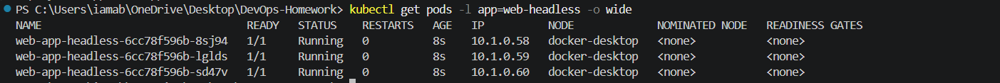
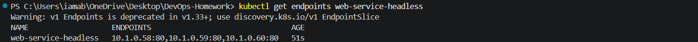
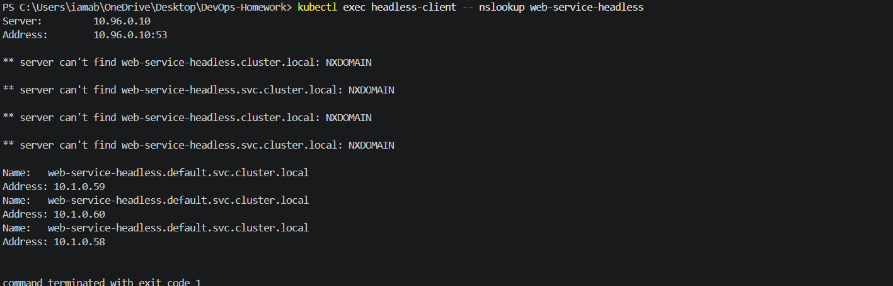
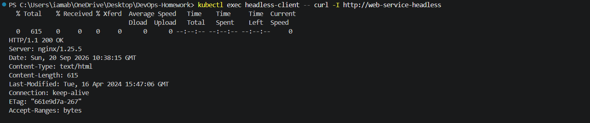

# 05 - Headless Service

## Objective

Create and test a Kubernetes Headless Service and verify that Kubernetes DNS returns the individual Pod IP addresses instead of a virtual ClusterIP.

> **Environment:** Docker Desktop Kubernetes (local single-node cluster)

---

## Folder Structure

```text
05-headless/
├── app-deployment.yaml
├── client-pod.yaml
├── service.yaml
├── README.md
└── screenshots/
    ├── 01-headless-pods-running.png
    ├── 02-headless-service.png
    ├── 03-headless-endpoints.png
    ├── 04-headless-dns-test.png
    └── 05-headless-application-test.png
```

---

## 1. Application Deployment

The deployment creates 3 NGINX replicas.

### Manifest

`app-deployment.yaml`

```yaml
apiVersion: apps/v1
kind: Deployment
metadata:
  name: web-app-headless
  labels:
    app: web-headless
spec:
  replicas: 3
  selector:
    matchLabels:
      app: web-headless
  template:
    metadata:
      labels:
        app: web-headless
    spec:
      containers:
        - name: web-server
          image: nginx:1.25-alpine
          ports:
            - containerPort: 80
          resources:
            requests:
              cpu: "50m"
              memory: "64Mi"
            limits:
              cpu: "100m"
              memory: "128Mi"
```

### Apply

```powershell
kubectl apply -f Kubernetes-Services/05-headless/app-deployment.yaml
```

### Verify

```powershell
kubectl get pods -l app=web-headless -o wide
```

### Actual Result

```text
NAME                                READY   STATUS    RESTARTS   AGE   IP          NODE
web-app-headless-6cc78f596b-8sj94   1/1     Running   0          8s    10.1.0.58   docker-desktop
web-app-headless-6cc78f596b-lglds   1/1     Running   0          8s    10.1.0.59   docker-desktop
web-app-headless-6cc78f596b-sd47v   1/1     Running   0          8s    10.1.0.60   docker-desktop
```

All 3 Pods were running successfully.

### Screenshot



---

## 2. Headless Service

A Headless Service is created by setting:

```yaml
clusterIP: None
```

### Manifest

`service.yaml`

```yaml
apiVersion: v1
kind: Service
metadata:
  name: web-service-headless
  labels:
    app: web-headless
spec:
  clusterIP: None
  selector:
    app: web-headless
  ports:
    - name: http
      port: 80
      targetPort: 80
      protocol: TCP
```

### Apply

```powershell
kubectl apply -f Kubernetes-Services/05-headless/service.yaml
```

Kubernetes displayed:

```text
Warning: spec.SessionAffinity is ignored for headless services
service/web-service-headless created
```

The Service was created successfully. The warning is informational and does not prevent the Headless Service from working.

### Verify

```powershell
kubectl get svc web-service-headless
```

### Actual Result

```text
NAME                   TYPE        CLUSTER-IP   EXTERNAL-IP   PORT(S)
web-service-headless   ClusterIP   None         <none>        80/TCP
```

The key result is:

```text
CLUSTER-IP = None
```

### Screenshot


---

## 3. Service Endpoints

Verify the endpoints:

```powershell
kubectl get endpoints web-service-headless
```

### Actual Result

```text
NAME                   ENDPOINTS
web-service-headless   10.1.0.58:80,10.1.0.59:80,10.1.0.60:80
```

The Headless Service points directly to the 3 application Pod IPs.

Kubernetes also displayed a version warning because the legacy `Endpoints` API is deprecated in Kubernetes v1.33+:

```text
Warning: v1 Endpoints is deprecated in v1.33+; use discovery.k8s.io/v1 EndpointSlice
```

This warning does not affect the exercise.

### Screenshot



---

## 4. Client Pod

A temporary client Pod was created to test Kubernetes DNS from inside the cluster.

### Manifest

`client-pod.yaml`

```yaml
apiVersion: v1
kind: Pod
metadata:
  name: headless-client
spec:
  containers:
    - name: curl
      image: curlimages/curl:8.10.1
      command:
        - sleep
        - "3600"
```

### Apply

```powershell
kubectl apply -f Kubernetes-Services/05-headless/client-pod.yaml
```

The manifest was applied successfully and a second apply returned:

```text
pod/headless-client unchanged
```

### Verify

```powershell
kubectl get pod headless-client
```

### Actual Result

```text
NAME              READY   STATUS    RESTARTS   AGE
headless-client   1/1     Running   0          17s
```

---

## 5. Headless DNS Test

The DNS name was tested from inside the client Pod:

```powershell
kubectl exec headless-client -- nslookup web-service-headless
```

### Actual Result

The Kubernetes DNS server was:

```text
10.96.0.10
```

The full Service DNS name resolved to all three individual Pod IP addresses:

```text
Name:   web-service-headless.default.svc.cluster.local
Address: 10.1.0.59

Name:   web-service-headless.default.svc.cluster.local
Address: 10.1.0.60

Name:   web-service-headless.default.svc.cluster.local
Address: 10.1.0.58
```

The command also printed NXDOMAIN responses for shorter DNS forms before successfully resolving the full Service FQDN. The final results demonstrate that the Headless Service DNS name resolves directly to the individual Pods.

The command ended with:

```text
command terminated with exit code 1
```

Despite that exit code, the relevant DNS lookup succeeded and returned all three Pod IP addresses.

### Screenshot



---

## 6. Application Test

The NGINX application was tested through the Headless Service:

```powershell
kubectl exec headless-client -- curl -I http://web-service-headless
```

### Actual Result

```text
HTTP/1.1 200 OK
Server: nginx/1.25.5
Date: Sun, 20 Sep 2026 10:38:15 GMT
Content-Type: text/html
Content-Length: 615
Last-Modified: Tue, 16 Apr 2024 15:47:06 GMT
Connection: keep-alive
ETag: "661e9d7a-267"
Accept-Ranges: bytes
```

The `200 OK` response confirms successful HTTP communication through the Headless Service.

### Screenshot



---

## 7. How a Headless Service Works

A normal ClusterIP Service provides a virtual ClusterIP:

```text
Client
  |
  v
ClusterIP
  |
  +----> Pod 1
  +----> Pod 2
  +----> Pod 3
```

A Headless Service has:

```text
clusterIP: None
```

and DNS returns the individual Pod addresses:

```text
Client
  |
  v
Headless Service DNS
  |
  +----> 10.1.0.58
  +----> 10.1.0.59
  +----> 10.1.0.60
```

In this exercise:

```text
web-service-headless.default.svc.cluster.local
```

resolved to:

```text
10.1.0.58
10.1.0.59
10.1.0.60
```

---

## 8. Key Difference from ClusterIP

| Feature | ClusterIP Service | Headless Service |
|---|---|---|
| ClusterIP | Assigned | `None` |
| Virtual Service IP | Yes | No |
| DNS result | Service IP | Individual Pod IPs |
| Pod selector | Yes | Yes |
| Direct Pod discovery through DNS | No | Yes |

---

## 9. Cleanup

After the screenshots were captured, the temporary resources should be removed:

```powershell
kubectl delete -f Kubernetes-Services/05-headless/service.yaml
kubectl delete -f Kubernetes-Services/05-headless/client-pod.yaml
kubectl delete -f Kubernetes-Services/05-headless/app-deployment.yaml
```

Then verify:

```powershell
kubectl get pods
kubectl get svc
```

Only the temporary Headless Service exercise resources should be removed. Existing Session 10 workloads and Services should remain.

---

## 10. Commands Summary

```powershell
# Create application
kubectl apply -f Kubernetes-Services/05-headless/app-deployment.yaml

# Verify Pods
kubectl get pods -l app=web-headless -o wide

# Create Headless Service
kubectl apply -f Kubernetes-Services/05-headless/service.yaml

# Verify Service
kubectl get svc web-service-headless

# Verify endpoints
kubectl get endpoints web-service-headless

# Create client Pod
kubectl apply -f Kubernetes-Services/05-headless/client-pod.yaml

# Verify client
kubectl get pod headless-client

# Test Headless DNS
kubectl exec headless-client -- nslookup web-service-headless

# Test application
kubectl exec headless-client -- curl -I http://web-service-headless

# Cleanup
kubectl delete -f Kubernetes-Services/05-headless/service.yaml
kubectl delete -f Kubernetes-Services/05-headless/client-pod.yaml
kubectl delete -f Kubernetes-Services/05-headless/app-deployment.yaml

# Final verification
kubectl get pods
kubectl get svc
```

---

## Conclusion

The Headless Service was successfully created and tested.

The exercise demonstrated:

- Creating a Deployment with 3 NGINX replicas
- Creating a Headless Service using `clusterIP: None`
- Verifying that the Service has no ClusterIP
- Verifying that the Service endpoints contain the individual Pod IPs
- Testing Kubernetes DNS resolution from inside a Pod
- Confirming that the Headless Service DNS name resolves to all three Pod IPs
- Successfully accessing the NGINX application through the Headless Service with an HTTP `200 OK`
- Understanding the difference between a normal ClusterIP Service and a Headless Service
