# Session 13 — Kubernetes Storage, HPA & Probes

This README documents the practical work completed for Session 13.

**Environment:** Docker Desktop Kubernetes on Windows 11  
**Repository:** `DevOps-Homework`  
**Cluster context:** `docker-desktop`

---

# Task 1 — Kubernetes Volumes

## Objective

Demonstrate:

- `emptyDir`
- `hostPath`
- Volume mounting at `/data`
- Data behavior when a Pod is deleted and recreated

---

## 1.1 emptyDir

### YAML

```yaml
apiVersion: v1
kind: Pod
metadata:
  name: emptydir-demo
spec:
  containers:
    - name: app
      image: nginx:1.27
      volumeMounts:
        - name: app-storage
          mountPath: /data
  volumes:
    - name: app-storage
      emptyDir: {}
```

### Create and verify

```powershell
kubectl apply -f emptydir-pod.yaml
kubectl wait --for=condition=Ready pod/emptydir-demo --timeout=120s
kubectl get pods
```

Actual result:

```text
pod/emptydir-demo created
pod/emptydir-demo condition met

emptydir-demo   1/1   Running   0
```

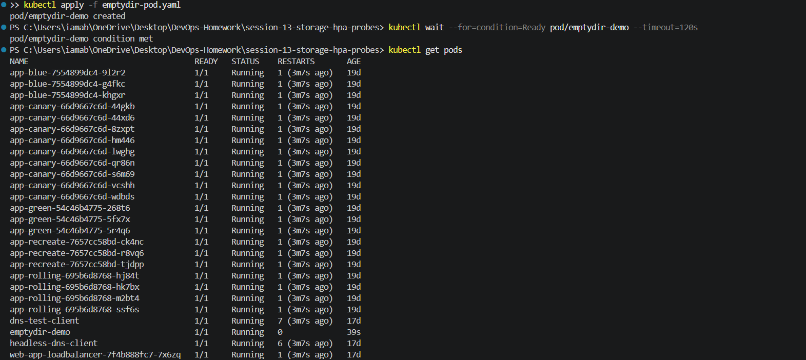

### Create and verify data

```powershell
kubectl exec -it emptydir-demo -- bash
```

Inside the container:

```bash
echo "Hello Kubernetes" > /data/message.txt
cat /data/message.txt
exit
```

Output:

```text
Hello Kubernetes
```

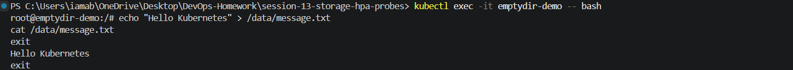

```powershell
kubectl exec emptydir-demo -- cat /data/message.txt
```

Output:

```text
Hello Kubernetes
```


### Delete and recreate

```powershell
kubectl delete pod emptydir-demo
kubectl get pods emptydir-demo
kubectl apply -f emptydir-pod.yaml
kubectl wait --for=condition=Ready pod/emptydir-demo --timeout=120s
kubectl get pods emptydir-demo
```

Actual result:

```text
pod "emptydir-demo" deleted from default namespace
Error from server (NotFound): pods "emptydir-demo" not found

pod/emptydir-demo created
pod/emptydir-demo condition met
```

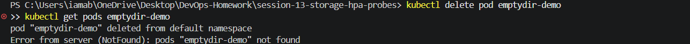

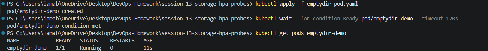

### Verify old data is gone

```powershell
kubectl exec emptydir-demo -- cat /data/message.txt
```

Actual result:

```text
cat: /data/message.txt: No such file or directory
command terminated with exit code 1
```


### Result

`emptyDir` storage is associated with the lifetime of the Pod. When the Pod was deleted and recreated, the previous file disappeared.

---

## 1.2 hostPath

### YAML

```yaml
apiVersion: v1
kind: Pod
metadata:
  name: hostpath-demo
spec:
  containers:
    - name: app
      image: nginx:1.27
      volumeMounts:
        - name: host-storage
          mountPath: /data
  volumes:
    - name: host-storage
      hostPath:
        path: /tmp/hostpath-data
        type: DirectoryOrCreate
```

### Create and verify

```powershell
kubectl apply -f hostpath-pod.yaml
kubectl wait --for=condition=Ready pod/hostpath-demo --timeout=120s
kubectl get pods hostpath-demo
```

Actual result:

```text
pod/hostpath-demo created
pod/hostpath-demo condition met

hostpath-demo   1/1   Running   0
```

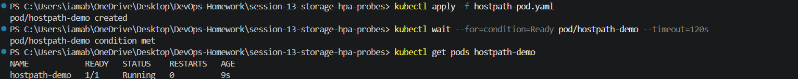

### Create and read a file

```powershell
kubectl exec hostpath-demo -- sh -c "echo 'Hello from hostPath' > /data/hostpath.txt"
kubectl exec hostpath-demo -- cat /data/hostpath.txt
```

Output:

```text
Hello from hostPath
```

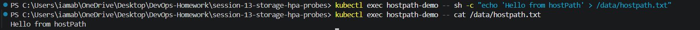

### Inspect volume

```powershell
kubectl describe pod hostpath-demo
```

Relevant output:

```text
/data from host-storage (rw)

Type:         HostPath
Path:         /tmp/hostpath-data
HostPathType: DirectoryOrCreate
```

Node:

```text
docker-desktop/192.168.65.3
```

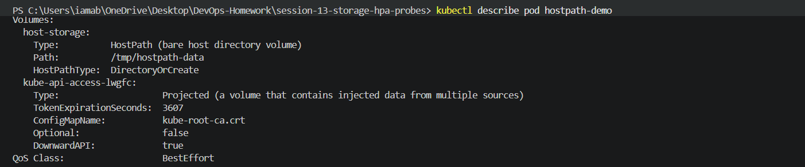

### Verify YAML

```powershell
kubectl get pod hostpath-demo -o yaml
```

Relevant configuration:

```yaml
volumeMounts:
  - mountPath: /data
    name: host-storage

volumes:
  - hostPath:
      path: /tmp/hostpath-data
      type: DirectoryOrCreate
    name: host-storage
```

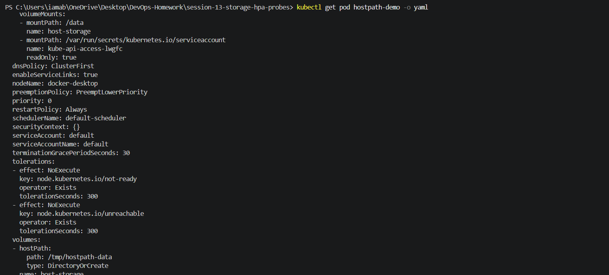

---

## 1.3 Cleanup

```powershell
kubectl delete pod hostpath-demo
kubectl delete pod emptydir-demo
kubectl get pods
```

Actual cleanup:

```text
pod "hostpath-demo" deleted from default namespace
pod "emptydir-demo" deleted from default namespace
```

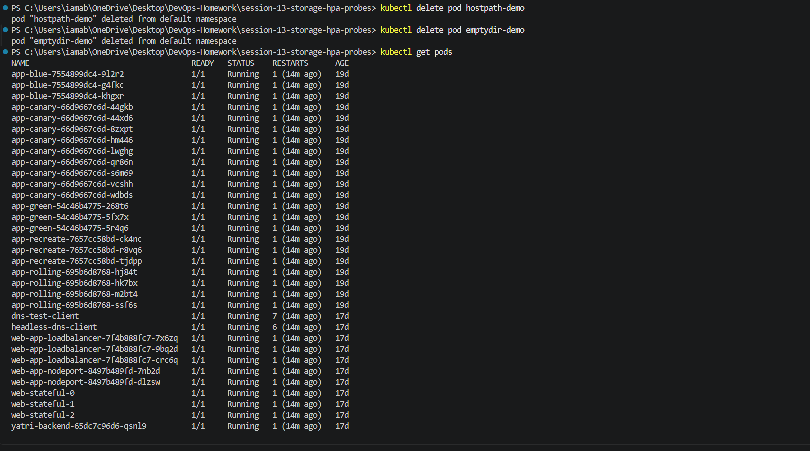

### Task 1 Result

| Volume | Result |
|---|---|
| emptyDir | Data lost after Pod deletion |
| hostPath | Node directory mounted successfully |
| `/data` mount | Verified |
| Cleanup | Completed |

---

# Task 2 — Horizontal Pod Autoscaling (HPA)

> **Environment:** Docker Desktop Kubernetes  
> The reference procedure contains Minikube-specific steps. Metrics Server was adapted for Docker Desktop.

## 2.1 Deployment

```yaml
apiVersion: apps/v1
kind: Deployment
metadata:
  name: hpa-demo
spec:
  replicas: 1
  selector:
    matchLabels:
      app: hpa-demo
  template:
    metadata:
      labels:
        app: hpa-demo
    spec:
      containers:
        - name: nginx
          image: nginx:1.27
          resources:
            requests:
              cpu: 100m
            limits:
              cpu: 200m
          ports:
            - containerPort: 80
```

Dry run:

```text
deployment.apps/hpa-demo created (dry run)
```

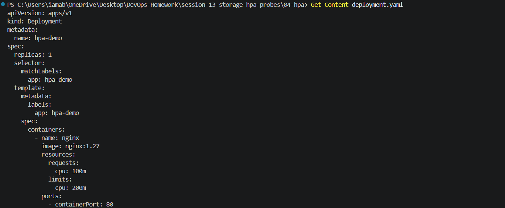

## 2.2 Service

```yaml
apiVersion: v1
kind: Service
metadata:
  name: hpa-demo-service
spec:
  selector:
    app: hpa-demo
  ports:
    - port: 80
      targetPort: 80
  type: ClusterIP
```

Actual Service:

```text
hpa-demo-service   ClusterIP   10.96.78.32   <none>   80/TCP
```

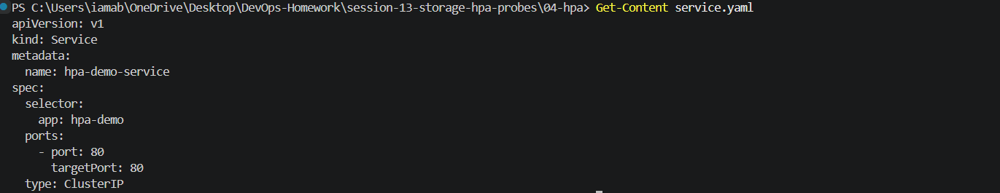

## 2.3 HPA

```yaml
apiVersion: autoscaling/v2
kind: HorizontalPodAutoscaler
metadata:
  name: hpa-demo
spec:
  scaleTargetRef:
    apiVersion: apps/v1
    kind: Deployment
    name: hpa-demo
  minReplicas: 1
  maxReplicas: 5
  metrics:
    - type: Resource
      resource:
        name: cpu
        target:
          type: Utilization
          averageUtilization: 50
```

Dry run:

```text
horizontalpodautoscaler.autoscaling/hpa-demo created (dry run)
```

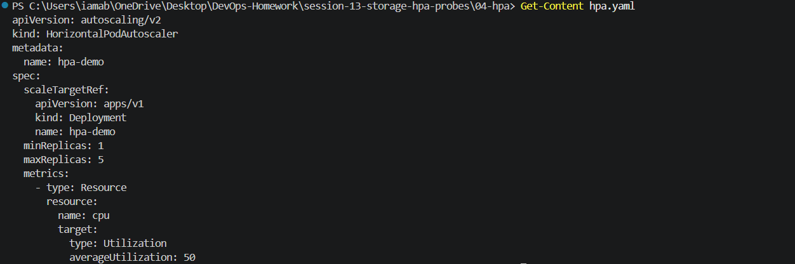

## 2.4 Application Running

```powershell
kubectl apply -f deployment.yaml
kubectl apply -f service.yaml
```

Actual state:

```text
NAME       READY   UP-TO-DATE   AVAILABLE
hpa-demo   1/1     1            1
```

Pod:

```text
hpa-demo-7b7f74b45d-f6qwx   1/1   Running   0
```

No `15-hpa-application-running.png` was captured, so the real terminal output is used instead.

## 2.5 Metrics Server

Initially:

```text
error: Metrics API not available
```

Installed with:

```powershell
kubectl apply -f https://github.com/kubernetes-sigs/metrics-server/releases/latest/download/components.yaml
```

For Docker Desktop, the Metrics Server deployment was edited to add:

```yaml
- --kubelet-insecure-tls
```

Then:

```text
deployment "metrics-server" successfully rolled out
```

Metrics API:

```text
v1beta1.metrics.k8s.io   kube-system/metrics-server   True
```

Node metrics:

```text
docker-desktop   3443m   28%   2644Mi   35%
```

HPA Pod metrics:

```text
hpa-demo-7b7f74b45d-f6qwx   0m   22Mi
```

No `16-metrics-server.png` was captured, so the real terminal output is documented here.

## 2.6 HPA Created

```powershell
kubectl apply -f hpa.yaml
```

Result:

```text
horizontalpodautoscaler.autoscaling/hpa-demo created
```

Immediately after creation:

```text
hpa-demo   Deployment/hpa-demo   cpu: <unknown>/50%   1   5   0
```

After metrics became available:

```text
hpa-demo   Deployment/hpa-demo   cpu: 0%/50%   1   5   1
```

No `17-hpa-created.png` was captured.

## 2.7 HPA Description

```powershell
kubectl describe hpa hpa-demo
```

Actual result included:

```text
Metrics:
  resource cpu on pods (as a percentage of request): 0% (0) / 50%

Min replicas: 1
Max replicas: 5
Deployment pods: 1 current / 1 desired

AbleToScale      True
ScalingActive    True
ScalingLimited   False
```

No `18-hpa-describe.png` was captured.

## 2.8 Load Generator

```powershell
kubectl run load-generator --image=busybox:1.36 --restart=Never -- /bin/sh -c "while true; do wget -q -O- http://hpa-demo-service; done"
```

Result:

```text
pod/load-generator created
```

Pod:

```text
load-generator   1/1   Running   0
```

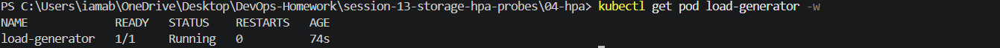

## 2.9 CPU Load

Recorded HPA state:

```text
hpa-demo   Deployment/hpa-demo   cpu: 107%/50%   1   5   1
```

CPU metrics included:

```text
hpa-demo-7b7f74b45d-cj74p   36m   12Mi
hpa-demo-7b7f74b45d-f6qwx   37m   24Mi
hpa-demo-7b7f74b45d-xccz7   35m   12Mi
```

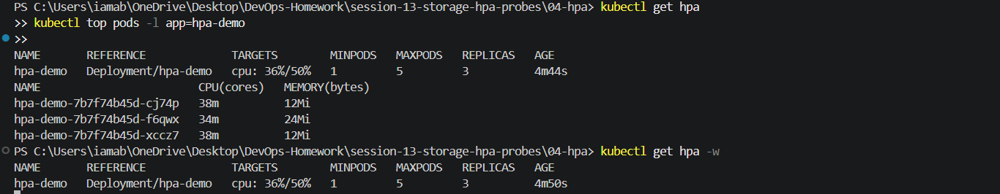

## 2.10 HPA Scaling

Actual HPA state after scaling:

```text
hpa-demo   Deployment/hpa-demo   cpu: 36%/50%   1   5   3
```

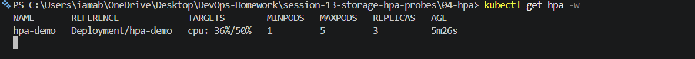

## 2.11 Scaled Pods

```text
hpa-demo-7b7f74b45d-cj74p   1/1   Running
hpa-demo-7b7f74b45d-f6qwx   1/1   Running
hpa-demo-7b7f74b45d-xccz7   1/1   Running
```

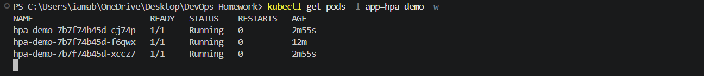

## 2.12 Final Loaded-State Output

```text
hpa-demo   Deployment/hpa-demo   cpu: 36%/50%   1   5   3
```

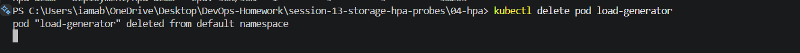

## 2.13 Stop Load

```powershell
kubectl delete pod load-generator
```

Result:

```text
pod "load-generator" deleted from default namespace
```

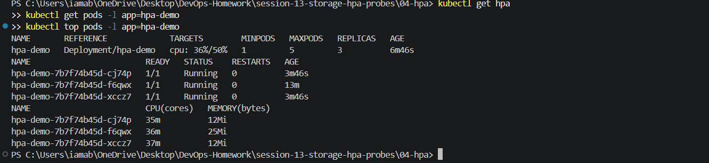

## 2.14 Post-Load Verification

Actual recorded state remained:

```text
hpa-demo   Deployment/hpa-demo   cpu: 36%/50%   1   5   3
```

All three Pods were Running.

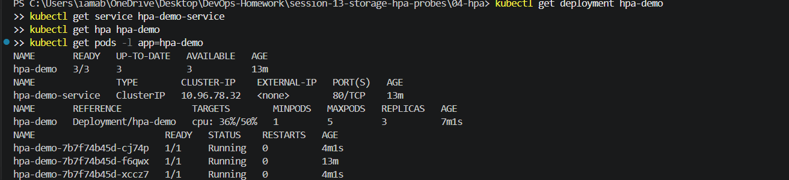

The HPA did not immediately return to one replica. The README records the actual observed state rather than inventing an expected result.

## Task 2 Result

| Item | Result |
|---|---|
| Metrics Server | Available |
| HPA | Active |
| CPU target | 50% |
| Peak recorded target | 107% / 50% |
| Initial replicas | 1 |
| Scaled replicas | 3 |
| Maximum allowed | 5 |
| Load generator | Deleted |
| Final recorded replicas | 3 |
| Final Pods | Running |

### Missing Task 2 screenshots

These files were not captured, so their actual terminal results are documented above:

```text
15-hpa-application-running.png
16-metrics-server.png
17-hpa-created.png
18-hpa-describe.png
26-hpa-final-verification.png
```

---

# Task 3 — Mini Project: Production-Ready Kubernetes Web App

## 3.1 Objective

The Session 13 mini-project combines:

- Persistent storage using a PVC
- HPA scaling between 2 and 5 replicas
- Startup, Readiness, and Liveness probes
- ClusterIP Service
- Load generation
- Persistence verification after Pod deletion

The project was implemented on **Docker Desktop Kubernetes**.

## 3.2 Mini-Project Structure

```text
mini-project/
├── namespace.yaml
├── pvc.yaml
├── deployment.yaml
├── service.yaml
├── hpa.yaml
└── README.md
```

## 3.3 Architecture

```text
                    Kubernetes Cluster
                           |
                           v
                 ┌──────────────────┐
                 │   web-app         │
                 │   Deployment      │
                 │                  │
                 │ Startup Probe    │
                 │ Readiness Probe  │
                 │ Liveness Probe   │
                 │ CPU Requests     │
                 │ /data mount      │
                 └────────┬─────────┘
                          |
                          v
                 ┌──────────────────┐
                 │  web-service     │
                 │  ClusterIP :80   │
                 └────────┬─────────┘
                          |
                          v
                 ┌──────────────────┐
                 │ Load Generator   │
                 │ BusyBox          │
                 └────────┬─────────┘
                          |
                          v
                 ┌──────────────────┐
                 │  Metrics Server  │
                 └────────┬─────────┘
                          |
                          v
                 ┌──────────────────┐
                 │ HPA web-app-hpa  │
                 │ 2–5 replicas     │
                 │ 50% CPU target   │
                 └──────────────────┘

                 web-app
                    |
                    | /data
                    v
                 PVC web-data
                    |
                    v
                 500Mi hostpath
```

## 3.4 Namespace

```powershell
kubectl apply -f namespace.yaml
```

Actual result:

```text
namespace/production-webapp created
```

Final status:

```text
production-webapp   Active
```

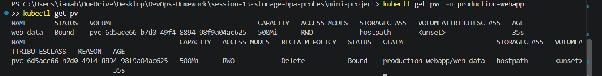

## 3.5 PersistentVolumeClaim

```powershell
kubectl apply -f pvc.yaml
kubectl get pvc -n production-webapp
```

Actual result:

```text
NAME       STATUS   VOLUME                                     CAPACITY   ACCESS MODES   STORAGECLASS
web-data   Bound    pvc-6d5ace66-b7d0-49f4-8894-98f9a04ac625   500Mi      RWO            hostpath
```

Docker Desktop dynamically provisioned the PVC using the `hostpath` StorageClass.

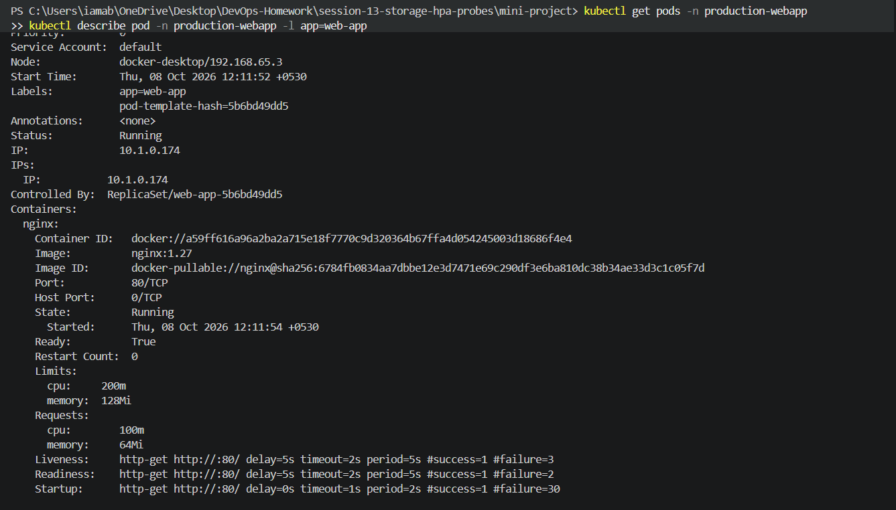

## 3.6 Deployment and Service

```powershell
kubectl apply -f deployment.yaml
kubectl apply -f service.yaml
kubectl get pods -n production-webapp
kubectl get svc -n production-webapp
```

Initial Pods:

```text
web-app-5b6bd49dd5-grgmr   1/1   Running   0
web-app-5b6bd49dd5-vcqxp   1/1   Running   0
```

Service:

```text
web-service   ClusterIP   10.102.230.144   80/TCP
```


## 3.7 Health Probes

### Startup Probe

```yaml
startupProbe:
  httpGet:
    path: /
    port: 80
  failureThreshold: 30
  periodSeconds: 2
```

### Readiness Probe

```yaml
readinessProbe:
  httpGet:
    path: /
    port: 80
  initialDelaySeconds: 5
  periodSeconds: 5
  timeoutSeconds: 2
  failureThreshold: 2
```

### Liveness Probe

```yaml
livenessProbe:
  httpGet:
    path: /
    port: 80
  initialDelaySeconds: 5
  periodSeconds: 5
  timeoutSeconds: 2
  failureThreshold: 3
```

The actual Pod description confirmed:

```text
Liveness:  http-get http://:80/
Readiness: http-get http://:80/
Startup:   http-get http://:80/
Ready:     True
Restart Count: 0
```

The `/data` mount was confirmed:

```text
/data from persistent-storage (rw)
```

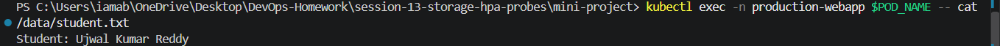

## 3.8 Persistent Storage Test

Select a Pod:

```powershell
$POD_NAME = kubectl get pods -n production-webapp -l app=web-app -o jsonpath='{.items[0].metadata.name}'
```

Create the file:

```powershell
kubectl exec -n production-webapp $POD_NAME -- sh -c "echo 'Student: Ujwal Kumar Reddy' > /data/student.txt"
```

Verify:

```powershell
kubectl exec -n production-webapp $POD_NAME -- cat /data/student.txt
```

Actual output:

```text
Student: Ujwal Kumar Reddy
```

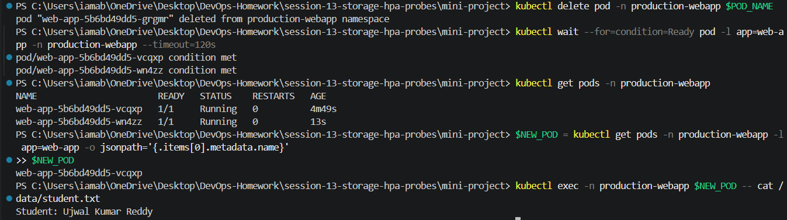

## 3.9 Persistence After Pod Deletion

Delete the original Pod:

```powershell
kubectl delete pod -n production-webapp $POD_NAME
```

Actual result:

```text
pod "web-app-5b6bd49dd5-grgmr" deleted from production-webapp namespace
```

After the replacement Pod became ready:

```powershell
kubectl exec -n production-webapp $NEW_POD -- cat /data/student.txt
```

Output:

```text
Student: Ujwal Kumar Reddy
```

The data survived Pod deletion because it was stored through the PVC-backed volume.

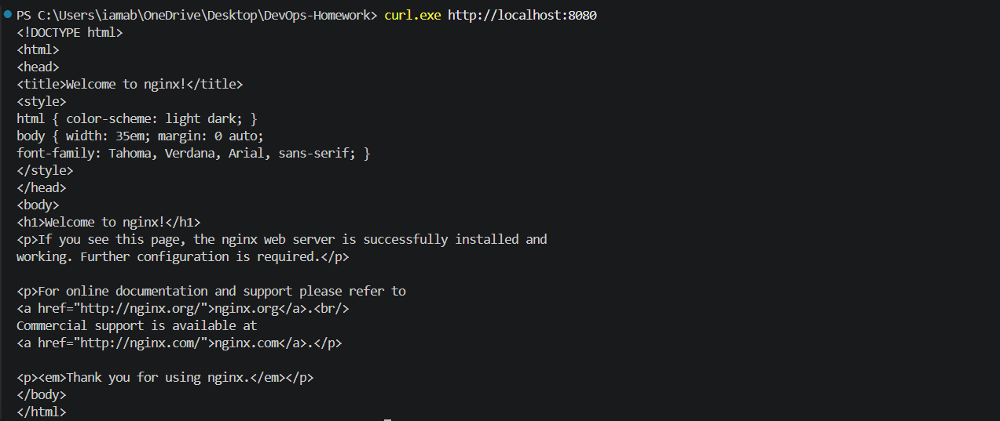

## 3.10 Service Verification

```powershell
kubectl port-forward -n production-webapp svc/web-service 8080:80
```

Actual result:

```text
Forwarding from 127.0.0.1:8080 -> 80
Forwarding from [::1]:8080 -> 80
Handling connection for 8080
```


## 3.11 HPA Configuration

The project HPA uses:

```text
Minimum replicas: 2
Maximum replicas: 5
CPU target: 50%
```

It was applied with:

```powershell
kubectl apply -f hpa.yaml
```

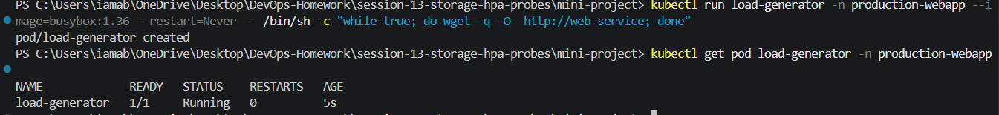

## 3.12 Mini-Project Load Generator

The load generator was run in the correct project namespace:

```powershell
kubectl run load-generator -n production-webapp --image=busybox:1.36 --restart=Never -- /bin/sh -c "while true; do wget -q -O- http://web-service; done"
```

Actual result:

```text
NAME             READY   STATUS    RESTARTS
load-generator   1/1     Running   0
```

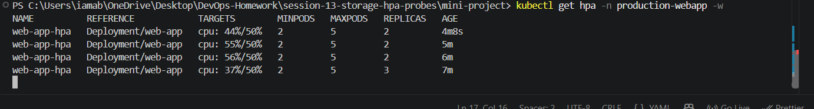

## 3.13 HPA Elastic Scaling

Monitor:

```powershell
kubectl get hpa -n production-webapp -w
```

Actual progression:

```text
NAME          REFERENCE            TARGETS        MINPODS   MAXPODS   REPLICAS
web-app-hpa   Deployment/web-app   cpu: 44%/50%   2         5         2
web-app-hpa   Deployment/web-app   cpu: 55%/50%   2         5         2
web-app-hpa   Deployment/web-app   cpu: 56%/50%   2         5         2
web-app-hpa   Deployment/web-app   cpu: 37%/50%   2         5         3
```

The HPA successfully scaled:

```text
2 replicas → 3 replicas
```

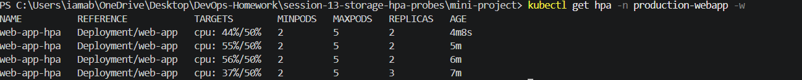

## 3.14 Scaled Pod Verification

After scaling:

```text
web-app-5b6bd49dd5-5v9jk   1/1   Running
web-app-5b6bd49dd5-vcqxp   1/1   Running
web-app-5b6bd49dd5-wn4zz   1/1   Running
```

CPU metrics:

```text
load-generator             828m   4Mi
web-app-5b6bd49dd5-5v9jk   37m    11Mi
web-app-5b6bd49dd5-vcqxp   36m    12Mi
web-app-5b6bd49dd5-wn4zz   38m    11Mi
```

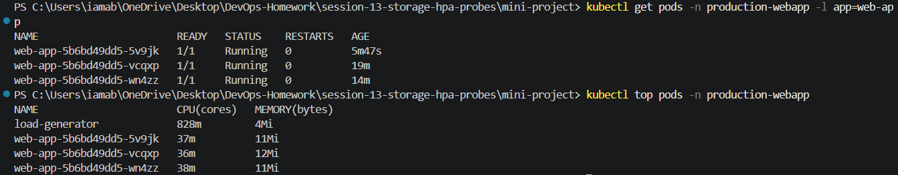

## 3.15 Stop Load Generator

```powershell
kubectl delete pod load-generator -n production-webapp
```

Actual result:

```text
pod "load-generator" deleted from production-webapp namespace
```

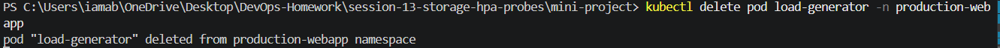

## 3.16 Final Verification

Commands:

```powershell
kubectl get namespace production-webapp
kubectl get pvc -n production-webapp
kubectl get deployment web-app -n production-webapp
kubectl get service web-service -n production-webapp
kubectl get hpa web-app-hpa -n production-webapp
kubectl get pods -n production-webapp
kubectl top pods -n production-webapp
```

Actual final state:

```text
production-webapp   Active

web-data   Bound   500Mi   RWO   hostpath

web-app   3/3   3   3

web-service   ClusterIP   10.102.230.144   80/TCP

web-app-hpa   Deployment/web-app   cpu: 36%/50%   2   5   3
```

Final application state:

```text
3/3 Pods Running
HPA replicas: 3
HPA range: 2–5
CPU target: 50%
PVC: Bound
Service: ClusterIP
```

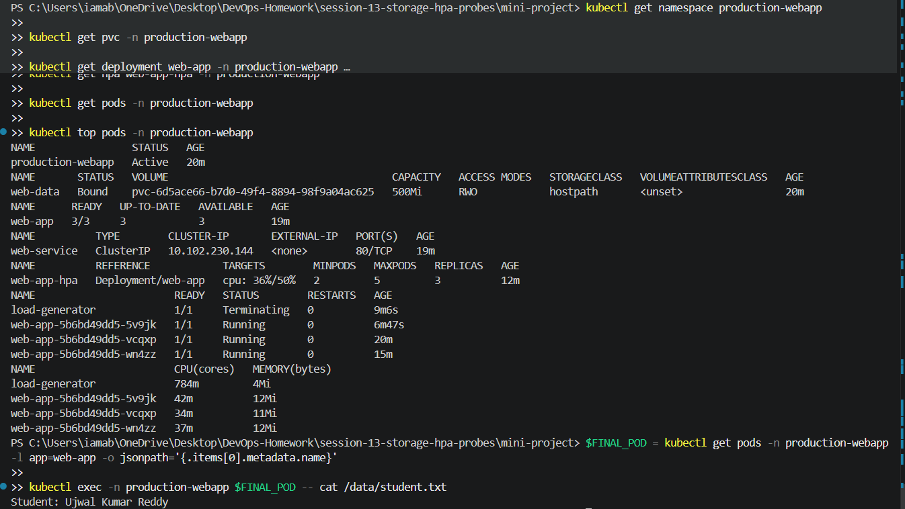

## 3.17 Final Persistence Verification

```powershell
$FINAL_POD = kubectl get pods -n production-webapp -l app=web-app -o jsonpath='{.items[0].metadata.name}'

kubectl exec -n production-webapp $FINAL_POD -- cat /data/student.txt
```

Final output:

```text
Student: Ujwal Kumar Reddy
```

## 3.18 Mini-Project Results

| Requirement | Result |
|---|---|
| Dedicated Namespace | ✅ `production-webapp` |
| PVC | ✅ 500Mi, Bound |
| Persistent Storage | ✅ Verified |
| Pod deletion persistence | ✅ Data survived |
| Startup Probe | ✅ Configured and verified |
| Readiness Probe | ✅ Configured and verified |
| Liveness Probe | ✅ Configured and verified |
| Service | ✅ ClusterIP |
| Metrics Server | ✅ Working |
| HPA | ✅ 2–5 replicas |
| CPU target | ✅ 50% |
| Load Generator | ✅ Working |
| HPA Scaling | ✅ 2 → 3 replicas |
| Final application Pods | ✅ 3/3 Running |
| Persistent data final check | ✅ Successful |

## 3.19 Task 3 Conclusion

The Session 13 mini-project was successfully completed.

```text
PVC
 ↓
Persistent /data storage
 ↓
NGINX Deployment
 ↓
Startup + Readiness + Liveness Probes
 ↓
ClusterIP Service
 ↓
Metrics Server
 ↓
HPA
 ↓
Load Generator
 ↓
Automatic scaling: 2 → 3 replicas
```

The project was tested on **Docker Desktop Kubernetes** rather than Minikube. The PVC was dynamically provisioned using Docker Desktop's `hostpath` StorageClass.

---

# Task 3 Screenshot Evidence

The following screenshots actually exist in the main Session 13 `screenshots` folder:

```text
27-mini-project-deployed.png
28-pvc-bound.png
29-probes-verified.png
30-persistent-data-created.png
31-persistent-data-survived.png
32-service-verification.png
33-hpa-created.png
34-mini-project-load-generator.png
35-hpa-scaling.png
36-scaled-pods.png
37-load-generator-deleted.png
38-mini-project-final-verification.png
```

All of these paths are relative to this root file:

```text
session-13-storage-hpa-probes/README.md
```

Therefore the correct Markdown image format is:

```text
screenshots/<filename>.png
```

not `../screenshots/<filename>.png`.

---

# Session 13 — Overall Result

| Task | Status |
|---|---|
| Task 1 — Kubernetes Volumes | ✅ Completed |
| Task 2 — Horizontal Pod Autoscaling | ✅ Completed |
| Task 3 — Production-Ready Kubernetes Web App | ✅ Completed |
