# Session 14 — Kubernetes Troubleshooting

## Task 1: Kubernetes Troubleshooting Commands

This task covers the core troubleshooting commands from the reference material:

- `kubectl get`
- `kubectl describe`
- `kubectl logs`
- `kubectl exec`
- Kubernetes Events

The exercises were performed on **Docker Desktop Kubernetes** using `kubectl`.

### Environment

```text
Kubernetes context: docker-desktop
Kubernetes version: v1.34.1
Node: docker-desktop
Container runtime: docker://29.5.3
```

---

# 01 — kubectl get

## Objective

`kubectl get` provides a quick view of the current state of Kubernetes resources.

Think of it as:

> "Kubernetes, show me what is currently happening."

## Pod Used

`pod.yaml`

```yaml
apiVersion: v1
kind: Pod
metadata:
  name: get-demo
  labels:
    app: get-demo
spec:
  containers:
    - name: nginx
      image: nginx:1.27
      ports:
        - containerPort: 80
```

## Commands

```powershell
kubectl apply -f pod.yaml
kubectl get pods
kubectl get pods -o wide
kubectl get services
kubectl get deployments
kubectl get nodes
kubectl get all
kubectl get pods -w
```

The Pod was deleted from another terminal with:

```powershell
kubectl delete pod get-demo
```

The watch showed the Pod terminating and reaching `Completed`.

## Actual Node Output

```text
NAME             STATUS   ROLES           AGE   VERSION
docker-desktop   Ready    control-plane   20d   v1.34.1
```

## Actual `kubectl get all` Result

The cluster contained existing workloads plus the Task 1 Pod. Important resources included:

```text
pod/get-demo                                1/1   Running   0
pod/hpa-demo-7b7f74b45d-f6qwx               1/1   Running   0
service/hpa-demo-service                    ClusterIP   10.96.78.32   80/TCP
deployment.apps/app-blue                    3/3
deployment.apps/app-canary                  9/9
deployment.apps/app-green                   3/3
deployment.apps/app-recreate                3/3
deployment.apps/app-rolling                 4/4
deployment.apps/hpa-demo                    1/1
deployment.apps/yatri-backend               2/2
deployment.apps/yatri-frontend              2/2
```

## What the Output Means

- **NAME** — resource name.
- **READY** — number of ready containers.
- **STATUS** — current resource state.
- **RESTARTS** — number of container restarts.
- **AGE** — how long the resource has existed.
- `-o wide` adds information such as Pod IP and node.

## Screenshots

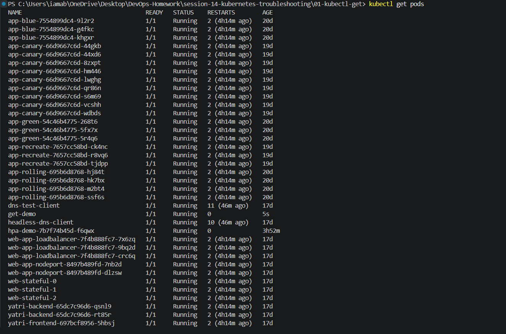

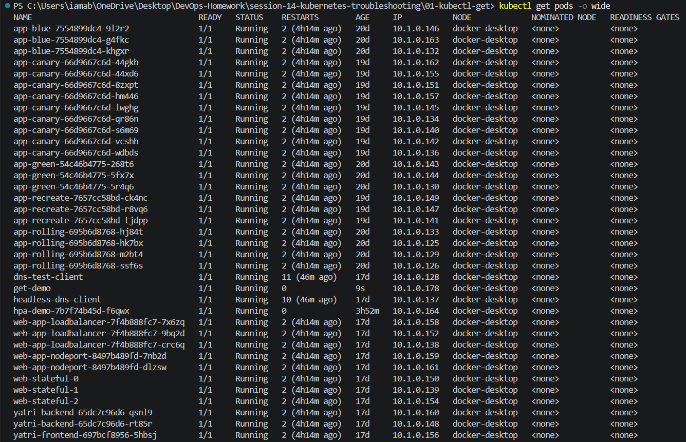

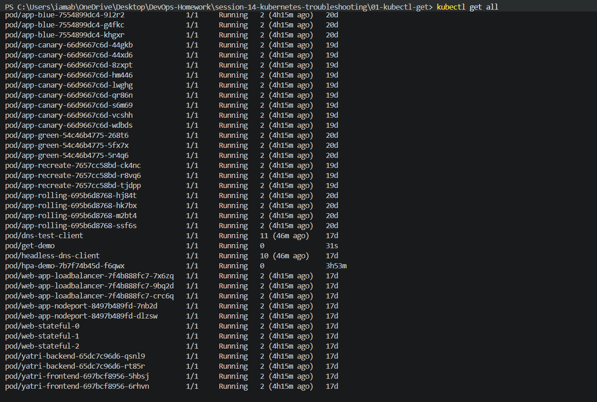

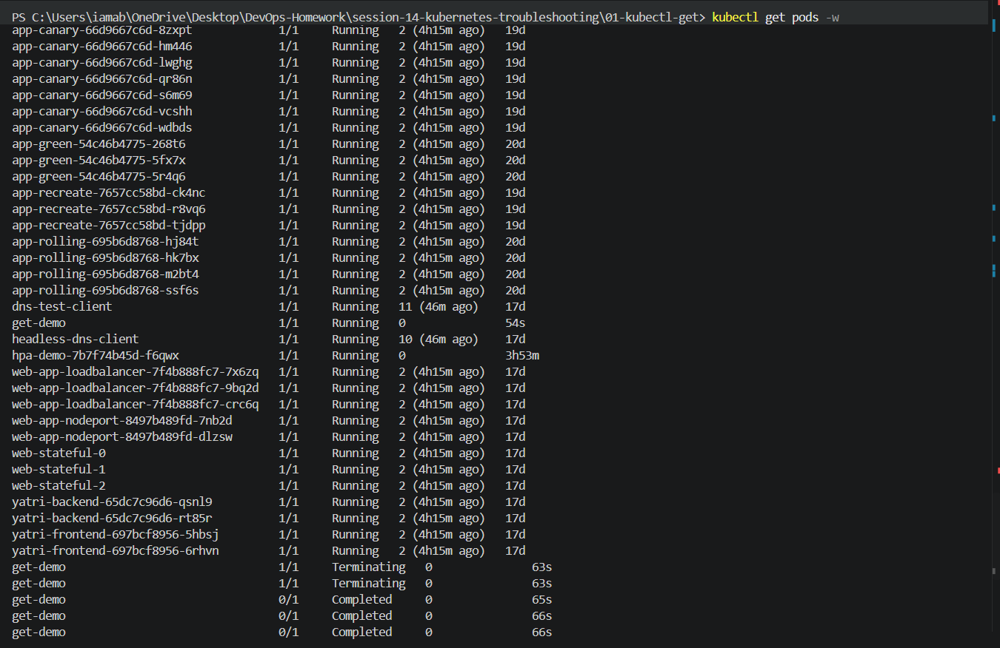

## Key Learning

```text
kubectl get
     |
     v
"What is happening?"
```

---

# 02 — kubectl describe

## Objective

`kubectl describe` provides detailed information about a Kubernetes resource.

Think of it as:

> "What exactly happened?"

## Pod Used

`demo-pod.yaml`

```yaml
apiVersion: v1
kind: Pod
metadata:
  name: describe-demo
  labels:
    app: describe-demo
spec:
  containers:
    - name: nginx
      image: nginx:1.27
      ports:
        - containerPort: 80
```

## Commands

```powershell
kubectl apply -f demo-pod.yaml
kubectl get pod describe-demo
kubectl describe pod describe-demo
```

Actual creation and status:

```text
pod/describe-demo created

NAME            READY   STATUS    RESTARTS   AGE
describe-demo   1/1     Running   0
```

## Actual `kubectl describe pod` Result

Important actual values were:

```text
Name:             describe-demo
Namespace:        default
Node:             docker-desktop/192.168.65.3
Labels:           app=describe-demo
Status:           Running
IP:               10.1.0.179
Image:            nginx:1.27
Port:             80/TCP
State:            Running
Ready:            True
Restart Count:    0
```

Conditions were all successful:

```text
PodReadyToStartContainers   True
Initialized                 True
Ready                       True
ContainersReady             True
PodScheduled                True
```

Events showed:

```text
Normal  Scheduled  Successfully assigned default/describe-demo to docker-desktop
Normal  Pulled     Container image "nginx:1.27" already present on machine
Normal  Created    Created container: nginx
Normal  Started    Started container nginx
```

## Node Description

The Docker Desktop node was also inspected:

```powershell
kubectl describe node docker-desktop
```

Important actual information included:

```text
Name:               docker-desktop
Roles:              control-plane
Unschedulable:      false
Ready               True
InternalIP:         192.168.65.3
Operating System:   linux
Architecture:       amd64
Container Runtime:  docker://29.5.3
Kubelet Version:    v1.34.1
```

Node capacity included 12 CPUs, about 7.8 GiB memory, and 110 Pod capacity.

## Placeholder Command Note

The reference uses examples such as:

```powershell
kubectl describe deployment <deployment-name>
kubectl describe service <service-name>
```

These are placeholders and should not be typed literally in PowerShell. Typing the angle-bracket form produced the PowerShell parser error:

```text
The '<' operator is reserved for future use.
```

Typing the literal `service-name` produced:

```text
Error from server (NotFound): services "service-name" not found
```

No fake resource was created. The actual Pod and Docker Desktop node were described.

## Screenshots

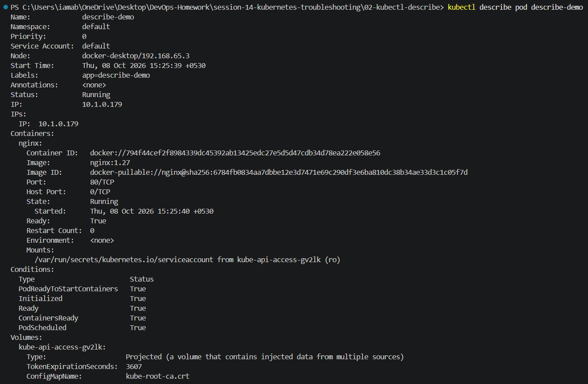


## Key Learning

```text
kubectl get
     |
     v
"What is happening?"

kubectl describe
     |
     v
"Why / what exactly is happening?"
```

---

# 03 — kubectl logs

## Objective

`kubectl logs` displays output written by a container.

Think of it as:

> "What is the application saying?"

## Pod Used

`pod.yaml` uses `busybox:1.36` and continuously prints health messages.

## Commands

```powershell
kubectl apply -f pod.yaml
kubectl get pod logs-demo
kubectl logs logs-demo
kubectl logs -f logs-demo
kubectl logs logs-demo --previous
```

Actual Pod status:

```text
NAME        READY   STATUS    RESTARTS   AGE
logs-demo   1/1     Running   0
```

## Actual Logs

```text
Application started
Connecting to database...
Database connection successful
Application is running
Application is healthy
Application is healthy
```

Following logs produced repeated health messages.

The `--previous` command returned:

```text
Error from server (BadRequest): previous terminated container "app" in pod "logs-demo" not found
```

This happened because the container had not previously crashed or restarted, so there was no previous terminated container.

## Screenshots

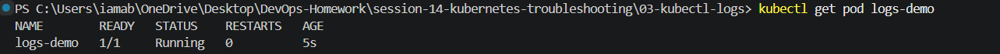

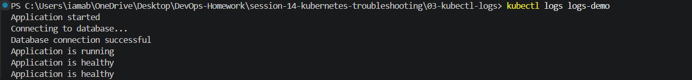

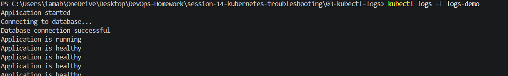

## Key Learning

```text
kubectl logs
     |
     v
"What is the application saying?"
```

---

# 04 — kubectl exec

## Objective

`kubectl exec` allows commands to be executed inside a running container.

Think of it as:

> "Let me check what is happening from inside the container."

## Pod Used

`exec-demo` runs `nginx:1.27`.

## Commands

```powershell
kubectl apply -f pod.yaml
kubectl get pod exec-demo
kubectl exec -it exec-demo -- bash
```

Inside the container:

```bash
ls /usr/share/nginx/html
curl localhost
nginx -T
exit
```

Actual files:

```text
50x.html
index.html
```

`curl localhost` returned the Nginx welcome page, confirming that Nginx was working inside the container.

`nginx -T` confirmed:

```text
nginx: the configuration file /etc/nginx/nginx.conf syntax is ok
nginx: configuration file /etc/nginx/nginx.conf test is successful
```

## Individual Commands

```powershell
kubectl exec exec-demo -- hostname
kubectl exec exec-demo -- ls /usr/share/nginx/html
kubectl exec exec-demo -- cat /etc/hosts
kubectl exec exec-demo -- curl localhost
```

Actual hostname:

```text
exec-demo
```

The Kubernetes-managed hosts file contained:

```text
127.0.0.1       localhost
10.1.0.181      exec-demo
```

The direct `curl localhost` command returned the Nginx welcome page.

A small accidental input of `1s` inside the interactive shell produced:

```text
bash: 1s: command not found
```

It did not affect the exercise; all intended commands subsequently worked.

## Screenshots

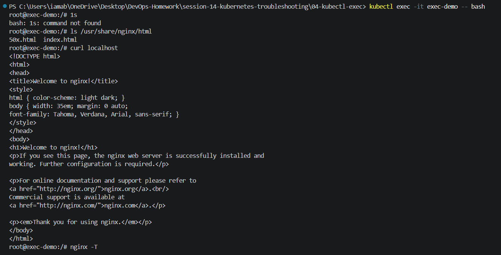

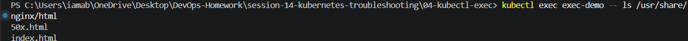

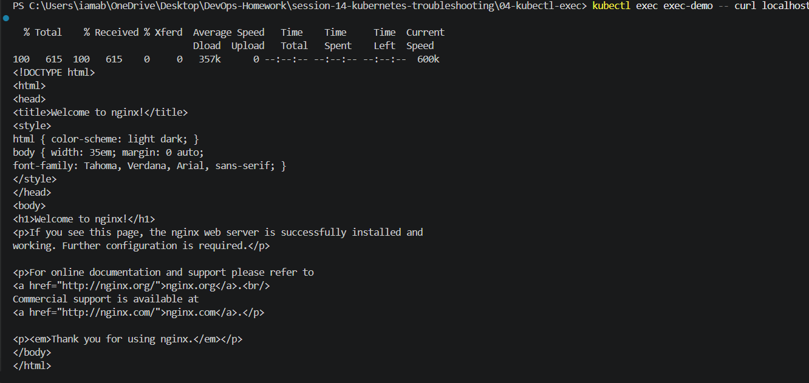

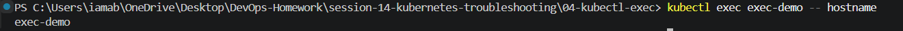

## Key Learning

```text
kubectl exec
     |
     v
"Let me check from INSIDE the container."
```

---

# 05 — Kubernetes Events

## Objective

Kubernetes Events show what Kubernetes attempted to do with resources and what happened.

Think of Events as:

> "Kubernetes' activity log for a resource."

## Pod Used

`events-demo` runs `nginx:1.27`.

## Create and Inspect Events

```powershell
kubectl apply -f pod.yaml
kubectl get events
kubectl get events --sort-by=.lastTimestamp
kubectl describe pod events-demo
kubectl events --for pod/events-demo
kubectl events --watch
kubectl get events --field-selector type=Warning
```

The Pod was created successfully:

```text
pod/events-demo created
```

## Actual `events-demo` Status

```text
Name:          events-demo
Namespace:     default
Node:          docker-desktop/192.168.65.3
Status:        Running
IP:            10.1.0.182
Image:         nginx:1.27
State:         Running
Ready:         True
Restart Count: 0
```

## Actual Pod Events

```text
Normal  Scheduled  Successfully assigned default/events-demo to docker-desktop
Normal  Pulled     Container image "nginx:1.27" already present on machine
Normal  Created    Created container: nginx
Normal  Started    Started container nginx
```

`kubectl events --for pod/events-demo` displayed the same lifecycle events for this Pod.

## Warning Events

The Warning filter returned:

```text
No resources found in default namespace.
```

This means there were no Warning-type Events in the default namespace at the time of the check.

## Screenshots

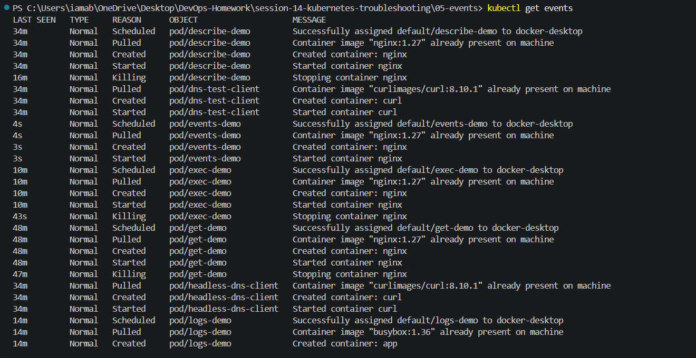

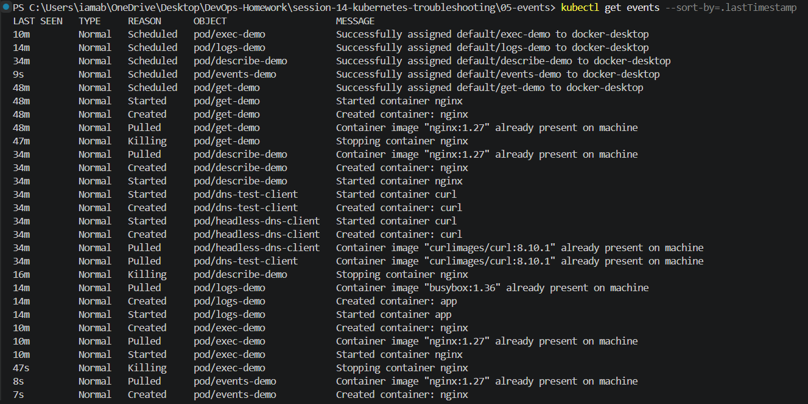

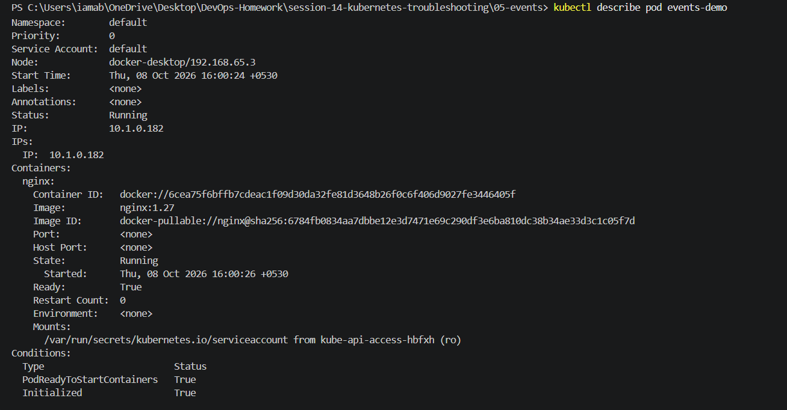

## Key Learning

```text
kubectl get
     |
     v
Current status

kubectl describe
     |
     v
Detailed information

Events
     |
     v
What Kubernetes tried to do and what happened
```

---

# Task 1 Summary

All five core troubleshooting tools from the reference were practiced successfully on Docker Desktop Kubernetes.

| Command | Purpose | Status |
|---|---|---|
| `kubectl get` | Quick current state | Completed |
| `kubectl describe` | Detailed resource investigation | Completed |
| `kubectl logs` | Application/container output | Completed |
| `kubectl exec` | Inspect from inside a container | Completed |
| Kubernetes Events | Kubernetes activity/lifecycle information | Completed |

## Troubleshooting Flow

```text
             Problem
                |
                v
        kubectl get pods
                |
                v
          What is wrong?
                |
        +-------+-------+
        |               |
        v               v
   describe          logs
        |               |
        +-------+-------+
                |
                v
          Check Events
                |
                v
       kubectl exec
                |
                v
      Verify from inside
```

## Screenshots Captured

```text
screenshots/
├── 01-get-pod-running.png
├── 02-get-pods-wide.png
├── 03-get-all-resources.png
├── 04-get-pod-watch.png
├── 05-describe-output.png
├── 06-logs-pod-running.png
├── 07-logs-output.png
├── 08-logs-follow.png
├── 09-exec-container-shell.png
├── 10-exec-nginx-files.png
├── 11-exec-curl.png
├── 12-exec-command.png
├── 13-events-output.png
├── 14-events-sorted.png
└── 15-events-describe.png
```

## Cleanup

The temporary Task 1 Pods were deleted after their exercises:

```powershell
kubectl delete pod get-demo
kubectl delete pod describe-demo
kubectl delete pod exec-demo
kubectl delete pod events-demo
```

The logs Pod can also be removed if it is still running:

```powershell
kubectl delete pod logs-demo
```

## Task 1 Status

**COMPLETED — Docker Desktop Kubernetes**

---

## References

- Kubernetes kubectl reference: https://kubernetes.io/docs/reference/kubectl/
- Kubernetes Pod lifecycle: https://kubernetes.io/docs/concepts/workloads/pods/pod-lifecycle/
- Kubernetes Logging: https://kubernetes.io/docs/concepts/cluster-administration/logging/
- Get a shell to a running container: https://kubernetes.io/docs/tasks/debug/debug-application/get-shell-r/
- Kubernetes Events API: https://kubernetes.io/docs/reference/kubernetes-api/cluster-resources/event

# Session 14 --- Kubernetes Troubleshooting

## Task 2: Troubleshoot Common Issues

**Environment:** Docker Desktop Kubernetes\
**Kubernetes:** v1.34.1\
**Node:** `docker-desktop`

Task 2 was completed by reproducing failures, investigating them with
Kubernetes commands, identifying root causes, fixing them, verifying the
fixes, and cleaning up the test resources.

------------------------------------------------------------------------

## 1. CrashLoopBackOff

### Problem

`crash-demo` used `busybox:1.36` and intentionally executed `exit 1`.

Commands:

``` powershell
kubectl apply -f broken-pod.yaml
kubectl get pod crash-demo
kubectl get pod crash-demo -o wide
kubectl describe pod crash-demo
kubectl logs crash-demo
kubectl logs crash-demo --previous
```

The container terminated with:

``` text
Reason:       Error
Exit Code:    1
Ready:        False
Restart Count: 3
```

Events showed:

``` text
Warning  BackOff  Back-off restarting failed container app
```

Logs:

``` text
Application starting...
Something went wrong!
```

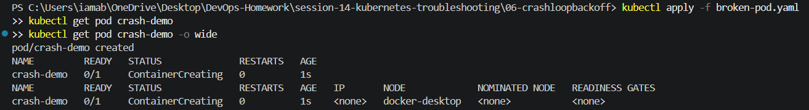

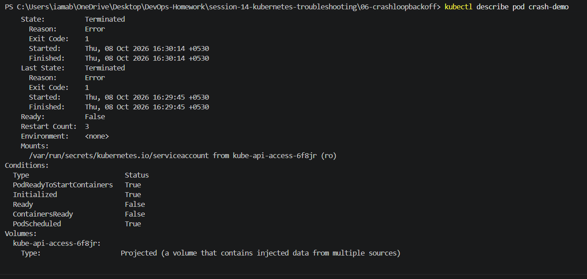

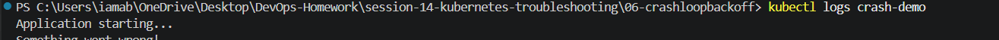

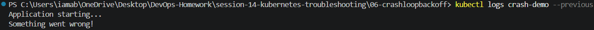

### Root Cause

The container command explicitly executed `exit 1`, so Kubernetes
repeatedly restarted the failed container.

### Fix

``` powershell
kubectl delete pod crash-demo
kubectl apply -f fixed-pod.yaml
kubectl get pod crash-demo
kubectl logs crash-demo
```

Final result:

``` text
NAME         READY   STATUS    RESTARTS
crash-demo   1/1     Running   0

Application starting...
Application is healthy
```

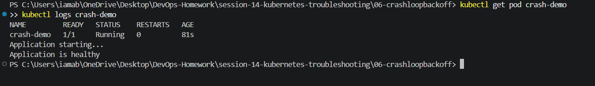

**Result: CrashLoopBackOff fixed successfully.**

------------------------------------------------------------------------

## 2. ImagePullBackOff / ErrImagePull

### Problem

`image-demo` referenced the invalid image:

``` text
nginx:this-image-does-not-exist
```

Commands:

``` powershell
kubectl apply -f broken-pod.yaml
kubectl get pod image-demo
```

The Pod changed through:

``` text
ContainerCreating
ImagePullBackOff
ErrImagePull
```

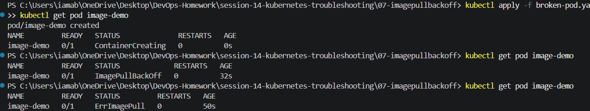

### Investigation

``` powershell
kubectl describe pod image-demo
```

Important output:

``` text
Image:          nginx:this-image-does-not-exist
State:          Waiting
Reason:         ImagePullBackOff
```

Events reported:

``` text
Failed to pull image "nginx:this-image-does-not-exist"
docker.io/library/nginx:this-image-does-not-exist: not found
Error: ErrImagePull
Error: ImagePullBackOff
```

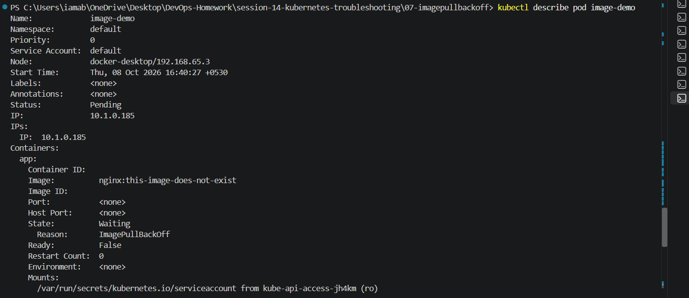

### Root Cause

The requested image tag did not exist.

### Fix and Verification

``` powershell
kubectl delete pod image-demo
kubectl apply -f fixed-pod.yaml
kubectl get pod image-demo
kubectl logs image-demo
```

Final state:

``` text
NAME         READY   STATUS    RESTARTS
image-demo   1/1     Running   0
```

NGINX logs confirmed successful startup.

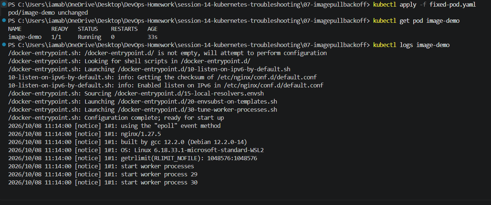

**Result: ErrImagePull/ImagePullBackOff fixed successfully.**

------------------------------------------------------------------------

## 3. Pending Pod

### Problem

`pending-demo` used a node selector for a node that did not exist:

``` text
kubernetes.io/hostname=node-that-does-not-exist
```

Commands:

``` powershell
kubectl apply -f broken-pod.yaml
kubectl get pod pending-demo
kubectl get pod pending-demo -o wide
```

Result:

``` text
NAME           READY   STATUS    RESTARTS
pending-demo   0/1     Pending   0
```

No node was assigned.

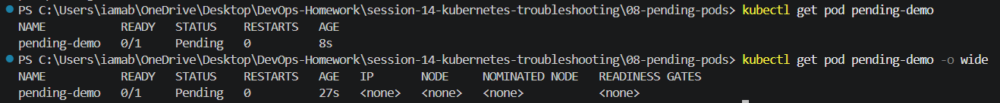

### Investigation

``` powershell
kubectl describe pod pending-demo
```

Important details:

``` text
Node:             <none>
PodScheduled      False
Node-Selectors:   kubernetes.io/hostname=node-that-does-not-exist
```

Scheduler event:

``` text
0/1 nodes are available:
1 node(s) didn't match Pod's node affinity/selector.
```

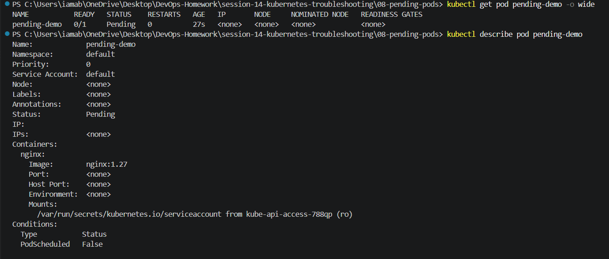

Available node:

``` powershell
kubectl get nodes
```

``` text
docker-desktop   Ready   control-plane   v1.34.1
```

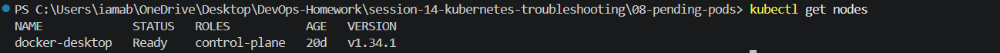

### Root Cause

The Pod selector did not match the only available Docker Desktop node.

### Fix and Verification

``` powershell
kubectl delete pod pending-demo
kubectl apply -f fixed-pod.yaml
kubectl get pod pending-demo
kubectl get pod pending-demo -o wide
```

Final result:

``` text
NAME           READY   STATUS    RESTARTS
pending-demo   1/1     Running   0
```

The Pod was scheduled to `docker-desktop`.

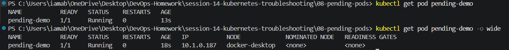

**Result: Pending scheduling issue fixed successfully.**

------------------------------------------------------------------------

## 4. ContainerCreating

`ContainerCreating` was observed immediately after several Pods were
created or recreated.

Example:

``` text
NAME         READY   STATUS              RESTARTS
crash-demo   0/1     ContainerCreating   0
```

This was a transient startup state. After image/container startup
completed, the Pod became:

``` text
1/1   Running
```

The correct investigation commands were:

``` powershell
kubectl get pod <pod-name>
kubectl describe pod <pod-name>
```

The lesson was not to treat an immediate `ContainerCreating` state as a
permanent failure.

------------------------------------------------------------------------

## 5. Service Connectivity

### Application

A two-replica NGINX Deployment was created:

``` powershell
kubectl apply -f deployment.yaml
kubectl get pods
kubectl get pods --show-labels
```

The Pods were:

``` text
web-77cc89f59f-hnhpn   1/1   Running   app=web
web-77cc89f59f-pns7d   1/1   Running   app=web
```

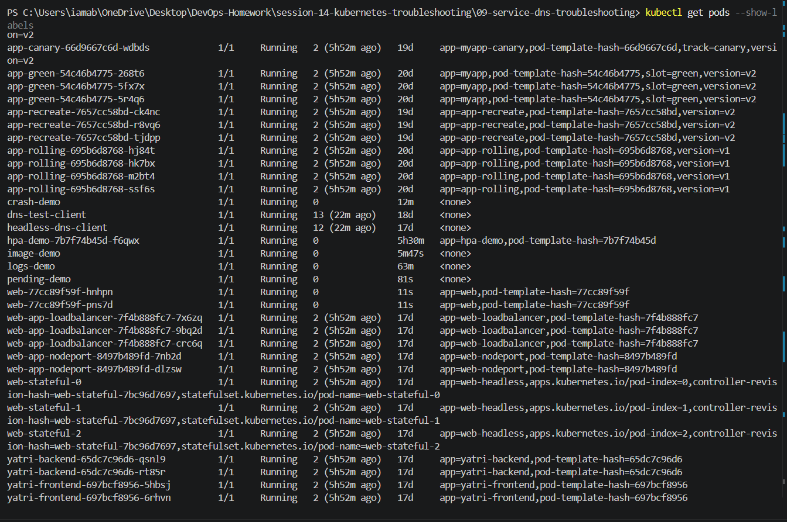

### Service

``` powershell
kubectl apply -f service.yaml
kubectl get service web-service
```

Result:

``` text
NAME          TYPE        CLUSTER-IP      PORT(S)
web-service   ClusterIP   10.107.186.18   80/TCP
```

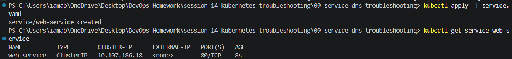

### Investigate

``` powershell
kubectl describe service web-service
kubectl get endpoints web-service
```

The Service had:

``` text
Selector:  app=web
TargetPort: 80/TCP
Endpoints: 10.1.0.188:80,10.1.0.189:80
```

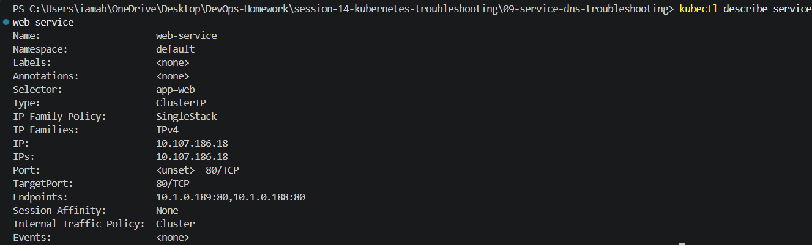

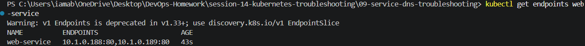

### Connectivity verification

From the test Pod:

``` powershell
kubectl exec dns-test -- wget -qO- http://web-service
```

The request returned the NGINX welcome page.

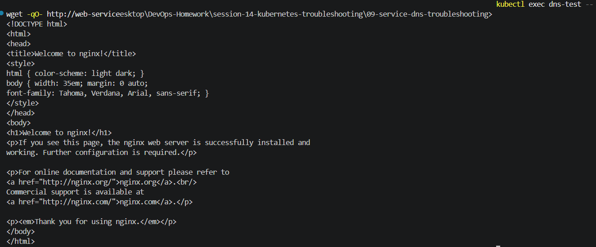

**Result: Service-to-Pod connectivity verified successfully.**

------------------------------------------------------------------------

## 6. DNS Troubleshooting

The first DNS test Pod used:

``` text
registry.k8s.io/e2e-test-images/dnsutils:1.3
```

In the Docker Desktop environment this image could not be pulled,
producing:

``` text
ErrImagePull
ImagePullBackOff
```

The Pod definition was corrected and recreated.

Final result:

``` text
dns-test   1/1   Running   0
```

### DNS lookup

``` powershell
kubectl exec -it dns-test -- nslookup web-service
```

The short-name lookup showed NXDOMAIN attempts before resolving the
fully-qualified Service name.

Explicit FQDN lookup:

``` powershell
kubectl exec -it dns-test -- nslookup web-service.default.svc.cluster.local
```

Result:

``` text
Server:         10.96.0.10
Address:        10.96.0.10:53

Name:   web-service.default.svc.cluster.local
Address: 10.107.186.18
```

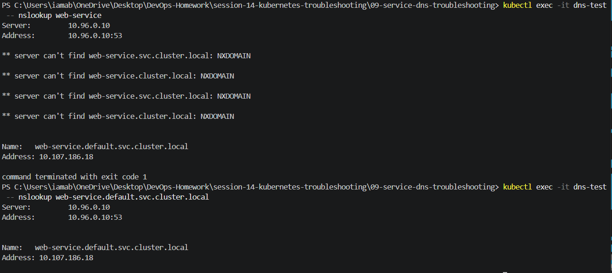

### DNS configuration

``` powershell
kubectl exec -it dns-test -- cat /etc/resolv.conf
```

Result:

``` text
nameserver 10.96.0.10
search default.svc.cluster.local svc.cluster.local cluster.local
options ndots:5
```

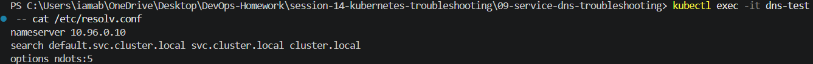

### CoreDNS

``` powershell
kubectl get pods -n kube-system
kubectl logs -n kube-system -l k8s-app=kube-dns
```

CoreDNS Pods were running:

``` text
coredns-66bc5c9577-7pp6k   1/1   Running
coredns-66bc5c9577-spz7s   1/1   Running
```

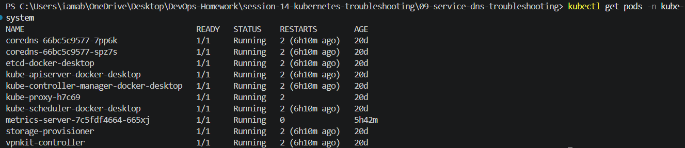

CoreDNS logs were inspected as part of the DNS investigation. The
captured logs contained Kubernetes-plugin connection errors at that
point in time, while the final FQDN resolution and HTTP request were
successful.

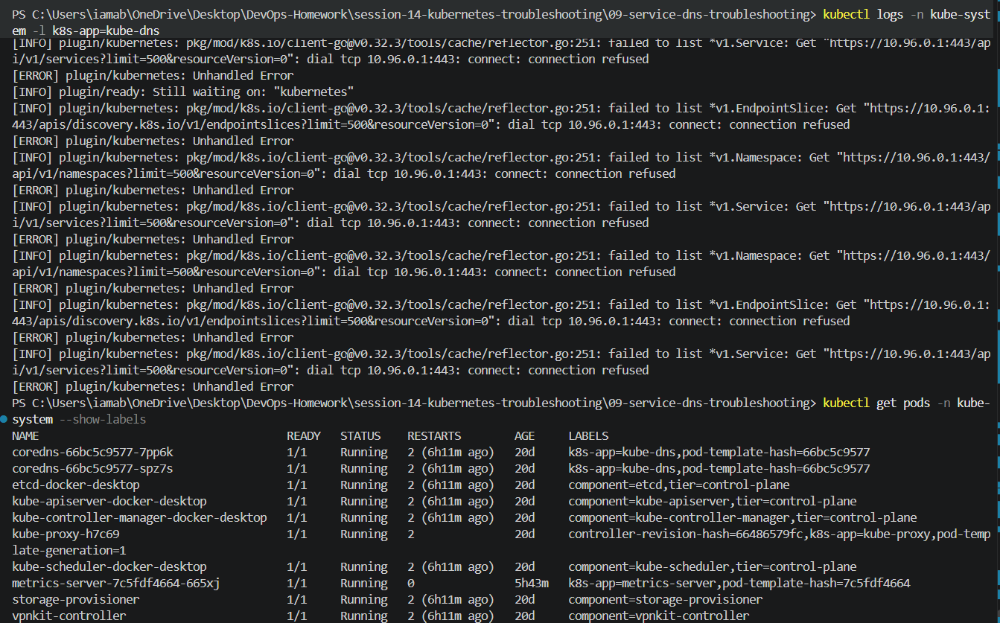

**Result: Kubernetes DNS configuration and Service DNS resolution were
verified.**

------------------------------------------------------------------------

## 7. Service Configuration Issue

A broken Service was intentionally configured with:

``` yaml
selector:
  app: does-not-exist
```

There was also an initial YAML error in the `ports` field. Kubernetes
rejected it with:

``` text
cannot unmarshal object into Go struct field ServiceSpec.spec.ports
of type []v1.ServicePort
```

After correcting the YAML, the Service was created.

### Investigation

``` powershell
kubectl get service broken-service
kubectl get endpoints broken-service
kubectl describe service broken-service
```

The Service existed, but:

``` text
ENDPOINTS   <none>
```

and:

``` text
Selector: app=does-not-exist
```

The application Pods actually used:

``` text
app=web
```

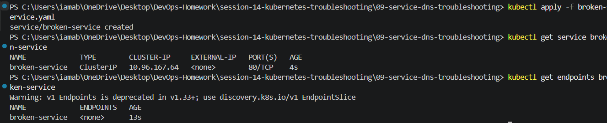

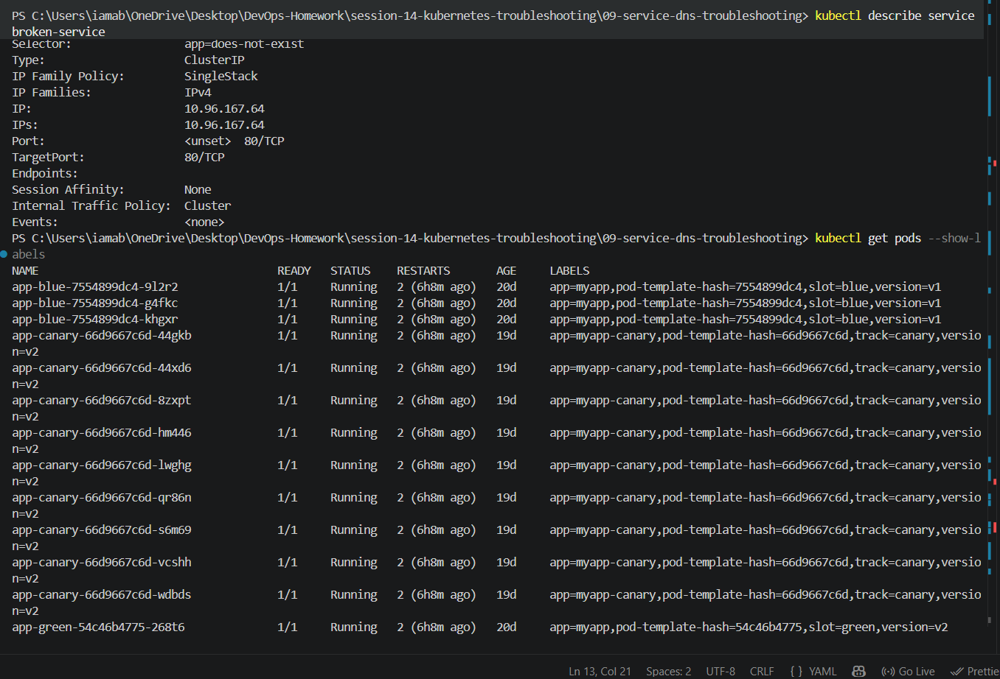

### Root Cause

The Service selector did not match any application Pods.

### Fix

The selector was corrected to:

``` yaml
selector:
  app: web
```

The valid Service then showed endpoints:

``` text
10.1.0.188:80,10.1.0.189:80
```

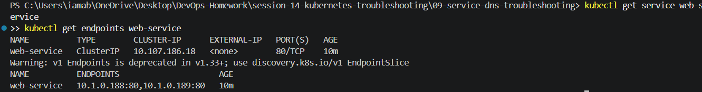

**Result: Service configuration/selector issue fixed successfully.**

------------------------------------------------------------------------

## 8. Pod Networking Verification

The Service and DNS tests also verified the Pod networking path:

``` text
dns-test Pod
     |
     | DNS
     v
web-service ClusterIP
     |
     | Service routing
     v
web Pods
     |
     | HTTP
     v
NGINX response
```

Successful evidence:

``` text
web-service.default.svc.cluster.local
        -> 10.107.186.18
```

and:

``` text
wget http://web-service
        -> NGINX Welcome page
```

This verified DNS, ClusterIP Service routing, Pod reachability, and HTTP
response.

------------------------------------------------------------------------

## 9. Final Verification and Cleanup

Cleanup commands:

``` powershell
kubectl delete pod crash-demo --ignore-not-found
kubectl delete pod image-demo --ignore-not-found
kubectl delete pod pending-demo --ignore-not-found
kubectl delete pod dns-test --ignore-not-found

kubectl delete deployment web --ignore-not-found
kubectl delete service web-service --ignore-not-found
kubectl delete service broken-service --ignore-not-found
```

Final checks included:

``` powershell
kubectl get pods
kubectl get services
kubectl get endpoints web-service
kubectl get nodes
kubectl get pods -n kube-system
```

The Docker Desktop node was healthy:

``` text
docker-desktop   Ready   control-plane   v1.34.1
```

Core Kubernetes components and Metrics Server were running.


------------------------------------------------------------------------

## 10. Troubleshooting Summary

  ----------------------------------------------------------------------------
  Issue               Root Cause        Fix                  Verification
  ------------------- ----------------- -------------------- -----------------
  CrashLoopBackOff    Container         Corrected command    Pod Running,
                      executed `exit 1`                      restart count 0,
                                                             healthy logs

  ErrImagePull        Invalid image tag Corrected image      Pod Running

  ImagePullBackOff    Repeated failed   Corrected image      Pod Running
                      image pulls                            

  Pending             Invalid node      Corrected selector   Pod scheduled on
                      selector                               docker-desktop

  ContainerCreating   Startup in        Waited/inspected Pod Pod reached
                      progress                               Running

  Service             Service/backend   Correct              NGINX response
  connectivity        path needed       selector/endpoints   
                      validation                             

  DNS                 DNS test image    Corrected test Pod   FQDN resolved
                      initially         and used FQDN        
                      unavailable; then                      
                      DNS verified                           

  Service             Selector matched  Changed to `app=web` Endpoints
  configuration       no Pods                                populated

  Pod networking      Needed cluster    DNS + ClusterIP +    NGINX page
                      path verification HTTP test            returned
  ----------------------------------------------------------------------------

------------------------------------------------------------------------

## 11. Commands Practiced

``` powershell
kubectl apply
kubectl get pod
kubectl get pod -o wide
kubectl get pods --show-labels
kubectl describe pod
kubectl logs
kubectl logs --previous
kubectl exec
kubectl get nodes
kubectl get service
kubectl describe service
kubectl get endpoints
kubectl get pods -n kube-system
kubectl logs -n kube-system
kubectl delete pod
kubectl delete deployment
kubectl delete service
```

------------------------------------------------------------------------

# Task 3 — Mini Project: Kubernetes Troubleshooting Challenge

## 3.1 Objective

The Session 14 mini-project puts the entire Kubernetes troubleshooting workflow into practice:

```text
Deploy ──► Observe ──► Break ──► Investigate ──► Find Root Cause ──► Fix ──► Verify
```

Key goals:
- Deploy a 2-replica Nginx application and ClusterIP Service.
- Inspect Pod status, logs, endpoints, and in-container connectivity.
- Troubleshoot a broken Pod failing with image errors.
- Troubleshoot a Service selector mismatch causing missing endpoints.
- Restore full cluster connectivity and verify final architecture.

---

## 3.2 Mini-Project Structure

```text
session-14-kubernetes-troubleshooting/mini-project/
├── deployment.yaml
├── service.yaml
├── broken-pod.yaml
├── fixed-pod.yaml
└── broken-service.yaml
```

---

## 3.3 Application Deployment

### Deployment Manifest (`deployment.yaml`)

```yaml
apiVersion: apps/v1
kind: Deployment
metadata:
  name: troubleshooting-app
spec:
  replicas: 2
  selector:
    matchLabels:
      app: troubleshooting-app
  template:
    metadata:
      labels:
        app: troubleshooting-app
    spec:
      containers:
        - name: app
          image: nginx:1.27
          ports:
            - containerPort: 80
```

### Service Manifest (`service.yaml`)

```yaml
apiVersion: v1
kind: Service
metadata:
  name: troubleshooting-service
spec:
  selector:
    app: troubleshooting-app
  ports:
    - port: 80
      targetPort: 80
  type: ClusterIP
```

### Deployment Commands and Output

```powershell
kubectl apply -f deployment.yaml
kubectl apply -f service.yaml
kubectl get pods -o wide -l app=troubleshooting-app
kubectl get service troubleshooting-service
kubectl get endpoints troubleshooting-service
```

Actual PowerShell output:

```text
deployment.apps/troubleshooting-app created
service/troubleshooting-service created

NAME                                   READY   STATUS    RESTARTS   AGE   IP           NODE             NOMINATED NODE   READINESS GATES
troubleshooting-app-7fc89bb698-wj5lk   1/1     Running   0          45s   10.1.0.192   docker-desktop   <none>           <none>
troubleshooting-app-7fc89bb698-zbj9v   1/1     Running   0          45s   10.1.0.193   docker-desktop   <none>           <none>

NAME                      TYPE        CLUSTER-IP      EXTERNAL-IP   PORT(S)   AGE
troubleshooting-service   ClusterIP   10.98.148.224   <none>        80/TCP    45s

NAME                      ENDPOINTS                     AGE
troubleshooting-service   10.1.0.192:80,10.1.0.193:80   45s
```

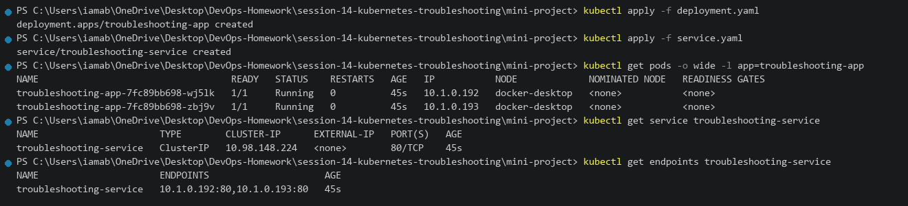

---

## 3.4 Application Inspection and Connectivity

### Commands

```powershell
kubectl describe pod troubleshooting-app-7fc89bb698-wj5lk
kubectl logs troubleshooting-app-7fc89bb698-wj5lk
kubectl exec troubleshooting-app-7fc89bb698-wj5lk -- curl -s http://localhost
```

Actual output:

```text
Name:             troubleshooting-app-7fc89bb698-wj5lk
Namespace:        default
Node:             docker-desktop/192.168.65.3
Status:           Running
IP:               10.1.0.192
Containers:
  app:
    Image:          nginx:1.27
    State:          Running
    Ready:          True
    Restart Count:  0
Events:
  Normal  Scheduled  2m    default-scheduler  Successfully assigned default/troubleshooting-app-7fc89bb698-wj5lk to docker-desktop
  Normal  Pulled     2m    kubelet            Container image "nginx:1.27" already present on machine
  Normal  Created    2m    kubelet            Created container: app
  Normal  Started    2m    kubelet            Started container app

/docker-entrypoint.sh: Configuration complete; ready for start up
2026/10/08 12:19:34 [notice] 1#1: using the "epoll" event method
2026/10/08 12:19:34 [notice] 1#1: nginx/1.27.5
2026/10/08 12:19:34 [notice] 1#1: start worker processes

<!DOCTYPE html>
<html>
<head>
<title>Welcome to nginx!</title>
<h1>Welcome to nginx!</h1>
<p>If you see this page, the nginx web server is successfully installed and working.</p>
</html>
```

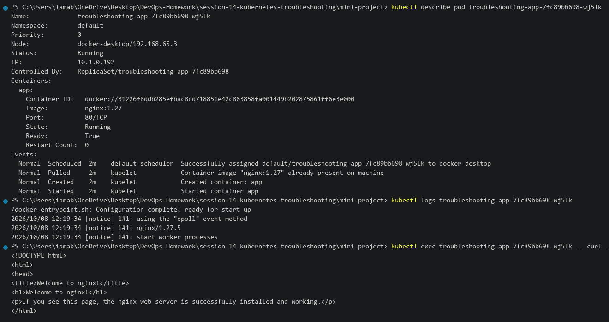

---

## 3.5 Service and Endpoints Inspection

### Commands

```powershell
kubectl describe service troubleshooting-service
kubectl get endpoints troubleshooting-service
```

Actual output:

```text
Name:                     troubleshooting-service
Namespace:                default
Labels:                   <none>
Annotations:              <none>
Selector:                 app=troubleshooting-app
Type:                     ClusterIP
IP Families:              IPv4
IP:                       10.98.148.224
Port:                     <unset>  80/TCP
TargetPort:               80/TCP
Endpoints:                10.1.0.192:80,10.1.0.193:80
Session Affinity:         None
Events:                   <none>

NAME                      ENDPOINTS                     AGE
troubleshooting-service   10.1.0.192:80,10.1.0.193:80   5m
```

Both Pod IPs (`10.1.0.192:80`, `10.1.0.193:80`) were populated as endpoints.

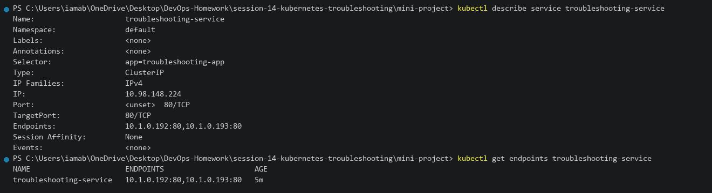

---

## 3.6 Scenario 1: Broken Pod Troubleshooting

### Broken Pod Manifest (`broken-pod.yaml`)

```yaml
apiVersion: v1
kind: Pod
metadata:
  name: project-broken-pod
spec:
  containers:
    - name: app
      image: nginx:this-tag-does-not-exist
```

### Investigation Commands

```powershell
kubectl apply -f broken-pod.yaml
kubectl get pod project-broken-pod
kubectl describe pod project-broken-pod
```

Actual output:

```text
pod/project-broken-pod created

NAME                 READY   STATUS             RESTARTS   AGE
project-broken-pod   0/1     ImagePullBackOff   0          93s

Name:             project-broken-pod
Namespace:        default
Status:           Pending
IP:               10.1.0.194
Containers:
  app:
    Image:          nginx:this-tag-does-not-exist
    State:          Waiting
      Reason:       ImagePullBackOff
    Ready:          False
Events:
  Type     Reason     Age                From               Message
  ----     ------     ----               ----               -------
  Normal   Scheduled  93s                default-scheduler  Successfully assigned default/project-broken-pod to docker-desktop
  Normal   Pulling    51s (x3 over 93s)  kubelet            Pulling image "nginx:this-tag-does-not-exist"
  Warning  Failed     49s (x3 over 91s)  kubelet            Failed to pull image "nginx:this-tag-does-not-exist": Error response from daemon: failed to resolve reference "docker.io/library/nginx:this-tag-does-not-exist": not found
  Warning  Failed     49s (x3 over 91s)  kubelet            Error: ErrImagePull
  Normal   BackOff    9s (x5 over 90s)   kubelet            Back-off pulling image "nginx:this-tag-does-not-exist"
  Warning  Failed     9s (x5 over 90s)   kubelet            Error: ImagePullBackOff
```

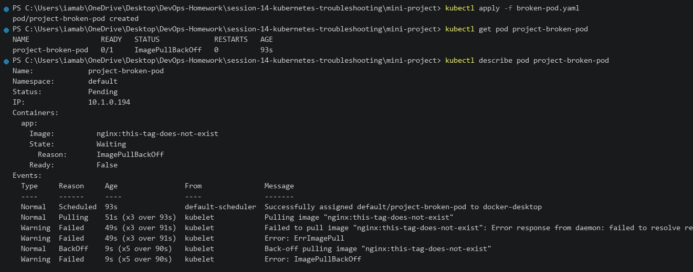

### Broken Pod Questions & Analysis

- **Question 1: What is the Pod status?**  
  *Answer:* `ImagePullBackOff` (initially `ErrImagePull`).
- **Question 2: What is the actual error?**  
  *Answer:* `Error response from daemon: failed to resolve reference "docker.io/library/nginx:this-tag-does-not-exist": not found`.
- **Question 3: Which command helped you find the reason?**  
  *Answer:* `kubectl describe pod project-broken-pod` (Events section).
- **Question 4: What is wrong with the image?**  
  *Answer:* The tag `this-tag-does-not-exist` does not exist in the official Nginx repository on Docker Hub.
- **Question 5: How would you fix it?**  
  *Answer:* Update the container image to a valid tag, such as `nginx:1.27`.

### Solution and Fix (`fixed-pod.yaml`)

```yaml
apiVersion: v1
kind: Pod
metadata:
  name: project-broken-pod
spec:
  containers:
    - name: app
      image: nginx:1.27
```

Fix execution:

```powershell
kubectl delete pod project-broken-pod
kubectl apply -f fixed-pod.yaml
kubectl get pod project-broken-pod
```

Actual output:

```text
pod "project-broken-pod" deleted
pod/project-broken-pod created

NAME                 READY   STATUS    RESTARTS   AGE
project-broken-pod   1/1     Running   0          9s
```

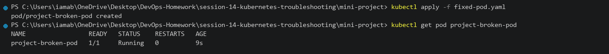

---

## 3.7 Scenario 2: Service Troubleshooting Challenge

### Misconfigured Service Manifest (`broken-service.yaml`)

```yaml
apiVersion: v1
kind: Service
metadata:
  name: troubleshooting-service
spec:
  selector:
    app: wrong-app
  ports:
    - port: 80
      targetPort: 80
  type: ClusterIP
```

### Investigation Commands

```powershell
kubectl apply -f broken-service.yaml
kubectl get service troubleshooting-service
kubectl get endpoints troubleshooting-service
kubectl get pods --show-labels -l app=troubleshooting-app
kubectl describe service troubleshooting-service
```

Actual output:

```text
service/troubleshooting-service configured

NAME                      TYPE        CLUSTER-IP      EXTERNAL-IP   PORT(S)   AGE
troubleshooting-service   ClusterIP   10.98.148.224   <none>        80/TCP    19m

NAME                      ENDPOINTS   AGE
troubleshooting-service   <none>      19m

NAME                                   READY   STATUS    RESTARTS   AGE   LABELS
troubleshooting-app-7fc89bb698-wj5lk   1/1     Running   0          19m   app=troubleshooting-app,pod-template-hash=7fc89bb698
troubleshooting-app-7fc89bb698-zbj9v   1/1     Running   0          19m   app=troubleshooting-app,pod-template-hash=7fc89bb698

Name:                     troubleshooting-service
Namespace:                default
Selector:                 app=wrong-app
Type:                     ClusterIP
IP:                       10.98.148.224
Port:                     <unset>  80/TCP
TargetPort:               80/TCP
Endpoints:                
Events:                   <none>
```

### Root Cause
The Service selector was configured as `app=wrong-app`, whereas the target Deployment Pods have the label `app=troubleshooting-app`. Because no Pods matched the selector, Kubernetes removed all backend endpoints (`<none>`).

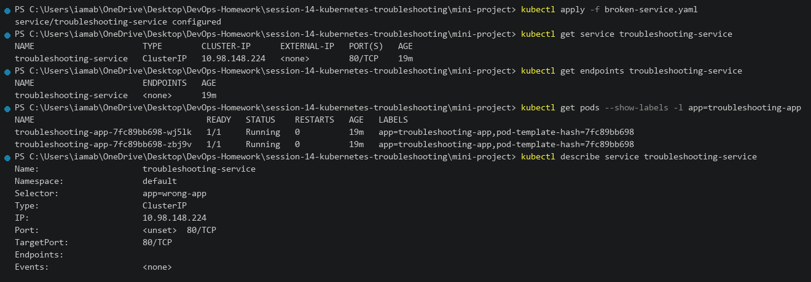

### Fix and Verification

Re-apply the correct Service manifest (`service.yaml` with `selector.app: troubleshooting-app`) and test end-to-end connectivity:

```powershell
kubectl apply -f service.yaml
kubectl get service troubleshooting-service
kubectl get endpoints troubleshooting-service
kubectl exec dns-test -- wget -qO- http://troubleshooting-service
```

Actual output:

```text
service/troubleshooting-service configured

NAME                      TYPE        CLUSTER-IP      EXTERNAL-IP   PORT(S)   AGE
troubleshooting-service   ClusterIP   10.98.148.224   <none>        80/TCP    19m

NAME                      ENDPOINTS                     AGE
troubleshooting-service   10.1.0.192:80,10.1.0.193:80   19m

<!DOCTYPE html>
<html>
<head>
<title>Welcome to nginx!</title>
<h1>Welcome to nginx!</h1>
<p>If you see this page, the nginx web server is successfully installed and working.</p>
</html>
```

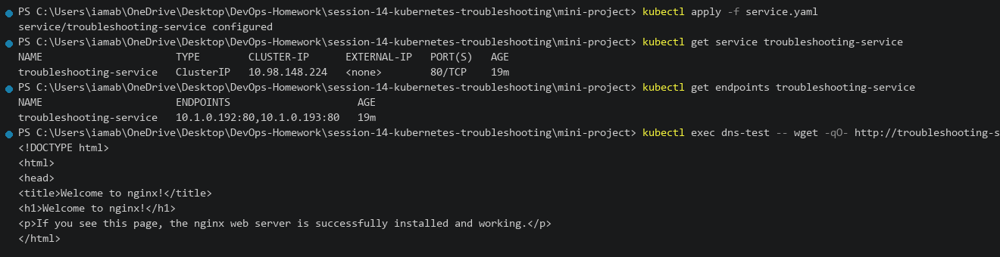

---

## 3.8 Final Task 3 Verification

```powershell
kubectl get deployment troubleshooting-app
kubectl get pods -l app=troubleshooting-app
kubectl get service troubleshooting-service
kubectl get endpoints troubleshooting-service
kubectl get pod project-broken-pod
```

Actual output:

```text
NAME                  READY   UP-TO-DATE   AVAILABLE   AGE
troubleshooting-app   2/2     2            2           19m

NAME                                   READY   STATUS    RESTARTS   AGE
troubleshooting-app-7fc89bb698-wj5lk   1/1     Running   0          19m
troubleshooting-app-7fc89bb698-zbj9v   1/1     Running   0          19m

NAME                      TYPE        CLUSTER-IP      EXTERNAL-IP   PORT(S)   AGE
troubleshooting-service   ClusterIP   10.98.148.224   <none>        80/TCP    19m

NAME                      ENDPOINTS                     AGE
troubleshooting-service   10.1.0.192:80,10.1.0.193:80   19m

NAME                 READY   STATUS    RESTARTS   AGE
project-broken-pod   1/1     Running   0          61s
```

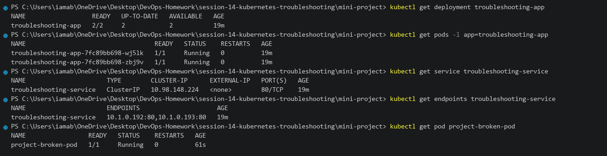

---

## 3.9 Troubleshooting Summary Table

| Problem | What I Saw | Command I Used | Root Cause | Fix |
|:---|:---|:---|:---|:---|
| **Broken Pod** | Pod in `ImagePullBackOff` / `ErrImagePull` | `kubectl describe pod project-broken-pod` | Image tag `this-tag-does-not-exist` does not exist on Docker Hub | Changed image to `nginx:1.27` |
| **Service Problem** | Endpoints displayed `<none>` | `kubectl describe service troubleshooting-service` & `kubectl get pods --show-labels` | Service selector `app=wrong-app` did not match Pod label `app=troubleshooting-app` | Changed Service selector back to `app=troubleshooting-app` |
| **Connectivity** | Verifying cluster-internal routing | `kubectl exec dns-test -- wget -qO- http://troubleshooting-service` | Required validating DNS and Service endpoint reachability | Verified Nginx welcome page response |

---

## 3.10 Core Troubleshooting Q&A

1. **What does `kubectl get` tell us?**  
   It gives a high-level snapshot of current cluster resource states (name, ready count, status, restarts, age, IP).

2. **What is the difference between `get` and `describe`?**  
   `kubectl get` provides brief tabular status, while `kubectl describe` provides deep resource metadata, container details, conditions, and real-time events.

3. **Why do we use `kubectl logs`?**  
   To view the application stdout/stderr streams inside a container to debug runtime errors, application crashes, or startup logs.

4. **When would you use `kubectl exec`?**  
   To run commands inside an active container or open an interactive shell for network testing (`curl`, `nslookup`, `ping`) or local file inspection.

5. **What does `CrashLoopBackOff` mean?**  
   The container starts, encounters an error (non-zero exit code or application exception), crashes, and Kubernetes restarts it with an increasing back-off delay.

6. **What does `ImagePullBackOff` mean?**  
   Kubernetes repeatedly failed to download the container image due to an invalid image name/tag, network failure, or missing registry credentials.

7. **Why can a Pod remain `Pending`?**  
   The scheduler cannot assign the Pod to a node due to insufficient CPU/memory resources, unsatisfied node selectors/taints, or unbound PersistentVolumeClaims.

8. **Why can a Service have no endpoints?**  
   The Service selector does not match any Pod labels, or matching Pods are not passing their readiness probes.

9. **What is the relationship between a Service selector and Pod labels?**  
   The Service selector defines key-value pairs that Kubernetes uses to automatically discover target Pods and register their IP addresses as Service endpoints.

10. **What is Kubernetes DNS?**  
    An internal cluster DNS service (CoreDNS) that enables Pods to discover and communicate with Services and other Pods using standard DNS names (e.g. `service-name.namespace.svc.cluster.local`).


