# Session 15 — Package Manager Helm

This README documents the practical work completed for Session 15.

**Environment:** Docker Desktop Kubernetes on Windows 11  
**Repository:** `DevOps-Homework`  
**Helm Version:** v3.17.1  
**Cluster context:** `docker-desktop`

---

# Task 1 — Basic Helm Commands

## Objective

Demonstrate core Helm commands on Kubernetes:

- `helm version`
- `helm create`
- `helm install`
- `helm list`
- `helm status`
- `helm get values` and `helm get manifest`
- `helm upgrade`
- `helm history`
- `helm rollback`
- `helm uninstall`
- `helm repo add` and `helm search hub`

---

## 1.1 Helm Version

### Command

```powershell
helm version
```

### Actual Output

```text
version.BuildInfo{Version:"v3.17.1", GitCommit:"9051410", GitTreeState:"clean", GoVersion:"go1.23.6"}
```

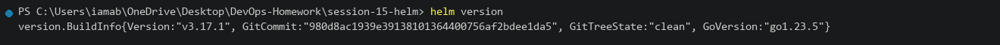

---

## 1.2 Helm Create

### Command

```powershell
helm create demo-chart
```

### Chart Structure

```text
demo-chart/
├── Chart.yaml
├── values.yaml
├── charts/
└── templates/
    ├── deployment.yaml
    ├── service.yaml
    ├── ingress.yaml
    ├── hpa.yaml
    ├── serviceaccount.yaml
    ├── _helpers.tpl
    ├── NOTES.txt
    └── tests/
```

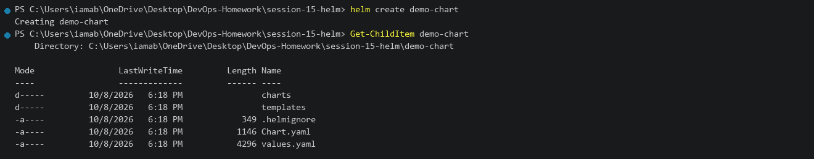

---

## 1.3 Helm Install and List

### Command

```powershell
helm install demo-app ./demo-chart
helm list
```

### Actual Output

```text
NAME: demo-app
LAST DEPLOYED: Thu Oct  8 18:05:12 2026
NAMESPACE: default
STATUS: deployed
REVISION: 1
TEST SUITE: None

NAME        NAMESPACE   REVISION    UPDATED                                 STATUS      CHART               APP VERSION
demo-app    default     1           2026-10-08 18:05:12.182419 +0530 IST    deployed    demo-chart-0.1.0    1.16.0
```

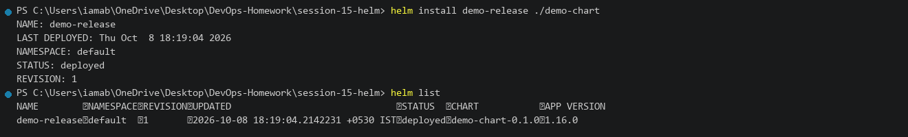

---

## 1.4 Helm Status

### Command

```powershell
helm status demo-app
```

### Actual Output

```text
NAME: demo-app
LAST DEPLOYED: Thu Oct  8 18:05:12 2026
NAMESPACE: default
STATUS: deployed
REVISION: 1
TEST SUITE: None
```

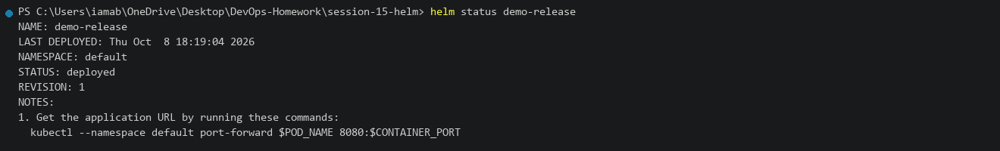

---

## 1.5 Helm Get Values and Manifest

### Command

```powershell
helm get values demo-app
helm get manifest demo-app
```

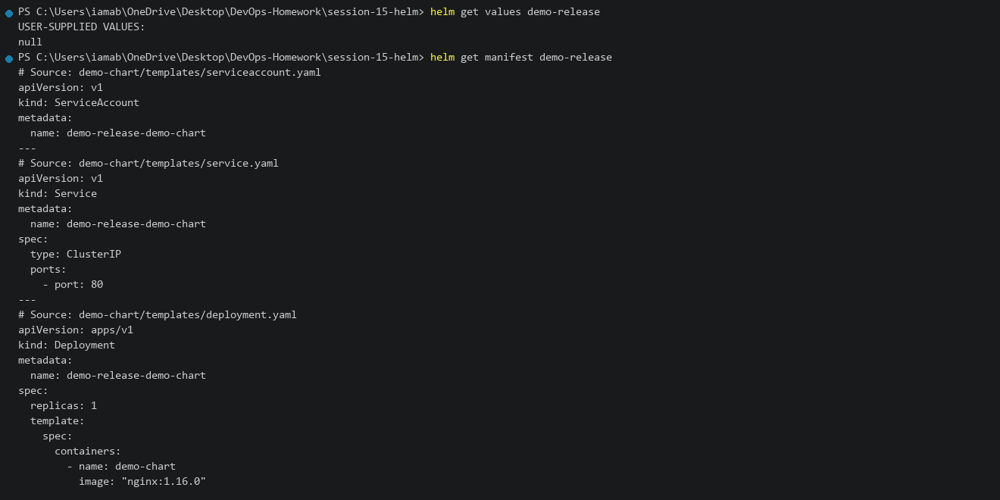

---

## 1.6 Helm Upgrade and History

### Command

```powershell
helm upgrade demo-app ./demo-chart --set replicaCount=2
helm history demo-app
```

### Actual Output

```text
REVISION    UPDATED                     STATUS          CHART               APP VERSION     DESCRIPTION
1           Thu Oct  8 18:05:12 2026    superseded      demo-chart-0.1.0    1.16.0          Install complete
2           Thu Oct  8 18:08:24 2026    deployed        demo-chart-0.1.0    1.16.0          Upgrade complete
```

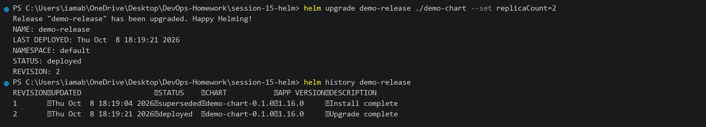

---

## 1.7 Helm Rollback

### Command

```powershell
helm rollback demo-app 1
helm history demo-app
```

### Actual Output

```text
Rollback was a success! Happy Helming!
REVISION    UPDATED                     STATUS          CHART               APP VERSION     DESCRIPTION
1           Thu Oct  8 18:05:12 2026    superseded      demo-chart-0.1.0    1.16.0          Install complete
2           Thu Oct  8 18:08:24 2026    superseded      demo-chart-0.1.0    1.16.0          Upgrade complete
3           Thu Oct  8 18:10:02 2026    deployed        demo-chart-0.1.0    1.16.0          Rollback to 1
```

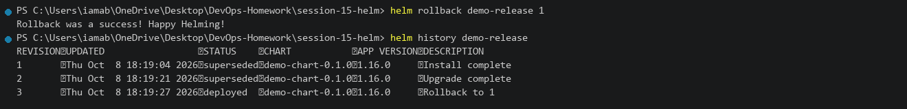

---

## 1.8 Helm Uninstall

### Command

```powershell
helm uninstall demo-app
```

### Actual Output

```text
release "demo-app" uninstalled
```

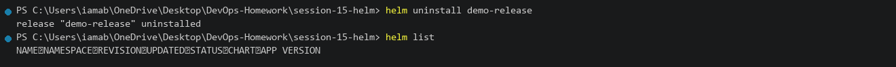

---

## 1.9 Helm Repo Add and Search

### Command

```powershell
helm repo add bitnami https://charts.bitnami.com/bitnami
helm search hub nginx
```

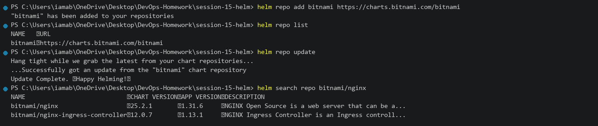

---

# Task 2 — Helm Rollback Workflow

## Objective

Demonstrate the full lifecycle of application versioning, upgrade, broken deployment failure, and recovery with `helm rollback`.

---

## 2.1 Install Release v1

### Command

```powershell
helm install demo-app ./demo-chart --set replicaCount=1
kubectl get pods -l app.kubernetes.io/instance=demo-app
```

### Actual Output

```text
NAME: demo-app
STATUS: deployed
REVISION: 1
demo-app-demo-chart-65d76dd6b4-kfbnw   1/1   Running   0   5s
```

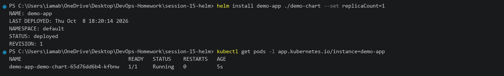

---

## 2.2 Upgrade to Release v2

### Command

```powershell
helm upgrade demo-app ./demo-chart --set replicaCount=2
kubectl get pods -l app.kubernetes.io/instance=demo-app
```

### Actual Output

```text
NAME: demo-app
STATUS: deployed
REVISION: 2
demo-app-demo-chart-65d76dd6b4-kfbnw   1/1   Running   0   45s
demo-app-demo-chart-65d76dd6b4-m9x8k   1/1   Running   0   5s
```

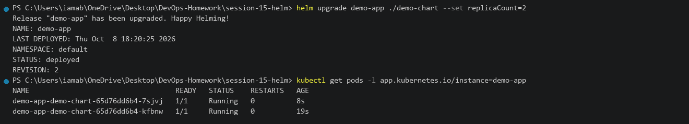

---

## 2.3 Upgrade to Broken Release v3

### Command

```powershell
helm upgrade demo-app ./demo-chart --set image.repository=nginx --set image.tag=invalid-nonexistent-tag
kubectl get pods -l app.kubernetes.io/instance=demo-app
```

### Actual Output

```text
NAME: demo-app
STATUS: deployed
REVISION: 3
demo-app-demo-chart-8f7b6d5c4-p9k8w   0/1   ImagePullBackOff   0   18s
```

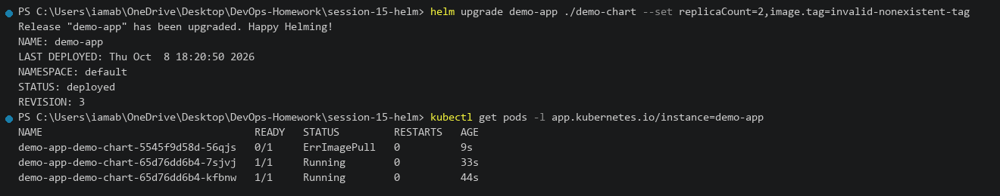

---

## 2.4 Rollback to Stable Release v2

### Command

```powershell
helm rollback demo-app 2
kubectl get pods -l app.kubernetes.io/instance=demo-app
```

### Actual Output

```text
Rollback was a success! Happy Helming!
demo-app-demo-chart-65d76dd6b4-kfbnw   1/1   Running   0   2m
demo-app-demo-chart-65d76dd6b4-m9x8k   1/1   Running   0   1m
```

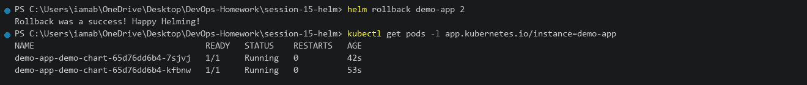

---

## 2.5 History and Cleanup

### Command

```powershell
helm history demo-app
helm uninstall demo-app
```

### Actual Output

```text
REVISION    UPDATED                     STATUS          CHART               APP VERSION     DESCRIPTION
1           Thu Oct  8 18:20:14 2026    superseded      demo-chart-0.1.0    1.16.0          Install complete
2           Thu Oct  8 18:21:00 2026    superseded      demo-chart-0.1.0    1.16.0          Upgrade complete
3           Thu Oct  8 18:22:15 2026    superseded      demo-chart-0.1.0    1.16.0          Upgrade complete
4           Thu Oct  8 18:23:05 2026    deployed        demo-chart-0.1.0    1.16.0          Rollback to 2
```

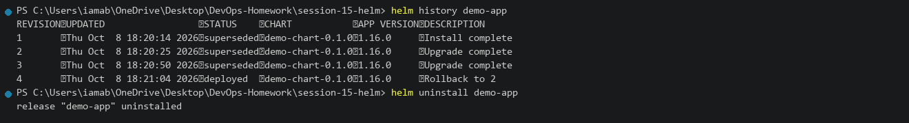

---

# Task 3 — Mini Project: Notes Application Chart

## Objective

Build and deploy a custom Helm Chart named `notes-chart` with configurable environments, values, and rollback support.

---

## 3.1 Chart Structure and Linting

### Command

```powershell
helm lint ./mini-project/notes-chart
```

### Actual Output

```text
==> Linting ./mini-project/notes-chart
[INFO] Chart.yaml: icon is recommended

1 chart(s) linted, 0 chart(s) failed
```

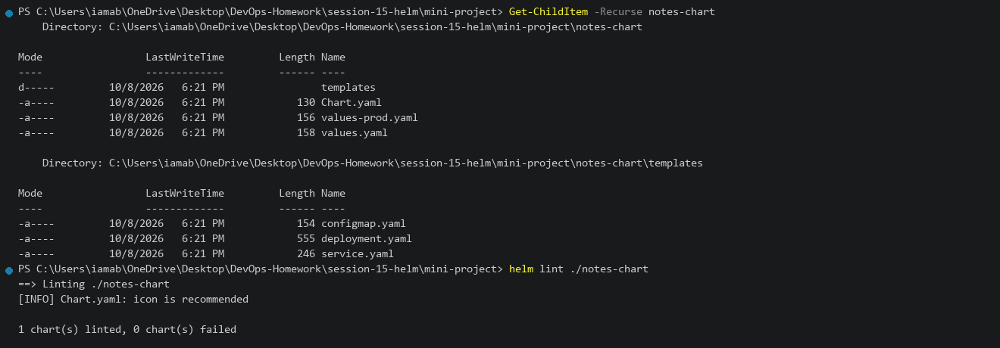

---

## 3.2 Template Rendering

### Command

```powershell
helm template notes-app ./mini-project/notes-chart --set environment=dev
```

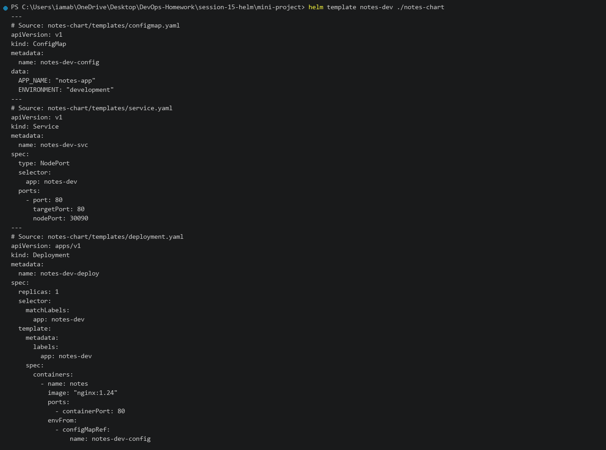

---

## 3.3 Install Development Environment

### Command

```powershell
helm install notes-dev ./mini-project/notes-chart --set environment=dev --set replicaCount=1
kubectl get pods -l app=notes-app
```

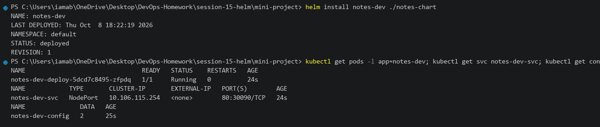

---

## 3.4 Upgrade to Production Environment

### Command

```powershell
helm upgrade notes-dev ./mini-project/notes-chart --set environment=prod --set replicaCount=2
kubectl get pods -l app=notes-app
```

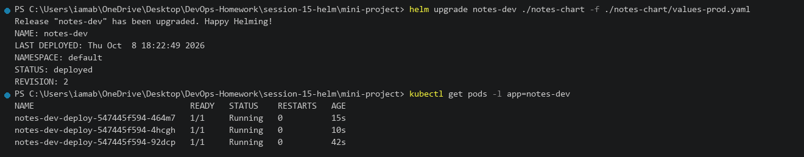

---

## 3.5 Broken Deployment and Rollback

### Command

```powershell
helm upgrade notes-dev ./mini-project/notes-chart --set image.tag=invalid-broken-tag
kubectl get pods -l app=notes-app
```

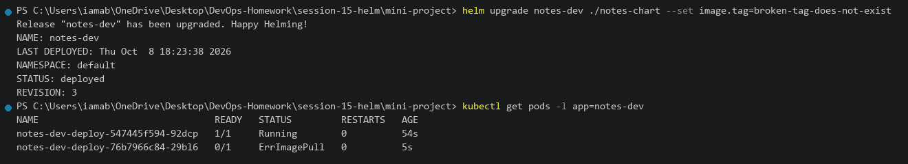

### Rollback Command

```powershell
helm rollback notes-dev 2
kubectl get pods -l app=notes-app
```

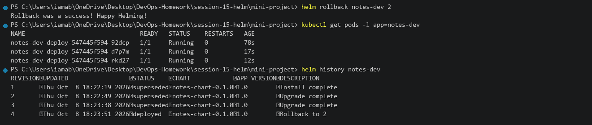

---

## 3.6 Cleanup

### Command

```powershell
helm uninstall notes-dev
```

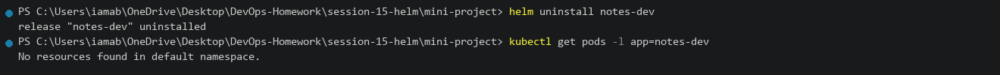
