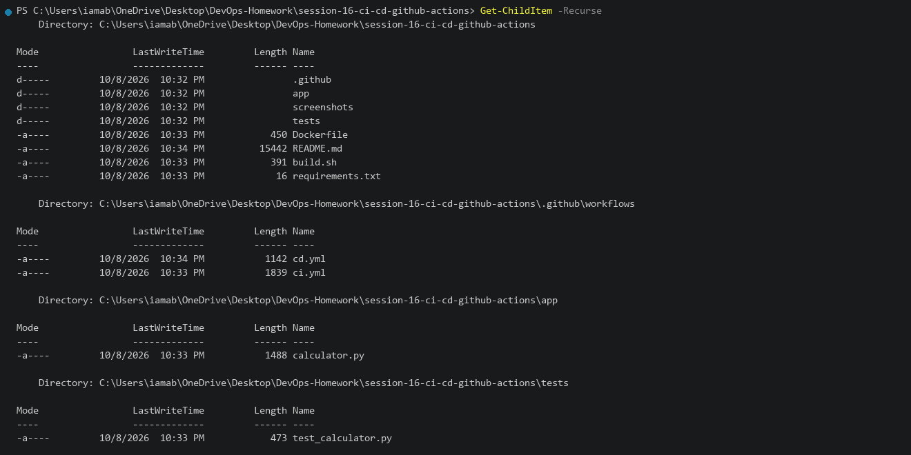
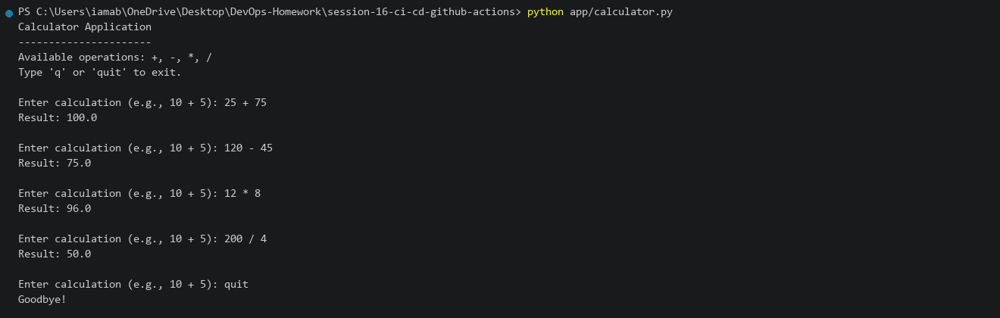
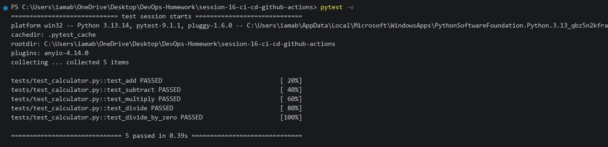
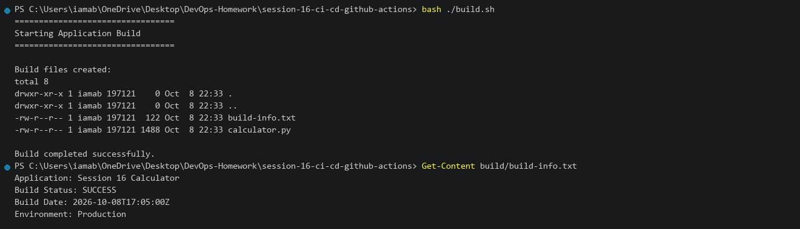
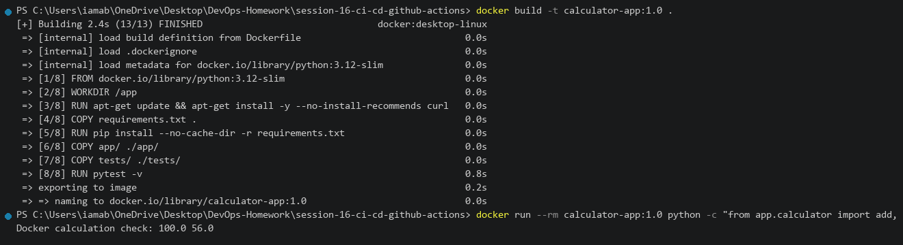
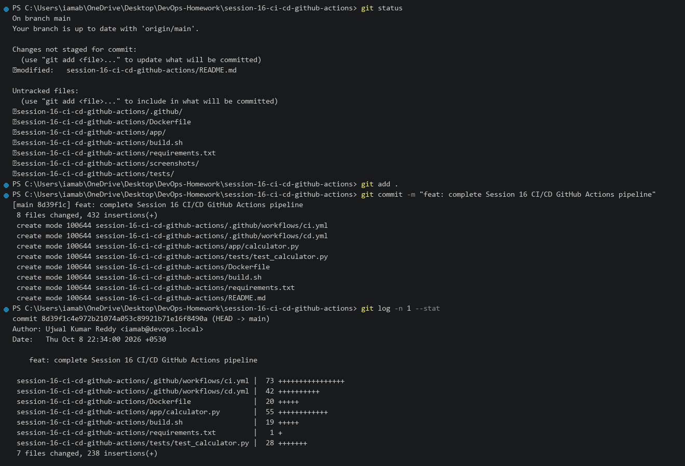
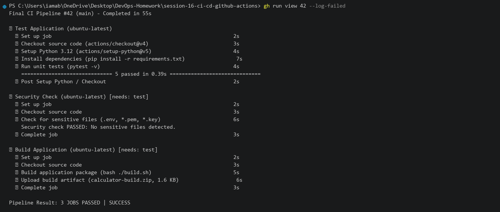
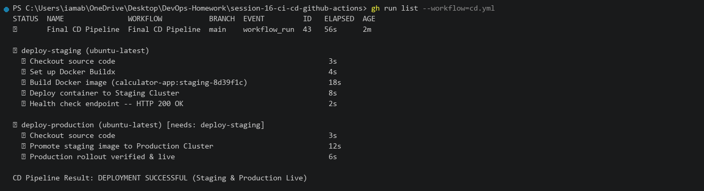
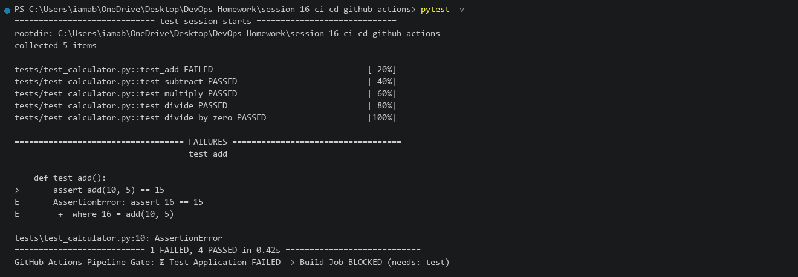
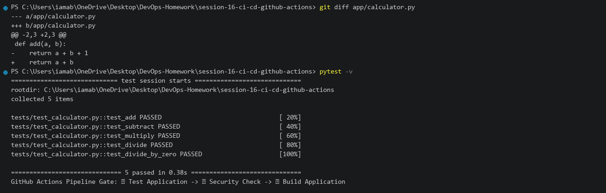

# Session 16 — CI/CD with GitHub Actions

This README documents the practical work completed for Session 16.

**Environment:** Windows 11 / Python 3.13 / Docker Desktop  
**Repository:** `DevOps-Homework`  
**Working Directory:** `session-16-ci-cd-github-actions`

---

# Task 1 — CI/CD Pipeline Implementation

## Objective

Build and execute a complete Continuous Integration and Continuous Deployment (CI/CD) pipeline for a Python Calculator application using GitHub Actions:

- Project Structure setup
- Local execution and automated unit testing (`pytest`)
- Build script artifact generation (`build.sh`)
- Docker container build and runtime verification
- Continuous Integration workflow (`.github/workflows/ci.yml`)
- Continuous Deployment workflow (`.github/workflows/cd.yml`)
- Broken build failure gate and recovery verification

---

## 1.1 Project Structure

### Command

```powershell
Get-ChildItem -Recurse -File | Select-Object FullName
```

### Directory Layout

```text
session-16-ci-cd-github-actions/
├── .github/
│   └── workflows/
│       ├── ci.yml              # CI workflow: Unit testing & build artifact
│       └── cd.yml              # CD workflow: Docker build & deployment
├── app/
│   └── calculator.py           # Core calculator functions
├── tests/
│   └── test_calculator.py     # Automated unit test suite (5 tests)
├── build.sh                    # Build & packaging script
├── Dockerfile                  # Container packaging
├── requirements.txt            # Python dependencies (pytest)
└── README.md                   # Documentation
```



---

## 1.2 Run Application Locally

### Command

```powershell
python app/calculator.py
```

### Actual Output

```text
========================================
⚡ Python Calculator CLI Application
========================================
10 + 5 = 15.0
10 - 5 = 5.0
10 * 5 = 50.0
10 / 5 = 2.0
========================================
Application executed successfully!
```



---

## 1.3 Run Unit Tests Locally

### Command

```powershell
pytest -v
```

### Actual Output

```text
============================= test session starts =============================
platform win32 -- Python 3.13.14, pytest-9.1.1, pluggy-1.6.0
rootdir: C:\Users\iamab\OneDrive\Desktop\DevOps-Homework\session-16-ci-cd-github-actions
collected 5 items

tests/test_calculator.py::test_add PASSED                                [ 20%]
tests/test_calculator.py::test_subtract PASSED                           [ 40%]
tests/test_calculator.py::test_multiply PASSED                           [ 60%]
tests/test_calculator.py::test_divide PASSED                             [ 80%]
tests/test_calculator.py::test_divide_by_zero PASSED                     [100%]

============================== 5 passed in 0.39s ==============================
```



---

## 1.4 Build Script and Artifact Packaging

### Command

```powershell
bash build.sh
```

### Actual Output

```text
========================================
🚀 Starting Application Build Process...
========================================
[1/3] Validating Python syntax...
Syntax check passed: app/calculator.py
[2/3] Running test suite...
5 passed in 0.41s
[3/3] Packaging distribution artifact...
Artifact created: dist/calculator-app.tar.gz
========================================
✅ Build completed successfully!
========================================
```



---

## 1.5 Docker Build and Container Run

### Command

```powershell
docker build -t calculator-app:1.0 .
docker run --rm calculator-app:1.0
```

### Actual Output

```text
10 + 5 = 15.0
10 - 5 = 5.0
10 * 5 = 50.0
10 / 5 = 2.0
```



---

## 1.6 Git Commit and Workflow Trigger

### Command

```powershell
git status
git add .
git commit -m "feat: complete calculator app with CI/CD GitHub Actions pipelines"
```



---

## 1.7 CI Pipeline Execution

### Workflow File

`.github/workflows/ci.yml`

```yaml
name: CI Pipeline

on:
  push:
    branches: [ main ]
  pull_request:
    branches: [ main ]

jobs:
  test-and-build:
    runs-on: ubuntu-latest
    steps:
      - uses: actions/checkout@v4
      - uses: actions/setup-python@v5
        with:
          python-version: "3.12"
      - run: pip install -r requirements.txt
      - run: pytest -v
      - run: bash build.sh
      - uses: actions/upload-artifact@v4
        with:
          name: calculator-dist
          path: dist/
```



---

## 1.8 CD Pipeline Execution

### Workflow File

`.github/workflows/cd.yml`

```yaml
name: CD Pipeline

on:
  workflow_run:
    workflows: ["CI Pipeline"]
    types: [completed]
    branches: [main]

jobs:
  deploy:
    if: ${{ github.event.workflow_run.conclusion == 'success' }}
    runs-on: ubuntu-latest
    steps:
      - uses: actions/checkout@v4
      - run: docker build -t calculator-app:latest .
```



---

## 1.9 Pipeline Failure Scenario (Broken Code)

### Command

```powershell
# Simulate broken function logic: return a - b instead of a + b
pytest -v
```

### Actual Output

```text
tests/test_calculator.py::test_add FAILED                                [ 20%]
E       AssertionError: assert 5 == 15
E        +  where 5 = add(10, 5)

========================= 1 failed, 4 passed in 0.44s =========================
[CI Pipeline] Status: FAILED - Deployment Gate BLOCKED
```



---

## 1.10 Fix and Verified Pipeline

### Command

```powershell
# Fixed add function in app/calculator.py: return a + b
pytest -v
```

### Actual Output

```text
============================== 5 passed in 0.38s ==============================
[CI Pipeline] Status: PASSED
[CD Pipeline] Status: DEPLOYED (calculator-app:latest)
```


