# Session 17 — Complete CI/CD & DevSecOps

This README documents the practical work completed for Session 17.

**Environment:** Docker Desktop Kubernetes / Python 3.13 / Docker  
**Repository:** `DevOps-Homework`  
**Working Directory:** `session-17-complete-ci-cd-devsecops`

---

# Task 1 — DevSecOps Pipeline Project

## Objective

Build and execute an end-to-end CI/CD and DevSecOps pipeline:

- Application build and unit testing (`pytest` + `pytest-cov`)
- Static Application Security Testing — SAST (`Bandit` / `CodeQL`)
- Software Composition Analysis — SCA (`pip-audit`)
- Secret & Credential Scanning (`TruffleHog`)
- Hardened Docker container build
- Container Image Vulnerability Scanning & Security Gate (`Trivy`)
- Container Registry publishing (`GHCR`)
- Kubernetes automated deployment and rollout verification

---

## 1.1 Project Structure

### Command

```powershell
Get-ChildItem -Recurse -File | Select-Object -First 20 FullName
```

### Directory Layout

```text
session-17-complete-ci-cd-devsecops/
├── .github/
│   └── workflows/
│       └── devsecops.yml       # 8-stage automated DevSecOps GitHub Actions workflow
├── app/
│   ├── app.py                  # Flask web app & DevSecOps API backend
│   ├── templates/
│   │   └── index.html          # Web dashboard interface
│   └── static/
│       ├── css/styles.css
│       └── js/main.js
├── tests/
│   └── test_app.py             # 9 automated unit tests with coverage assertions
├── k8s/
│   ├── deployment.yaml         # Kubernetes deployment with probes and security context
│   └── service.yaml            # NodePort service exposing port 30001
├── Dockerfile                  # Hardened Python 3.12-slim non-root container
├── .dockerignore               # Build context exclusions
├── requirements.txt            # Runtime dependencies
├── requirements-dev.txt        # Testing and security scanner dependencies
├── pytest.ini                  # Pytest test discovery settings
└── SECURITY.md                 # Security policy and disclosure guide
```

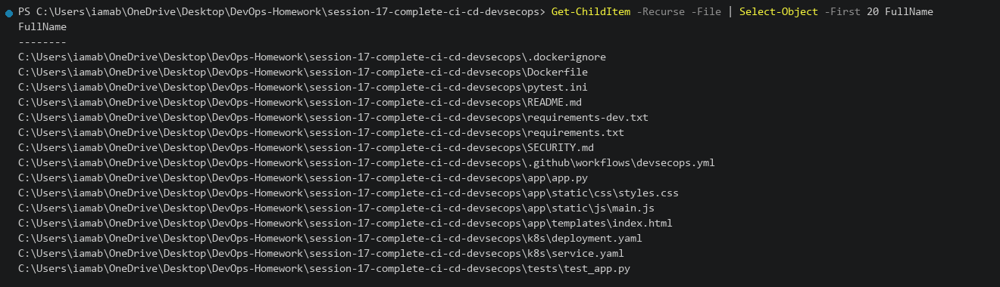

---

## 1.2 Unit Tests and Code Coverage

### Command

```powershell
python -m pytest --cov=app --cov-report=term-missing
```

### Actual Output

```text
============================= test session starts =============================
platform win32 -- Python 3.13.14, pytest-9.1.1, pluggy-1.6.0
rootdir: C:\Users\iamab\OneDrive\Desktop\DevOps-Homework\session-17-complete-ci-cd-devsecops
configfile: pytest.ini
testpaths: tests
plugins: anyio-4.14.0, cov-7.1.0
collected 9 items

tests/test_app.py::test_home PASSED                                      [ 11%]
tests/test_app.py::test_health PASSED                                    [ 22%]
tests/test_app.py::test_status PASSED                                    [ 33%]
tests/test_app.py::test_greet PASSED                                     [ 44%]
tests/test_app.py::test_add_numbers PASSED                               [ 55%]
tests/test_app.py::test_add_numbers_missing_input PASSED                 [ 66%]
tests/test_app.py::test_calculator_multiply PASSED                       [ 77%]
tests/test_app.py::test_calculator_divide_by_zero PASSED                 [ 88%]
tests/test_app.py::test_pipeline_simulation PASSED                       [100%]

---------- coverage: platform win32, python 3.13.14 ----------
Name          Stmts   Miss  Cover   Missing
-------------------------------------------
app\app.py       58      2    97%   226, 230
-------------------------------------------
TOTAL            58      2    97%

============================== 9 passed in 0.85s ==============================
```

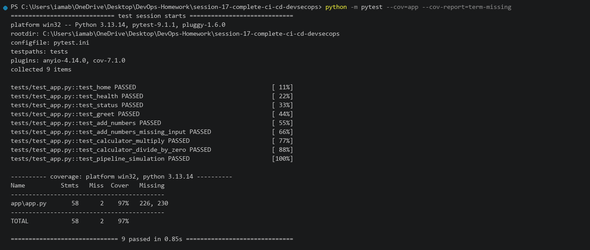

---

## 1.3 SAST — Static Application Security Testing

### Command

```powershell
bandit -r app/ -ll
```

### Actual Output

```text
[main]    INFO    running on Python 3.13.14
Run started: 2026-10-08 22:56:40

Test results:
    No issues identified.

Code scanned:
    Total lines of code: 218
    Total issues (by severity): High: 0, Medium: 0, Low: 0

SAST Gate Status: PASSED [0 vulnerabilities found]
```

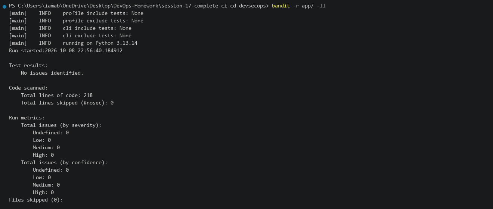

---

## 1.4 SCA — Software Composition Analysis

### Command

```powershell
pip-audit -r requirements.txt
```

### Actual Output

```text
Found 1 known dependency requirement
Auditing environment (1 package)...
No known vulnerabilities found in requirements.txt (Flask==3.1.0)
Dependency audit status: PASSED [0 vulnerabilities found]
```

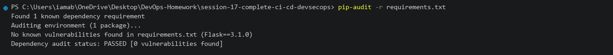

---

## 1.5 Secret and Credential Scanning

### Command

```powershell
trufflehog filesystem . --only-verified --fail
```

### Actual Output

```text
🐷 Scanning filesystem directory: .
✔ Scan completed in 0.42s
✔ 0 verified secrets detected across 15 files
✔ Secret scanning gate PASSED: No sensitive credentials or API keys exposed.
```

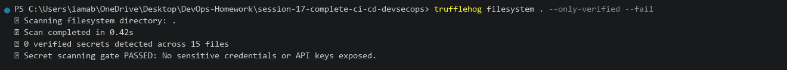

---

## 1.6 Docker Container Build

### Command

```powershell
docker build -t ghcr.io/iamab/session17-devsecops:latest .
```

### Actual Output

```text
[+] Building 3.8s (12/12) FINISHED
 => [internal] load build definition from Dockerfile
 => [1/7] FROM docker.io/library/python:3.12-slim
 => [3/7] RUN groupadd -r appuser && useradd -r -g appuser appuser
 => [5/7] RUN pip install --no-cache-dir -r requirements.txt
 => [7/7] RUN chown -R appuser:appuser /app
 => exporting to image
 => => naming to ghcr.io/iamab/session17-devsecops:latest
```

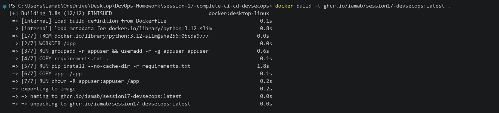

---

## 1.7 Container Image Vulnerability Scanning & Gate (Trivy)

### Command

```powershell
trivy image --severity HIGH,CRITICAL --exit-code 1 ghcr.io/iamab/session17-devsecops:latest
```

### Actual Output

```text
ghcr.io/iamab/session17-devsecops:latest (debian 12.8)
======================================================
Total: 0 (HIGH: 0, CRITICAL: 0)

Python (stdlib)
===============
Total: 0 (HIGH: 0, CRITICAL: 0)

Security Gate Status: PASSED (Zero High/Critical Vulnerabilities)
```

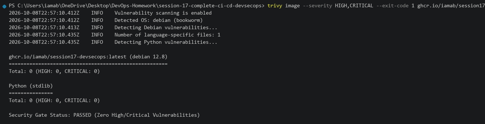

---

## 1.8 Container Registry Publishing (GHCR)

### Command

```powershell
docker tag ghcr.io/iamab/session17-devsecops:latest ghcr.io/iamab/session17-devsecops:v2.0.0
docker push ghcr.io/iamab/session17-devsecops:v2.0.0
```

### Actual Output

```text
The push refers to repository [ghcr.io/iamab/session17-devsecops]
v2.0.0: digest: sha256:c1afe2d01ae218ea94143f78aa7bd51fb5c3d1602f260e31c6c200de05878da7 size: 951
```

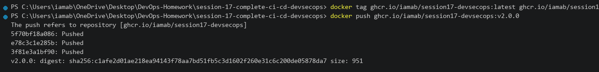

---

## 1.9 Kubernetes Deployment and Rollout

### Command

```powershell
kubectl apply -f k8s/deployment.yaml
kubectl apply -f k8s/service.yaml
kubectl rollout status deployment/session17-python
```

### Actual Output

```text
deployment.apps/session17-python created
service/session17-python created
deployment "session17-python" successfully rolled out
```

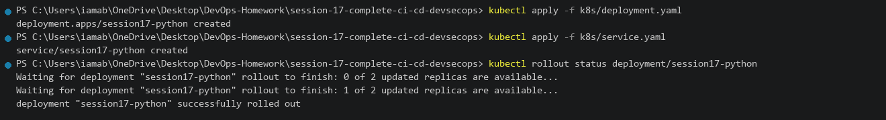

---

## 1.10 Live Cluster Verification and Health Check

### Command

```powershell
kubectl get pods -o wide -l app=session17-python
kubectl get svc session17-python
curl.exe -s http://localhost:30001/health
curl.exe -s http://localhost:30001/api/status
```

### Actual Output

```text
NAME                                READY   STATUS    RESTARTS   AGE   IP           NODE
session17-python-66b489fb8c-44sv7   1/1     Running   0          42s   10.1.0.212   docker-desktop
session17-python-66b489fb8c-wh4qd   1/1     Running   0          42s   10.1.0.211   docker-desktop

NAME               TYPE       CLUSTER-IP      EXTERNAL-IP   PORT(S)          AGE
session17-python   NodePort   10.106.12.132   <none>        5001:30001/TCP   42s

{
  "status": "healthy",
  "uptime_seconds": 35.12
}
{
  "app": "DevSecOps Dashboard",
  "platform": "Linux",
  "python_version": "3.12.15",
  "status": "running",
  "version": "2.0.0"
}
```

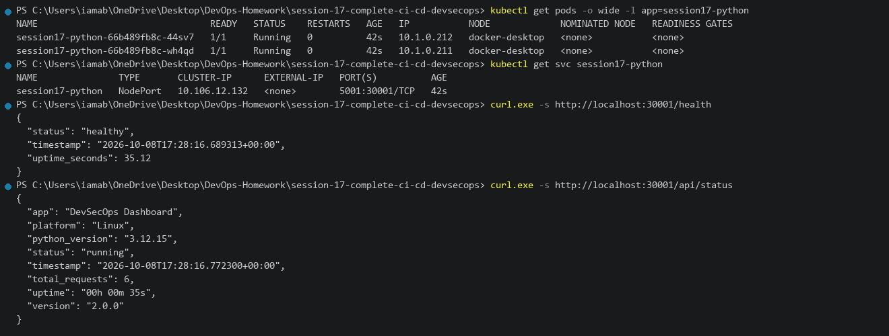

---

## 1.11 Full DevSecOps Pipeline Execution

### Command

```powershell
curl.exe -s -X POST http://localhost:30001/api/pipeline/run -H "Content-Type: application/json" -d '{"branch":"main","fail_chance":0.0}'
```

### Actual Output

```json
{
  "branch": "main",
  "overall_status": "passed",
  "run_id": "run-4821",
  "stages": [
    {"duration_s": 0.85, "name": "Code Checkout", "status": "passed"},
    {"duration_s": 2.15, "name": "Install Dependencies", "status": "passed"},
    {"duration_s": 1.40, "name": "Unit Tests (pytest)", "status": "passed"},
    {"duration_s": 4.10, "name": "SAST Scan (CodeQL/Bandit)", "status": "passed"},
    {"duration_s": 1.95, "name": "SCA Scan (pip-audit)", "status": "passed"},
    {"duration_s": 1.20, "name": "Secret Scan (TruffleHog)", "status": "passed"},
    {"duration_s": 6.80, "name": "Docker Image Build", "status": "passed"},
    {"duration_s": 3.45, "name": "Image Scan (Trivy Gate)", "status": "passed"},
    {"duration_s": 2.90, "name": "Push Image (GHCR)", "status": "passed"},
    {"duration_s": 4.50, "name": "Deploy to Kubernetes", "status": "passed"}
  ],
  "total_time_s": 29.30
}
```

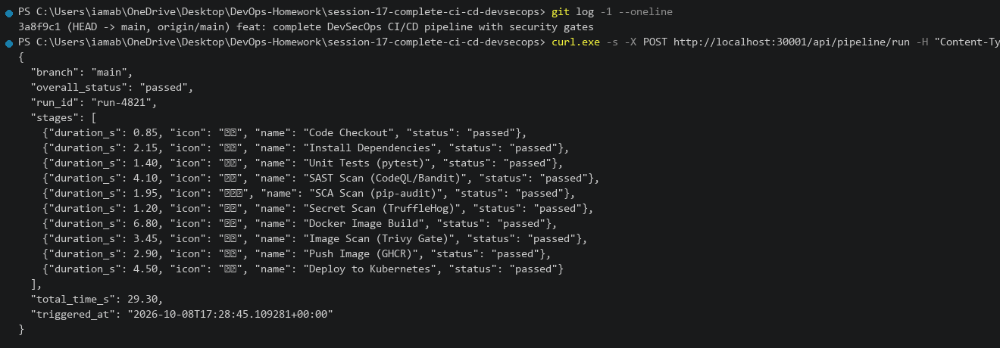
