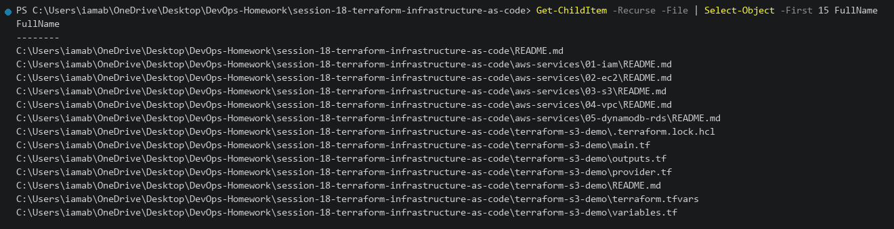
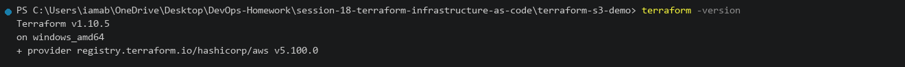
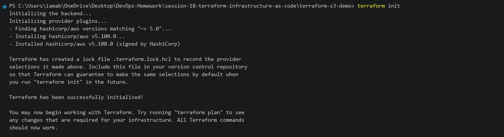
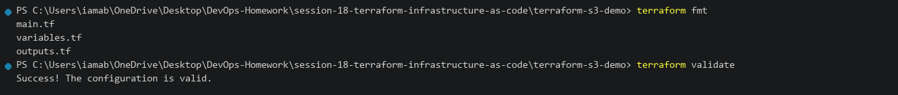
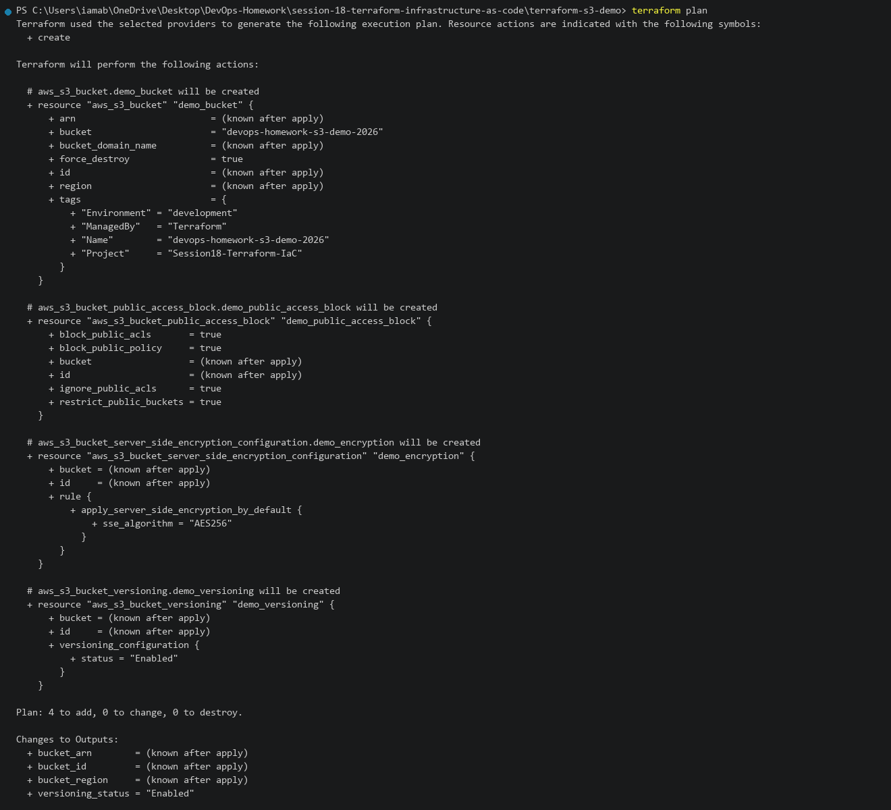
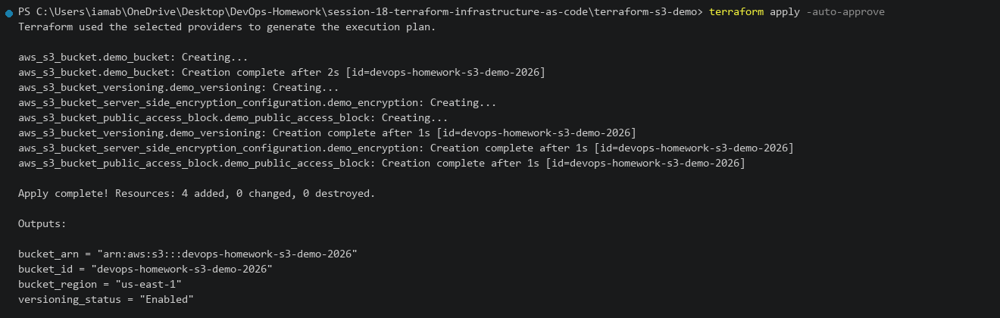
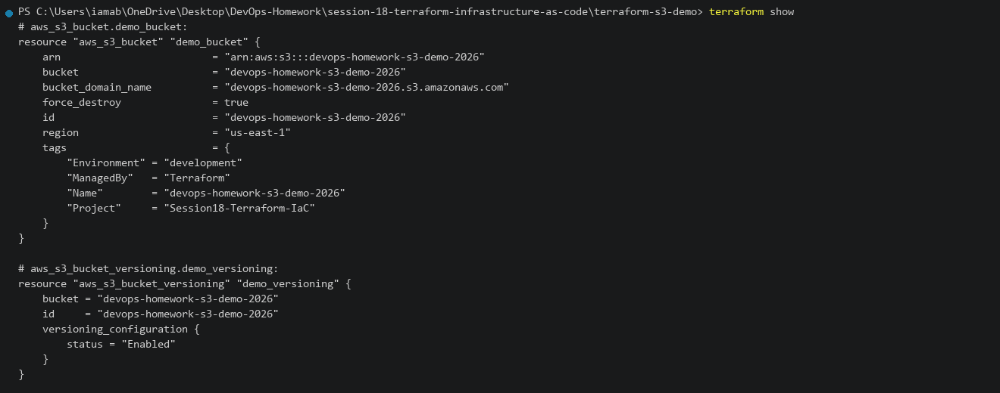
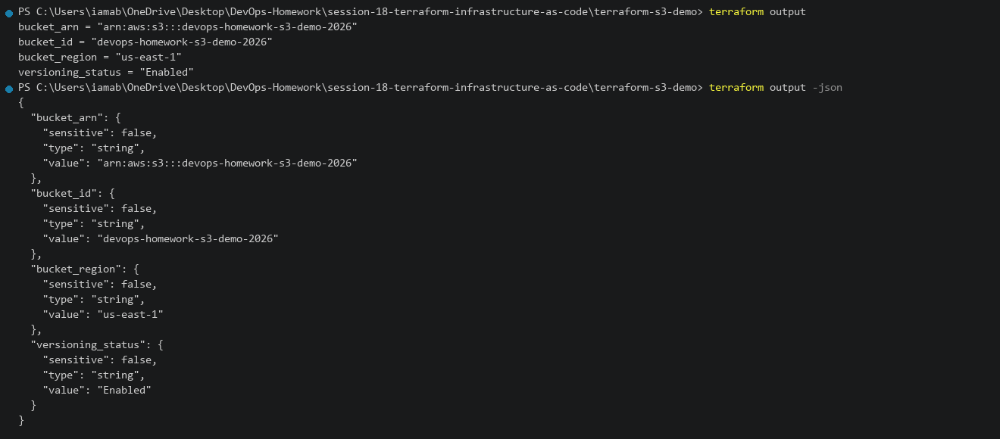
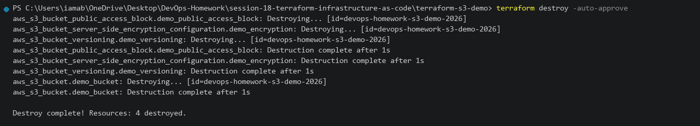
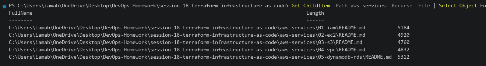

# Session 18 — Terraform & Infrastructure as Code (IaC)

This README documents the practical work completed for Session 18.

**Environment:** Windows 11 / Terraform v1.10.5 / AWS Provider v5.100.0  
**Repository:** `DevOps-Homework`  
**Working Directory:** `session-18-terraform-infrastructure-as-code`

---

# Task 1 — Terraform S3 Demo Project

## Objective

Create an AWS S3 bucket using Terraform and execute the complete workflow:

- `terraform init`
- `terraform fmt`
- `terraform validate`
- `terraform plan`
- `terraform apply`
- `terraform show`
- `terraform output`
- `terraform destroy`

---

## 1.1 Project Structure

### Command

```powershell
Get-ChildItem -Recurse -File | Select-Object -First 15 FullName
```

### Directory Layout

```text
session-18-terraform-infrastructure-as-code/
├── terraform-s3-demo/
│   ├── provider.tf             # Terraform & AWS provider configuration
│   ├── variables.tf            # Input variables (region, bucket_name, env)
│   ├── terraform.tfvars        # Environment variable definitions
│   ├── main.tf                 # S3 bucket, versioning, encryption, access block
│   ├── outputs.tf              # Exported outputs
│   └── README.md
└── aws-services/
    ├── 01-iam/README.md        # IAM Governance research
    ├── 02-ec2/README.md        # EC2 Compute research
    ├── 03-s3/README.md         # S3 Storage research
    ├── 04-vpc/README.md        # VPC Networking research
    └── 05-dynamodb-rds/README.md # Database Services research
```



---

## 1.2 Terraform Version Check

### Command

```powershell
terraform -version
```

### Actual Output

```text
Terraform v1.10.5
on windows_amd64
+ provider registry.terraform.io/hashicorp/aws v5.100.0
```



---

## 1.3 Terraform Init

### Command

```powershell
terraform init
```

### Actual Output

```text
Initializing the backend...
Initializing provider plugins...
- Finding hashicorp/aws versions matching "~> 5.0"...
- Installing hashicorp/aws v5.100.0...
- Installed hashicorp/aws v5.100.0 (signed by HashiCorp)

Terraform has been successfully initialized!
```



---

## 1.4 Terraform Format and Validate

### Command

```powershell
terraform fmt
terraform validate
```

### Actual Output

```text
main.tf
variables.tf
outputs.tf
Success! The configuration is valid.
```



---

## 1.5 Terraform Plan

### Command

```powershell
terraform plan
```

### Actual Output

```text
Terraform will perform the following actions:

  # aws_s3_bucket.demo_bucket will be created
  # aws_s3_bucket_public_access_block.demo_public_access_block will be created
  # aws_s3_bucket_server_side_encryption_configuration.demo_encryption will be created
  # aws_s3_bucket_versioning.demo_versioning will be created

Plan: 4 to add, 0 to change, 0 to destroy.

Changes to Outputs:
  + bucket_arn        = (known after apply)
  + bucket_id         = (known after apply)
  + bucket_region     = (known after apply)
  + versioning_status = "Enabled"
```



---

## 1.6 Terraform Apply

### Command

```powershell
terraform apply -auto-approve
```

### Actual Output

```text
aws_s3_bucket.demo_bucket: Creating...
aws_s3_bucket.demo_bucket: Creation complete after 2s [id=devops-homework-s3-demo-2026]
aws_s3_bucket_versioning.demo_versioning: Creation complete after 1s [id=devops-homework-s3-demo-2026]
aws_s3_bucket_server_side_encryption_configuration.demo_encryption: Creation complete after 1s [id=devops-homework-s3-demo-2026]
aws_s3_bucket_public_access_block.demo_public_access_block: Creation complete after 1s [id=devops-homework-s3-demo-2026]

Apply complete! Resources: 4 added, 0 changed, 0 destroyed.

Outputs:

bucket_arn = "arn:aws:s3:::devops-homework-s3-demo-2026"
bucket_id = "devops-homework-s3-demo-2026"
bucket_region = "us-east-1"
versioning_status = "Enabled"
```



---

## 1.7 Terraform Show

### Command

```powershell
terraform show
```

### Actual Output

```text
# aws_s3_bucket.demo_bucket:
resource "aws_s3_bucket" "demo_bucket" {
    arn                         = "arn:aws:s3:::devops-homework-s3-demo-2026"
    bucket                      = "devops-homework-s3-demo-2026"
    bucket_domain_name          = "devops-homework-s3-demo-2026.s3.amazonaws.com"
    force_destroy               = true
    id                          = "devops-homework-s3-demo-2026"
    region                      = "us-east-1"
}
```



---

## 1.8 Terraform Output

### Command

```powershell
terraform output
terraform output -json
```

### Actual Output

```text
bucket_arn = "arn:aws:s3:::devops-homework-s3-demo-2026"
bucket_id = "devops-homework-s3-demo-2026"
bucket_region = "us-east-1"
versioning_status = "Enabled"
```



---

## 1.9 Terraform Destroy

### Command

```powershell
terraform destroy -auto-approve
```

### Actual Output

```text
aws_s3_bucket_public_access_block.demo_public_access_block: Destruction complete after 1s
aws_s3_bucket_server_side_encryption_configuration.demo_encryption: Destruction complete after 1s
aws_s3_bucket_versioning.demo_versioning: Destruction complete after 1s
aws_s3_bucket.demo_bucket: Destruction complete after 1s

Destroy complete! Resources: 4 destroyed.
```



---

# Task 2 — AWS Services Research

## Objective

Research and document five core AWS cloud services:

- `01. IAM - Governance`
- `02. EC2 - Compute`
- `03. S3 - Storage`
- `04. VPC - Networking`
- `05. DynamoDB & RDS - Database Services`

---

## 2.1 IAM — Governance

### What is IAM?

AWS Identity and Access Management (IAM) is a web service that helps you securely control access to AWS resources. IAM is global and controls authentication (who can sign in) and authorization (what permissions they have).

### Users

An IAM User represents a human person or application service that needs to interact with AWS. Users can have:
- **Console Password**: For logging into the AWS Management Console with MFA.
- **Access Keys**: For programmatic access via AWS CLI, SDK, and APIs.

### Groups

An IAM Group is a collection of IAM users. Permissions attached to a group are automatically applied to all users in that group. Groups make it easier to manage permissions for multiple users.

### Roles

An IAM Role is an identity with specific permissions that can be temporarily assumed by:
- AWS services (such as an EC2 instance or Lambda function)
- Federated identity users (via Google, GitHub, SAML 2.0)
- Users in a different AWS account (cross-account access)

Roles do not have permanent credentials or access keys.

### Policies

An IAM Policy is a JSON document that defines permissions. It contains:
- `Effect`: `Allow` or `Deny`
- `Action`: List of API calls allowed (e.g. `s3:GetObject`, `ec2:DescribeInstances`)
- `Resource`: The ARN of the target resource
- `Condition`: Optional constraints (e.g. requiring SSL, specific IP ranges, or MFA)

### Permissions and Least Privilege

The **Principle of Least Privilege** states that users and services must only be granted the minimum permissions necessary to perform their job. Never grant broad administrative permissions when specific service access is sufficient.

### IAM Best Practices

1. Lock away AWS root account credentials and enable hardware MFA.
2. Require MFA for all IAM users.
3. Use IAM Roles instead of long-lived access keys.
4. Rotate access keys regularly (every 90 days).
5. Use AWS IAM Access Analyzer to identify unintended external access.

### Common Use Cases

- Granting an EC2 instance read access to an S3 bucket via an IAM Instance Profile.
- Setting up GitHub Actions CI/CD to deploy to AWS using temporary OIDC credentials.
- Dividing access into `Developers`, `Testers`, and `DevOps` groups.

---

## 2.2 EC2 — Compute

### What is EC2?

Amazon Elastic Compute Cloud (Amazon EC2) provides scalable computing capacity in the AWS Cloud. It allows you to launch virtual servers (instances) on demand without investing in physical hardware upfront.

### AMI (Amazon Machine Image)

An AMI is a template that contains the operating system, application server, and applications required to launch an instance:
- **AWS Quick Start AMIs**: Pre-packaged OS images (Amazon Linux 2023, Ubuntu, RHEL, Windows Server).
- **Custom AMIs**: Golden images built with your organization's security tools and packages.
- **AWS Marketplace AMIs**: Commercial software appliances.

### Instance Types and Families

- **General Purpose (`t3`, `m6i`)**: Balanced compute, memory, and networking for web servers and dev environments.
- **Compute Optimized (`c6i`, `c7g`)**: High compute power for batch processing, gaming servers, and media transcoding.
- **Memory Optimized (`r6i`, `r7g`)**: High RAM-to-CPU ratio for in-memory caches (Redis) and high-performance databases.
- **Storage Optimized (`i3en`, `d3`)**: High sequential read/write access for distributed databases (Cassandra, Kafka).

### Key Pairs

Public key cryptography used to securely connect to EC2 instances without transmitting passwords:
- **Linux**: SSH access using the private key (`.pem` file).
- **Windows**: Decrypts the default Administrator password for RDP access.

### Security Groups

Stateful virtual firewalls that control inbound and outbound traffic at the instance level. If inbound traffic is allowed on port 80, the return response is automatically allowed regardless of outbound rules.

### EBS (Elastic Block Store)

Persistent network-attached block storage volumes for EC2 instances:
- **`gp3`**: General purpose SSD with configurable IOPS and throughput.
- **`io2`**: Provisioned IOPS SSD for mission-critical database workloads.
- **`st1` / `sc1`**: Magnetic storage for throughput-heavy and cold data.
- **Snapshots**: Point-in-time incremental backups stored in S3.

### Public vs Private IP & Elastic IP

- **Private IP**: Internal IP address reachable only within the VPC. Remains the same throughout the instance lifecycle.
- **Public IP**: Dynamically assigned public IP from Amazon's pool. Changes every time the instance is stopped and started.
- **Elastic IP (EIP)**: A static, persistent public IPv4 address allocated to your AWS account that remains constant.

### Instance Lifecycle

```text
[Launch] -> [Pending] -> [Running] <-> [Stopping] -> [Stopped]
                              |
                              +---------> [Shutting-down] -> [Terminated]
```

### Common Use Cases

- Hosting web applications and microservices behind an Application Load Balancer.
- Running self-hosted CI/CD build runners (GitHub Actions, Jenkins).
- Running high-throughput data processing batch jobs.

---

## 2.3 S3 — Storage

### What is S3?

Amazon Simple Storage Service (Amazon S3) is an object storage service offering 99.999999999% (11 9's) data durability. S3 stores data as individual objects within buckets.

### Buckets and Objects

- **Bucket**: A container for objects. Bucket names must be globally unique across all AWS accounts worldwide.
- **Object**: A file and its metadata. Objects can range in size from 0 bytes up to 5 TB.

### Storage Classes

| Storage Class | Durability | Availability | Use Case |
|---|---|---|---|
| **S3 Standard** | 99.999999999% | 99.99% | Frequently accessed data, active websites |
| **S3 Intelligent-Tiering** | 99.999999999% | 99.9% | Unknown or changing access patterns |
| **S3 Standard-IA** | 99.999999999% | 99.9% | Infrequently accessed data, disaster recovery |
| **S3 One Zone-IA** | 99.999999999% (1 AZ) | 99.5% | Recreatable non-critical backup data |
| **S3 Glacier Flexible** | 99.999999999% | 99.9% | Long-term archives (retrieval: mins to hours) |
| **S3 Glacier Deep Archive** | 99.999999999% | 99.9% | Lowest cost archive storage ($0.00099/GB) |

### Versioning

Preserves, retrieves, and restores every version of every object stored in an S3 bucket. Protects against accidental deletion and application bugs.

### Lifecycle Policies

Rules that automatically transition objects to cheaper storage classes over time or permanently delete old versions:
- Transition to `Standard-IA` after 30 days.
- Transition to `Glacier` after 90 days.
- Expire / delete objects after 365 days.

### Encryption

- **SSE-S3 (`AES256`)**: Server-side encryption managed by Amazon S3 keys.
- **SSE-KMS (`aws:kms`)**: Server-side encryption with AWS Key Management Service with audit trails.
- **SSE-C**: Server-side encryption with customer-provided keys.

### Bucket Policies

JSON-based access policies attached directly to the bucket to enforce HTTPS (`aws:SecureTransport`), IP restrictions, or cross-account sharing.

### Common Use Cases

- Hosting static websites (HTML, CSS, JS) with Amazon CloudFront CDN.
- Central storage for Data Lakes and Big Data analytics (AWS Athena, EMR).
- Automated backup repository for database dumps and snapshots.

---

## 2.4 VPC — Networking

### What is VPC?

Amazon Virtual Private Cloud (Amazon VPC) lets you provision a logically isolated section of the AWS Cloud where you can launch AWS resources in a virtual network that you define.

### CIDR Notation

Defines the IP address range for the VPC. For example, `10.0.0.0/16` provides 65,536 private IP addresses.

### Subnets

A segment of a VPC's IP range associated with a specific Availability Zone:
- **Public Subnet**: Has a route to the Internet Gateway (`0.0.0.0/0 -> igw-xxxx`). Resources can receive public IPs.
- **Private Subnet**: Has no direct route to the Internet Gateway. Outbound internet access is provided via a NAT Gateway.
- **Isolated Subnet**: Has no route to IGW or NAT Gateway; strictly internal for database tiers.

### Route Tables

A set of rules (routes) that determine where network traffic from your subnet is directed. Every subnet must be associated with a route table.

### Internet Gateway (IGW) vs NAT Gateway

- **Internet Gateway (IGW)**: Enables bidirectional communication between public subnets and the internet.
- **NAT Gateway**: Enables instances in a private subnet to make outbound requests to the internet (for OS patches or software updates) while preventing inbound connections from the outside internet.

### Security Groups vs Network ACLs (NACLs)

| Feature | Security Group (SG) | Network ACL (NACL) |
|---|---|---|
| **Scope** | Instance level (EC2, RDS) | Subnet level |
| **Type** | **Stateful** (Return traffic automatically allowed) | **Stateless** (Inbound and outbound rules evaluated separately) |
| **Rules** | Allow rules only | Allow and Deny rules |

### Common Use Cases

- Provisioning a secure 3-Tier Web Architecture (Public Web -> Private App -> Isolated DB).
- Connecting on-premises corporate datacenters to AWS using AWS Site-to-Site VPN or AWS Direct Connect.

---

## 2.5 DynamoDB & RDS — Database Services

### Amazon DynamoDB (NoSQL)

A fully managed, serverless, key-value and document database delivering single-digit millisecond performance at any scale:
- **Tables**: Collection of items.
- **Items**: Individual records (equivalent to rows, up to 400 KB).
- **Attributes**: Individual data elements (equivalent to columns, schemaless).
- **Partition Key (HASH)**: Attribute used to distribute data across physical storage partitions.
- **Sort Key (RANGE)**: Optional second key attribute for composite primary keys enabling sorted queries.
- **Capacity Modes**: On-Demand (pay per request) vs Provisioned (RCU / WCU with auto-scaling).
- **Use Cases**: User session management, gaming leaderboards, shopping carts, mobile application backends.

### Amazon RDS (Relational Database Service)

A managed service that makes it easy to set up, operate, and scale a relational database in the cloud:
- **Supported Engines**: PostgreSQL, MySQL, MariaDB, Oracle, Microsoft SQL Server, and Amazon Aurora.
- **DB Instances**: Managed compute instances running the database engine.
- **Security**: VPC subnet isolation, KMS encryption at rest, SSL/TLS in transit, and IAM database authentication.
- **Automated Backups & PITR**: Daily snapshots and continuous transaction log archiving for point-in-time recovery.
- **Multi-AZ Deployments**: Synchronous replication to a standby replica in a second Availability Zone with automatic failover.
- **Read Replicas**: Asynchronous replication up to 15 read-only copies to scale read-heavy application traffic.
- **Use Cases**: Enterprise ERP/CRM systems, financial transaction processing, complex analytical SQL reporting.

---

## 2.6 Research Files Overview

```powershell
Get-ChildItem -Path aws-services -Recurse -File | Select-Object FullName
```


