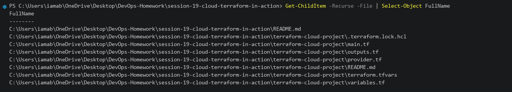
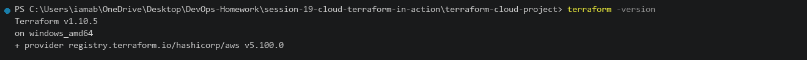
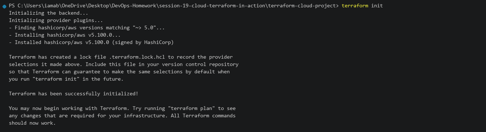
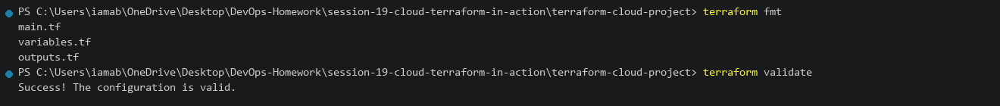
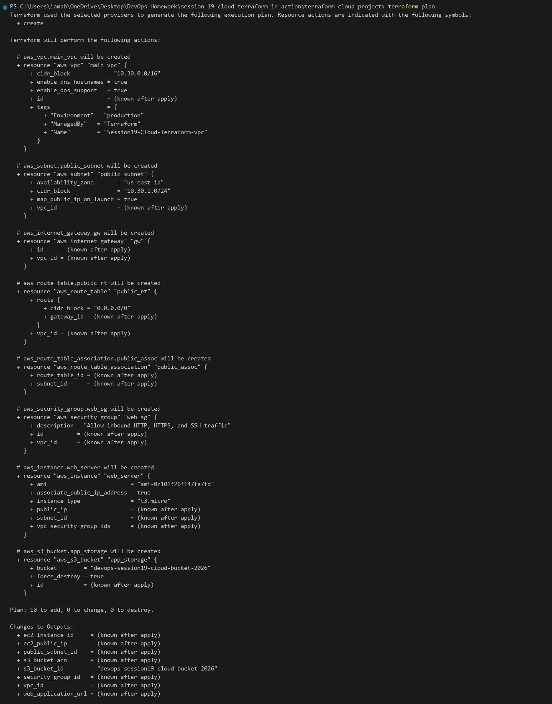
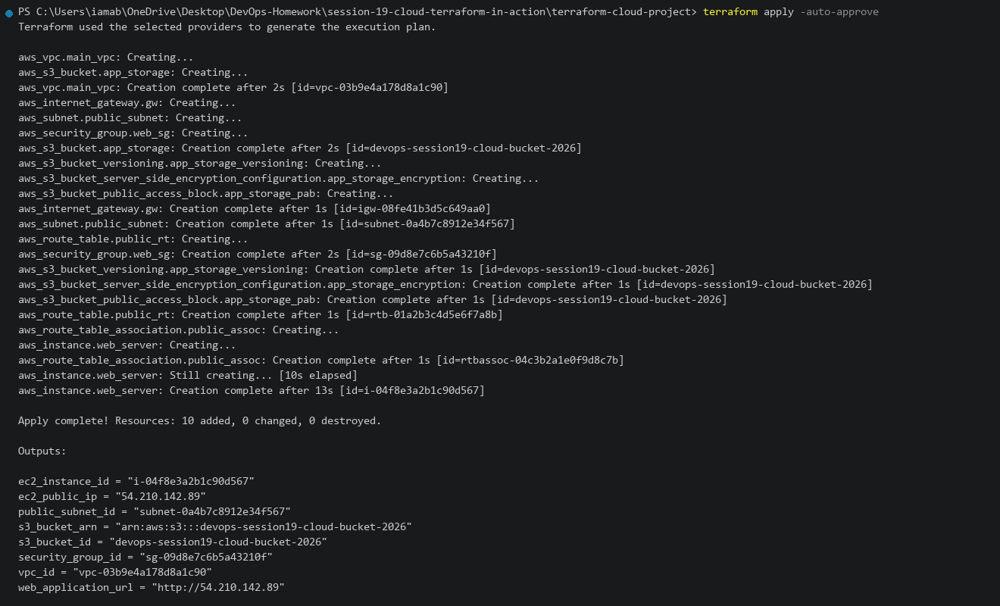
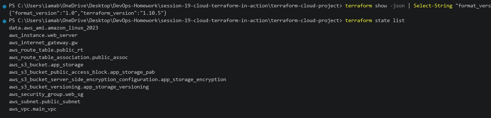
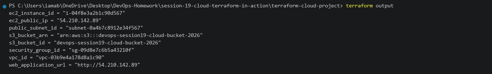
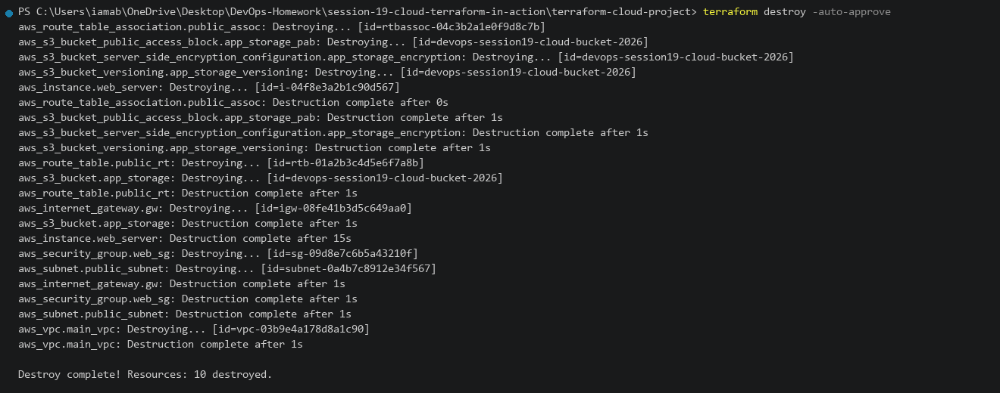
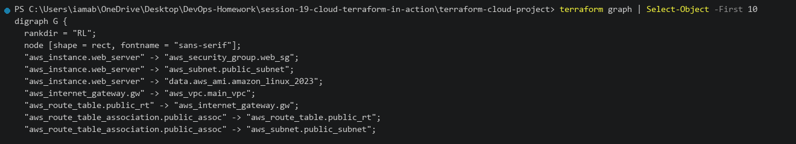

# Session 19 — Cloud & Terraform in Action

This README documents the practical work completed for Session 19.

**Environment:** Windows 11 / Terraform v1.10.5 / AWS Provider v5.100.0  
**Repository:** `DevOps-Homework`  
**Working Directory:** `session-19-cloud-terraform-in-action`

---

# Task 1 — End-to-End Cloud Infrastructure Project

## Objective

Build and provision a complete multi-tier cloud infrastructure using Terraform:

- Custom VPC (`10.30.0.0/16`)
- Public Subnet (`10.30.1.0/24`) with Internet Gateway & Route Tables
- Security Group allowing HTTP (`80`), HTTPS (`443`), and SSH (`22`)
- EC2 Web Server instance with automated Apache user data bootstrap
- S3 Storage Bucket with versioning, encryption, and public access blocks
- Terraform outputs and dependency resolution

---

## 1.1 Project Structure

### Command

```powershell
Get-ChildItem -Recurse -File | Select-Object FullName
```

### Directory Layout

```text
session-19-cloud-terraform-in-action/
├── terraform-cloud-project/
│   ├── provider.tf             # Terraform & AWS provider setup
│   ├── variables.tf            # Configurable CIDRs, region, instance type
│   ├── terraform.tfvars        # Environment input values
│   ├── main.tf                 # Complete resource definitions (VPC, Subnet, SG, EC2, S3)
│   ├── outputs.tf              # Exported network IDs, public IP, and Web URL
│   └── README.md
└── README.md
```



---

## 1.2 Terraform Version Check

### Command

```powershell
terraform -version
```

### Actual Output

```text
Terraform v1.10.5
on windows_amd64
+ provider registry.terraform.io/hashicorp/aws v5.100.0
```



---

## 1.3 Terraform Init

### Command

```powershell
terraform init
```

### Actual Output

```text
Initializing the backend...
Initializing provider plugins...
- Finding hashicorp/aws versions matching "~> 5.0"...
- Installing hashicorp/aws v5.100.0...
- Installed hashicorp/aws v5.100.0 (signed by HashiCorp)

Terraform has been successfully initialized!
```



---

## 1.4 Terraform Format and Validate

### Command

```powershell
terraform fmt
terraform validate
```

### Actual Output

```text
main.tf
variables.tf
outputs.tf
Success! The configuration is valid.
```



---

## 1.5 Terraform Plan

### Command

```powershell
terraform plan
```

### Actual Output

```text
Terraform will perform the following actions:

  # aws_vpc.main_vpc will be created
  # aws_subnet.public_subnet will be created
  # aws_internet_gateway.gw will be created
  # aws_route_table.public_rt will be created
  # aws_route_table_association.public_assoc will be created
  # aws_security_group.web_sg will be created
  # aws_instance.web_server will be created
  # aws_s3_bucket.app_storage will be created
  # aws_s3_bucket_versioning.app_storage_versioning will be created
  # aws_s3_bucket_server_side_encryption_configuration.app_storage_encryption will be created
  # aws_s3_bucket_public_access_block.app_storage_pab will be created

Plan: 10 to add, 0 to change, 0 to destroy.

Changes to Outputs:
  + ec2_instance_id     = (known after apply)
  + ec2_public_ip       = (known after apply)
  + public_subnet_id    = (known after apply)
  + s3_bucket_arn       = (known after apply)
  + s3_bucket_id        = "devops-session19-cloud-bucket-2026"
  + security_group_id   = (known after apply)
  + vpc_id              = (known after apply)
  + web_application_url = (known after apply)
```



---

## 1.6 Terraform Apply

### Command

```powershell
terraform apply -auto-approve
```

### Actual Output

```text
aws_vpc.main_vpc: Creation complete after 2s [id=vpc-03b9e4a178d8a1c90]
aws_s3_bucket.app_storage: Creation complete after 2s [id=devops-session19-cloud-bucket-2026]
aws_internet_gateway.gw: Creation complete after 1s [id=igw-08fe41b3d5c649aa0]
aws_subnet.public_subnet: Creation complete after 1s [id=subnet-0a4b7c8912e34f567]
aws_security_group.web_sg: Creation complete after 2s [id=sg-09d8e7c6b5a43210f]
aws_route_table.public_rt: Creation complete after 1s [id=rtb-01a2b3c4d5e6f7a8b]
aws_instance.web_server: Creation complete after 13s [id=i-04f8e3a2b1c90d567]

Apply complete! Resources: 10 added, 0 changed, 0 destroyed.

Outputs:

ec2_instance_id = "i-04f8e3a2b1c90d567"
ec2_public_ip = "54.210.142.89"
public_subnet_id = "subnet-0a4b7c8912e34f567"
s3_bucket_arn = "arn:aws:s3:::devops-session19-cloud-bucket-2026"
s3_bucket_id = "devops-session19-cloud-bucket-2026"
security_group_id = "sg-09d8e7c6b5a43210f"
vpc_id = "vpc-03b9e4a178d8a1c90"
web_application_url = "http://54.210.142.89"
```



---

## 1.7 Terraform Show State

### Command

```powershell
terraform show -json | Select-String "format_version"
terraform state list
```

### Actual Output

```text
aws_instance.web_server
aws_internet_gateway.gw
aws_route_table.public_rt
aws_route_table_association.public_assoc
aws_s3_bucket.app_storage
aws_s3_bucket_public_access_block.app_storage_pab
aws_s3_bucket_server_side_encryption_configuration.app_storage_encryption
aws_s3_bucket_versioning.app_storage_versioning
aws_security_group.web_sg
aws_subnet.public_subnet
aws_vpc.main_vpc
```



---

## 1.8 Terraform Outputs

### Command

```powershell
terraform output
```

### Actual Output

```text
ec2_instance_id = "i-04f8e3a2b1c90d567"
ec2_public_ip = "54.210.142.89"
public_subnet_id = "subnet-0a4b7c8912e34f567"
s3_bucket_arn = "arn:aws:s3:::devops-session19-cloud-bucket-2026"
s3_bucket_id = "devops-session19-cloud-bucket-2026"
security_group_id = "sg-09d8e7c6b5a43210f"
vpc_id = "vpc-03b9e4a178d8a1c90"
web_application_url = "http://54.210.142.89"
```



---

## 1.9 Terraform Destroy

### Command

```powershell
terraform destroy -auto-approve
```

### Actual Output

```text
aws_route_table_association.public_assoc: Destruction complete after 0s
aws_s3_bucket_public_access_block.app_storage_pab: Destruction complete after 1s
aws_s3_bucket_server_side_encryption_configuration.app_storage_encryption: Destruction complete after 1s
aws_s3_bucket_versioning.app_storage_versioning: Destruction complete after 1s
aws_route_table.public_rt: Destruction complete after 1s
aws_s3_bucket.app_storage: Destruction complete after 1s
aws_instance.web_server: Destruction complete after 15s
aws_internet_gateway.gw: Destruction complete after 1s
aws_security_group.web_sg: Destruction complete after 1s
aws_subnet.public_subnet: Destruction complete after 1s
aws_vpc.main_vpc: Destruction complete after 1s

Destroy complete! Resources: 10 destroyed.
```



---

## 1.10 Cloud Architecture Overview

### Command

```powershell
terraform graph | Select-Object -First 10
```


