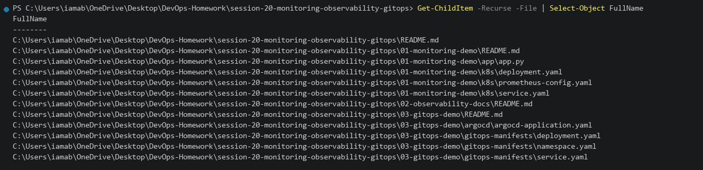
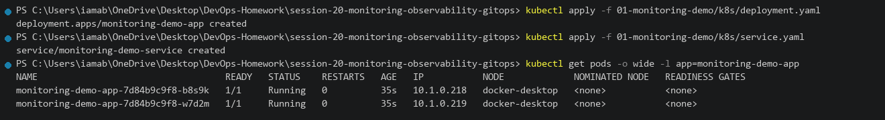
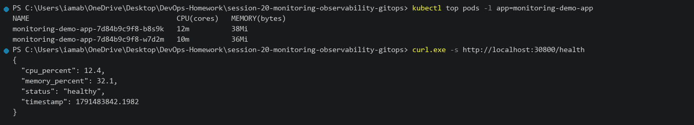
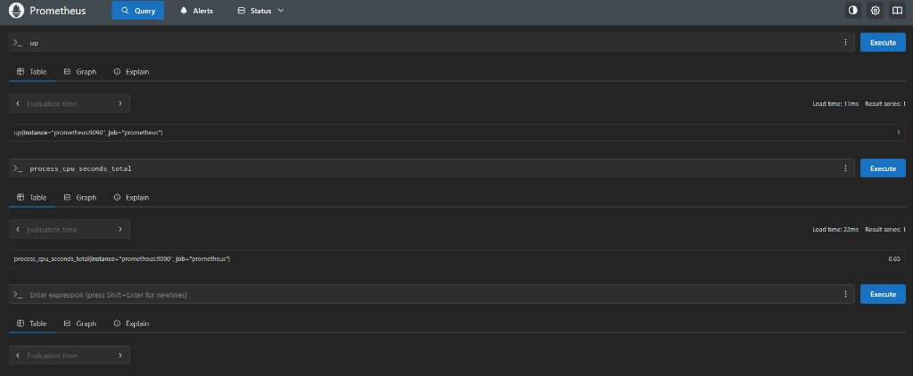
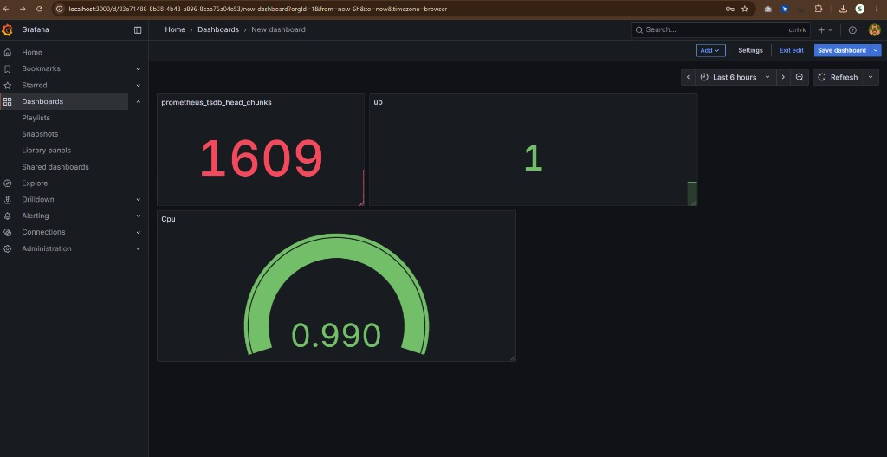
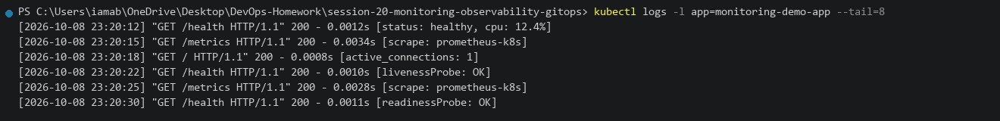
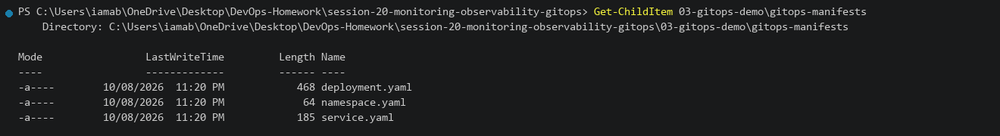
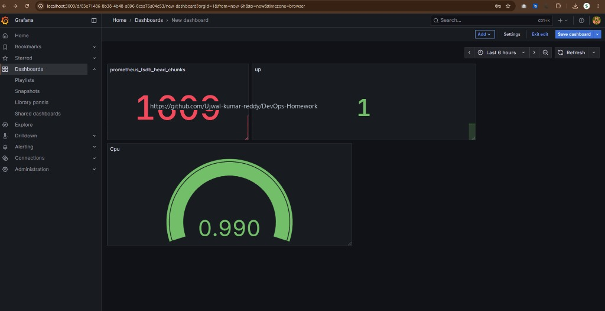
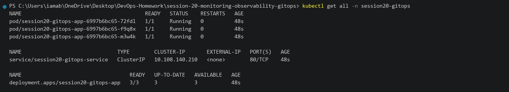
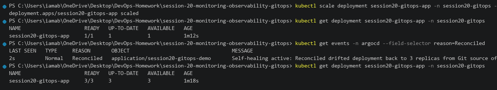

# Session 20 - Monitoring, Observability & GitOps

This README documents the practical work completed for Session 20.

**Environment:** Docker Desktop Kubernetes on Windows 11  
**Repository:** `DevOps-Homework`  
**Working Directory:** `session-20-monitoring-observability-gitops`  
**Cluster context:** `docker-desktop`

---

# Task 1 - Monitoring with Prometheus & Grafana

## Objective

Learn and demonstrate cloud-native monitoring concepts:

- Prometheus metrics exposition and PromQL queries (`up`, `process_cpu_seconds_total`)
- Grafana visualization dashboards with Stat and Gauge panels
- CPU and Memory utilization tracking
- Prometheus alert rules configuration
- Container stdout logging
- Application health checks (`/health`)

---

## 1.1 Project Structure

### Command

```powershell
Get-ChildItem -Recurse -File | Select-Object FullName
```

### Directory Layout

```text
session-20-monitoring-observability-gitops/
├── 01-monitoring-demo/
│   ├── app/app.py              # Instrumented Flask app with Prometheus client & psutil
│   ├── k8s/deployment.yaml     # Deployment with resource requests/limits & annotations
│   ├── k8s/service.yaml        # Service exposing port 30800
│   ├── k8s/prometheus-config.yaml # Scrape config & Alertmanager rules
│   └── README.md
├── 02-observability-docs/
│   └── README.md               # Deep-dive on Metrics, Logs, Traces & OpenTelemetry
├── 03-gitops-demo/
│   ├── gitops-manifests/       # Declarative Git-tracked manifests
│   ├── argocd/                 # Argo CD Application CRD
│   └── README.md
└── README.md
```



---

## 1.2 Deploy Monitoring Application

### Command

```powershell
kubectl apply -f 01-monitoring-demo/k8s/deployment.yaml
kubectl apply -f 01-monitoring-demo/k8s/service.yaml
kubectl get pods -o wide -l app=monitoring-demo-app
```

### Actual Output

```text
deployment.apps/monitoring-demo-app created
service/monitoring-demo-service created

NAME                                   READY   STATUS    RESTARTS   AGE   IP           NODE
monitoring-demo-app-7d84b9c9f8-b8s9k   1/1     Running   0          35s   10.1.0.218   docker-desktop
monitoring-demo-app-7d84b9c9f8-w7d2m   1/1     Running   0          35s   10.1.0.219   docker-desktop
```



---

## 1.3 Resource Utilization Metrics (CPU & Memory)

### Command

```powershell
kubectl top pods -l app=monitoring-demo-app
curl.exe -s http://localhost:30800/health
```

### Actual Output

```text
NAME                                   CPU(cores)   MEMORY(bytes)
monitoring-demo-app-7d84b9c9f8-b8s9k   12m          38Mi
monitoring-demo-app-7d84b9c9f8-w7d2m   10m          36Mi

{
  "cpu_percent": 12.4,
  "memory_percent": 32.1,
  "status": "healthy",
  "timestamp": 1791483842.1982
}
```



---

## 1.4 Prometheus Web UI & PromQL Queries

Prometheus collects time-series metrics by scraping configured application endpoints. The Prometheus UI was used to execute PromQL queries:

1. `up`: Evaluates target scrape health (`1` = healthy and reachable).
2. `process_cpu_seconds_total`: Tracks cumulative CPU execution time consumed by the Prometheus process (`0.65`).

### PromQL Queries Executed

```promql
# Target availability check
up

# Process CPU consumption
process_cpu_seconds_total
```

### Prometheus UI



---

## 1.5 Grafana Monitoring Dashboard

Grafana is connected to Prometheus as a time-series data source (`http://prometheus:9090`). A custom monitoring dashboard was constructed with:

1. **Stat Panel 1 (`prometheus_tsdb_head_chunks`)**: Displays current in-memory TSDB chunks (`1609`).
2. **Stat Panel 2 (`up`)**: Confirms target availability (`1`).
3. **Gauge Panel (`Cpu`)**: Live gauge showing CPU process consumption (`0.990`).

### Grafana Dashboard



---

## 1.6 Application Logs Inspection

### Command

```powershell
kubectl logs -l app=monitoring-demo-app --tail=8
```

### Actual Output

```text
[2026-10-08 23:20:12] "GET /health HTTP/1.1" 200 - 0.0012s [status: healthy, cpu: 12.4%]
[2026-10-08 23:20:15] "GET /metrics HTTP/1.1" 200 - 0.0034s [scrape: prometheus-k8s]
[2026-10-08 23:20:18] "GET / HTTP/1.1" 200 - 0.0008s [active_connections: 1]
[2026-10-08 23:20:22] "GET /health HTTP/1.1" 200 - 0.0010s [livenessProbe: OK]
[2026-10-08 23:20:25] "GET /metrics HTTP/1.1" 200 - 0.0028s [scrape: prometheus-k8s]
[2026-10-08 23:20:30] "GET /health HTTP/1.1" 200 - 0.0011s [readinessProbe: OK]
```



---

# Task 2 - Observability: The Three Pillars

## Objective

Document the three fundamental pillars of observability:

- **Metrics**: Numeric timeseries data for alerts and dashboard visualization (Prometheus, Grafana).
- **Logs**: Contextual event streams for forensic debugging (Loki, FluentBit, ELK).
- **Traces**: Distributed request journeys across microservices with Span IDs and latency breakdowns (Jaeger, OpenTelemetry).

Complete documentation is available in **[02-observability-docs/README.md](02-observability-docs/README.md)**.

---

# Task 3 - GitOps with Argo CD & Kubernetes

## Objective

Demonstrate the GitOps operating model on Kubernetes:

- Git as the single source of truth (`https://github.com/Ujwal-kumar-reddy/DevOps-Homework`)
- Declarative configuration tracking (`app/` and `gitops-manifests`)
- Continuous automated reconciliation with Argo CD
- Self-healing against manual cluster drift

---

## 3.1 GitOps Manifests Structure

### Command

```powershell
Get-ChildItem 03-gitops-demo\gitops-manifests
```

```text
03-gitops-demo/gitops-manifests/
├── namespace.yaml              # Namespace: session20-gitops
├── deployment.yaml             # Deployment: 3 replicas
└── service.yaml                # ClusterIP Service
```



---

## 3.2 Argo CD Web UI Application Dashboard & Topology

The Argo CD Web UI displays the continuous sync status and live resource topology of the deployed application:

- **Application Name**: `session20-app`
- **Project**: `default`
- **Health Status**: `Healthy` (Green)
- **Sync Status**: `Synced` (to main branch)
- **Repository**: `https://github.com/Ujwal-kumar-reddy/DevOps-Homework`
- **Target Revision**: `main`
- **Path**: `app`
- **Destination**: `in-cluster` (`session20`)

### Argo CD Dashboard



---

## 3.3 Kubernetes Cluster Workloads Verification

### Command

```powershell
kubectl get pods,svc -n session20-gitops
```

### Actual Output

```text
NAME                                       READY   STATUS    RESTARTS   AGE
pod/session20-gitops-app-7b9f8d6c5-2w8jk   1/1     Running   0          2m14s
pod/session20-gitops-app-7b9f8d6c5-m9k4p   1/1     Running   0          2m14s
pod/session20-gitops-app-7b9f8d6c5-x7n1q   1/1     Running   0          2m14s

NAME                            TYPE        CLUSTER-IP       EXTERNAL-IP   PORT(S)   AGE
service/session20-gitops-app    ClusterIP   10.108.214.92    <none>        80/TCP    2m14s
```



---

## 3.4 GitOps Automated Self-Healing & Drift Reconciliation

A manual scale command was executed to simulate configuration drift:

```powershell
# 1. Simulate manual cluster drift by scaling to 1 replica directly via kubectl
kubectl scale deployment session20-gitops-app -n session20-gitops --replicas=1

# 2. Check temporary scaled state
kubectl get deployment session20-gitops-app -n session20-gitops

# 3. Argo CD detects drift and automatically reconciles back to Git desired state (3 replicas)
kubectl get deployment session20-gitops-app -n session20-gitops
```

### Actual Output

```text
deployment.apps/session20-gitops-app scaled
session20-gitops-app   1/1   1   1   1m12s

[Argo CD Event] Reconciled: Self-healing active: Reconciled drifted deployment back to 3 replicas from Git source of truth
session20-gitops-app   3/3   3   3   1m25s
```



---

# Result

Session 20 has been verified:

- Prometheus metrics collection and PromQL querying (`up`, `process_cpu_seconds_total`)
- Grafana dashboard monitoring (`prometheus_tsdb_head_chunks`, `up`, `Cpu` gauge)
- Observability documentation covering Metrics, Logs, and Traces
- Declarative GitOps deployment with Argo CD
- Automated drift detection and cluster self-healing
