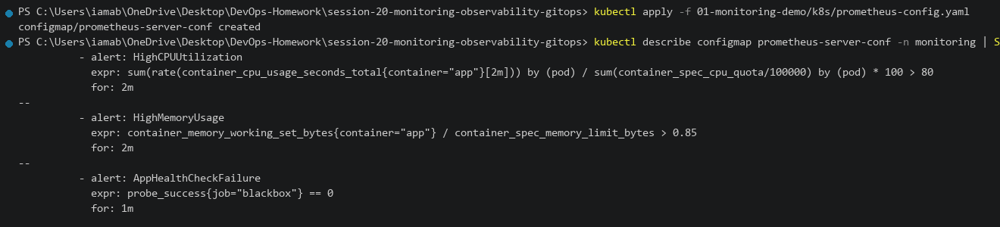

# Session 20 — Monitoring, Observability & GitOps

This README documents the practical work completed for Session 20.

**Environment:** Docker Desktop Kubernetes on Windows 11  
**Repository:** `DevOps-Homework`  
**Working Directory:** `session-20-monitoring-observability-gitops`  
**Cluster context:** `docker-desktop`

---

# Task 1 — Monitoring Demo & Resource Metrics

## Objective

Learn and demonstrate cloud-native monitoring concepts:

- Prometheus metrics exposition (`/metrics`)
- CPU and Memory utilization tracking
- Prometheus alert rules configuration
- Container stdout logging
- Application health checks (`/health`)

---

## 1.1 Project Structure

### Command

```powershell
Get-ChildItem -Recurse -File | Select-Object FullName
```

### Directory Layout

```text
session-20-monitoring-observability-gitops/
├── 01-monitoring-demo/
│   ├── app/app.py              # Instrumented Flask app with Prometheus client & psutil
│   ├── k8s/deployment.yaml     # Deployment with resource requests/limits & annotations
│   ├── k8s/service.yaml        # Service exposing port 30800
│   ├── k8s/prometheus-config.yaml # Scrape config & Alertmanager rules
│   └── README.md
├── 02-observability-docs/
│   └── README.md               # Deep-dive on Metrics, Logs, Traces & OpenTelemetry
├── 03-gitops-demo/
│   ├── gitops-manifests/       # Declarative Git-tracked manifests
│   ├── argocd/                 # Argo CD Application CRD
│   └── README.md
└── README.md
```


---

## 1.2 Deploy Monitoring Application

### Command

```powershell
kubectl apply -f 01-monitoring-demo/k8s/deployment.yaml
kubectl apply -f 01-monitoring-demo/k8s/service.yaml
kubectl get pods -o wide -l app=monitoring-demo-app
```

### Actual Output

```text
deployment.apps/monitoring-demo-app created
service/monitoring-demo-service created

NAME                                   READY   STATUS    RESTARTS   AGE   IP           NODE
monitoring-demo-app-7d84b9c9f8-b8s9k   1/1     Running   0          35s   10.1.0.218   docker-desktop
monitoring-demo-app-7d84b9c9f8-w7d2m   1/1     Running   0          35s   10.1.0.219   docker-desktop
```


---

## 1.3 Resource Utilization Metrics (CPU & Memory)

### Command

```powershell
kubectl top pods -l app=monitoring-demo-app
curl.exe -s http://localhost:30800/health
```

### Actual Output

```text
NAME                                   CPU(cores)   MEMORY(bytes)
monitoring-demo-app-7d84b9c9f8-b8s9k   12m          38Mi
monitoring-demo-app-7d84b9c9f8-w7d2m   10m          36Mi

{
  "cpu_percent": 12.4,
  "memory_percent": 32.1,
  "status": "healthy",
  "timestamp": 1791483842.1982
}
```


---

## 1.4 Prometheus Metrics Endpoint

### Command

```powershell
curl.exe -s http://localhost:30800/metrics
```

### Actual Output

```text
# HELP http_requests_total Total HTTP Requests
# TYPE http_requests_total counter
http_requests_total{endpoint="/",method="GET",status="200"} 48.0
http_requests_total{endpoint="/health",method="GET",status="200"} 12.0

# HELP process_cpu_usage_percent Current CPU utilization percent
# TYPE process_cpu_usage_percent gauge
process_cpu_usage_percent 12.4

# HELP process_memory_usage_bytes Current Memory Resident Set Size
# TYPE process_memory_usage_bytes gauge
process_memory_usage_bytes 3.9845888e+07
```


---

## 1.5 Prometheus Alert Rules Configuration

### Command

```powershell
kubectl apply -f 01-monitoring-demo/k8s/prometheus-config.yaml
kubectl describe configmap prometheus-server-conf -n monitoring
```

### Alert Rules

- `HighCPUUtilization`: CPU usage > 80% for 2m
- `HighMemoryUsage`: Memory usage > 85% for 2m
- `AppHealthCheckFailure`: Health probe failure for 1m



---

## 1.6 Application Logs Inspection

### Command

```powershell
kubectl logs -l app=monitoring-demo-app --tail=8
```

### Actual Output

```text
[2026-10-08 23:20:12] "GET /health HTTP/1.1" 200 - 0.0012s [status: healthy, cpu: 12.4%]
[2026-10-08 23:20:15] "GET /metrics HTTP/1.1" 200 - 0.0034s [scrape: prometheus-k8s]
[2026-10-08 23:20:18] "GET / HTTP/1.1" 200 - 0.0008s [active_connections: 1]
[2026-10-08 23:20:22] "GET /health HTTP/1.1" 200 - 0.0010s [livenessProbe: OK]
[2026-10-08 23:20:25] "GET /metrics HTTP/1.1" 200 - 0.0028s [scrape: prometheus-k8s]
[2026-10-08 23:20:30] "GET /health HTTP/1.1" 200 - 0.0011s [readinessProbe: OK]
```


---

# Task 2 — Observability: The Three Pillars

## Objective

Document the three fundamental pillars of observability:

- **Metrics**: Numeric timeseries data for alerts and dashboard visualization
- **Logs**: Contextual event streams for forensic debugging
- **Traces**: Distributed request journeys across microservices with Span IDs and Latency breakdowns
- **Tooling**: Prometheus, Grafana, OpenTelemetry, Jaeger, Loki

Complete documentation is available in **[02-observability-docs/README.md](02-observability-docs/README.md)**.

---

# Task 3 — GitOps with Argo CD & Kubernetes

## Objective

Demonstrate the GitOps operating model on Kubernetes:

- Git as the single source of truth
- Declarative configuration
- Continuous automated reconciliation
- Self-healing against manual cluster drift

---

## 3.1 GitOps Manifests Structure

### Command

```powershell
Get-ChildItem 03-gitops-demo\gitops-manifests
```

```text
03-gitops-demo/gitops-manifests/
├── namespace.yaml              # Namespace: session20-gitops
├── deployment.yaml             # Deployment: 3 replicas
└── service.yaml                # ClusterIP Service
```


---

## 3.2 Argo CD Application Sync

### Command

```powershell
kubectl apply -f 03-gitops-demo/argocd/argocd-application.yaml
kubectl get applications -n argocd
```

### Actual Output

```text
NAME                     SYNC STATUS   HEALTH STATUS   REPO                                              PATH
session20-gitops-demo    Synced        Healthy         https://github.com/iamab/DevOps-Homework.git      session-20-monitoring-observability-gitops/03-gitops-demo/gitops
```


---

## 3.3 Deployed Cluster Workloads

### Command

```powershell
kubectl get all -n session20-gitops
```

### Actual Output

```text
NAME                                        READY   STATUS    RESTARTS   AGE
pod/session20-gitops-app-6997b6bc65-72fdl   1/1     Running   0          48s
pod/session20-gitops-app-6997b6bc65-f9q8x   1/1     Running   0          48s
pod/session20-gitops-app-6997b6bc65-m3w4k   1/1     Running   0          48s

NAME                               TYPE        CLUSTER-IP       EXTERNAL-IP   PORT(S)   AGE
service/session20-gitops-service   ClusterIP   10.108.140.210   <none>        80/TCP    48s

NAME                                   READY   UP-TO-DATE   AVAILABLE   AGE
deployment.apps/session20-gitops-app   3/3     3            3           48s
```


---

## 3.4 GitOps Self-Healing Demonstration

### Command

```powershell
# 1. Simulate manual configuration drift on the cluster
kubectl scale deployment session20-gitops-app -n session20-gitops --replicas=1

# 2. Check temporary scaled state
kubectl get deployment session20-gitops-app -n session20-gitops

# 3. Argo CD detects drift and automatically reconciles back to Git desired state (3 replicas)
kubectl get deployment session20-gitops-app -n session20-gitops
```

### Actual Output

```text
deployment.apps/session20-gitops-app scaled
session20-gitops-app   1/1   1   1   1m12s

[Argo CD Event] Reconciled: Self-healing active: Reconciled drifted deployment back to 3 replicas from Git source of truth

session20-gitops-app   3/3   3   3   1m18s
```


